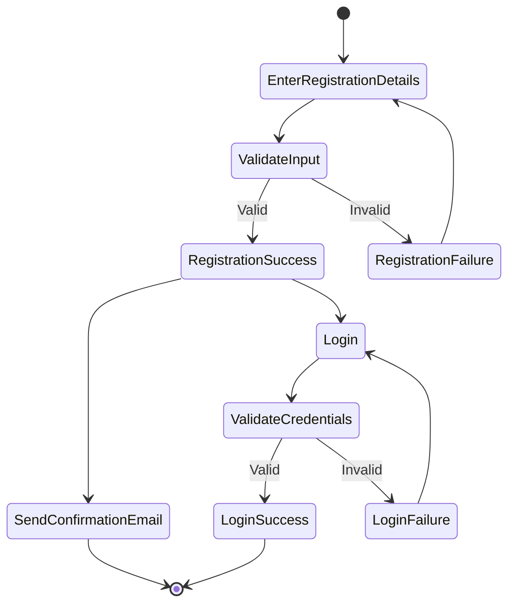
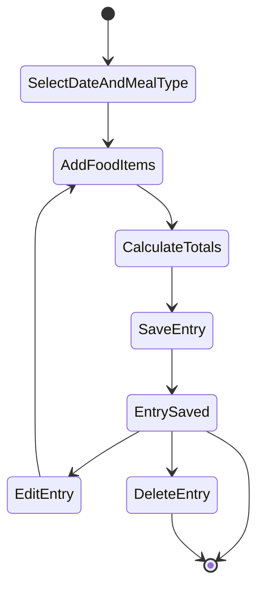
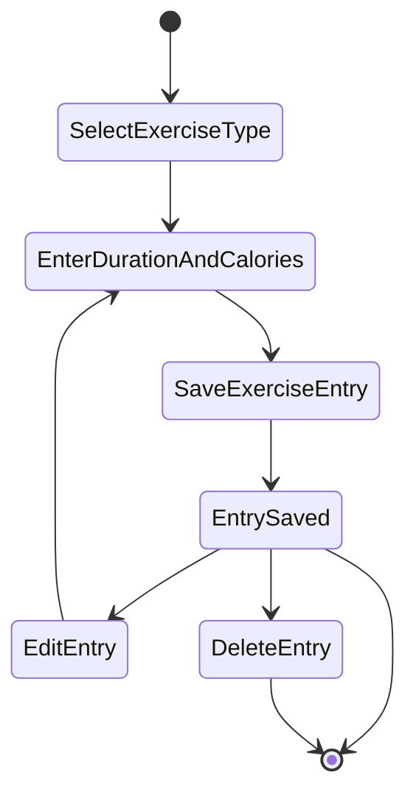
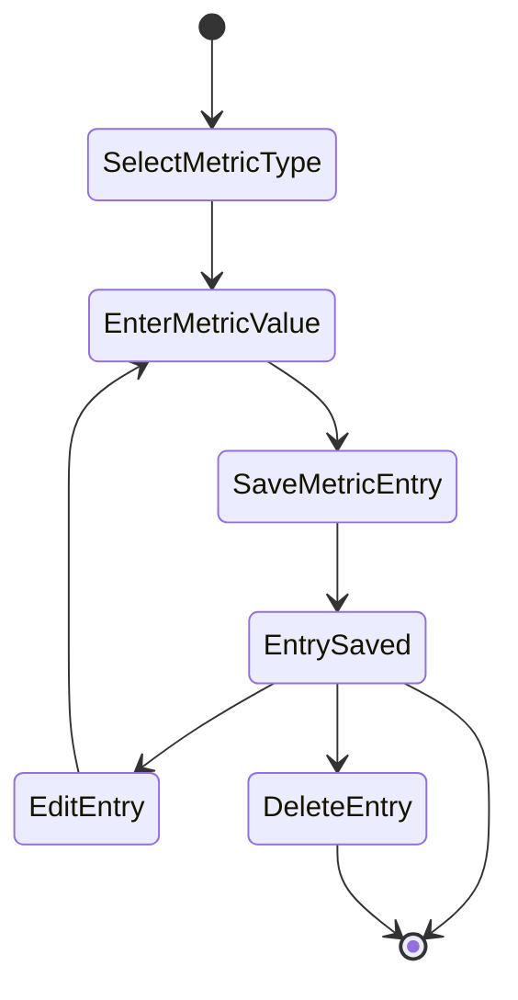
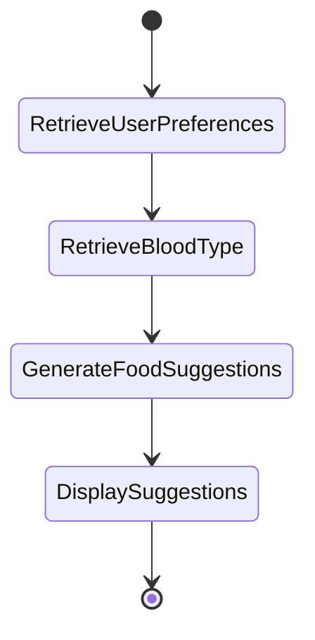

# Activity Diagrams for Health Tracker

This document provides UML activity diagrams representing workflows of key processes in the Health Tracker system. Activity diagrams model stepwise activities and actions with support for decisions, concurrency, and data flow.

## 1. User Registration and Authentication

## 2. Nutrition Logging

## 3. Exercise Tracking

## 4. Health Metrics Monitoring

## 5. Food Suggestions and Blood Type Diet Assistance

## Notes

- Each activity diagram models the flow of actions and decisions for the respective use case.
- Loops represent editing or retrying actions.
- The diagrams support clear visualization of workflows for developers and stakeholders.

This documentation complements the core use cases and supports detailed design and implementation planning.
