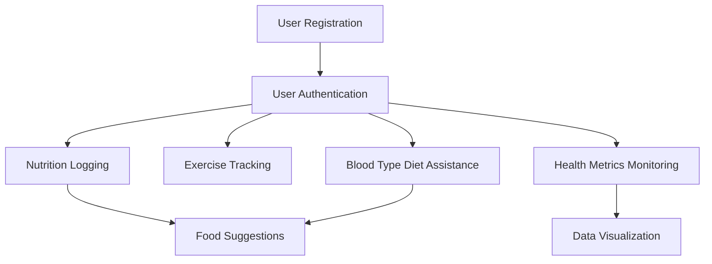

# Core Use Cases for Health Tracker

## 1. User Registration and Authentication
- User registers an account.
- User logs in and out securely.
- User manages profile information including blood type.

## 2. Nutrition Logging
- User creates, updates, and deletes nutrition entries.
- User adds food items to nutrition entries.
- System calculates total calories and macronutrients.
- System provides personalized food suggestions based on user preferences and blood type.

## 3. Exercise Tracking
- User logs exercise activities with type, duration, and calories burned.
- User updates and deletes exercise entries.

## 4. Health Metrics Monitoring
- User records health metrics such as weight, blood pressure, heart rate, and sleep duration.
- User updates and deletes health metric entries.

## 5. Data Visualization and Reporting
- System generates visual reports of nutrition, exercise, and health metrics over time.
- User views progress and insights.

## 6. Blood Type Diet Assistance
- System stores user blood type.
- System recommends foods to eat or avoid based on blood type.
- Integrates blood type advice into food suggestions.

---

# Use Case Flows and Diagrams

