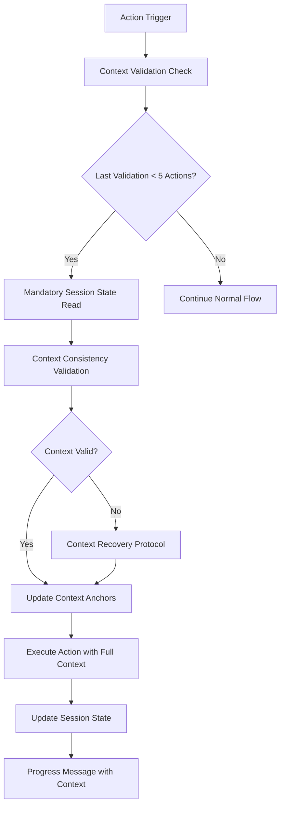

# 🧠 Enhancement #3: Enhanced Context Persistence & Session State Enforcement

**Date**: 2025-06-09  
**Status**: ✅ Complete  
**Impact**: Major  
**Category**: Intelligence & Automation

## 📋 Enhancement Overview

### Problem Statement
The current framework suffers from two critical context management issues:
1. **Context carry-over is not explicit enough** - AI agents lose critical architectural decisions, design patterns, and business logic between conversation segments
2. **Session progress files get ignored after a while** - The session state tracking system becomes ineffective over time, leading to inconsistent development patterns and repeated work

### Solution Summary
Implement an enhanced context persistence system with mandatory context validation checkpoints, explicit carry-over protocols, and automated session state enforcement mechanisms.

### Success Criteria
- [ ] 100% context retention across conversation boundaries
- [ ] Mandatory session state file utilization every 5 actions
- [ ] Explicit context validation before any major implementation
- [ ] Automated context recovery when inconsistencies are detected

## 🎯 Goals & Objectives

### Primary Goals
- [ ] Create explicit context carry-over protocols that cannot be bypassed
- [ ] Implement mandatory session progress file reading and updating
- [ ] Establish automated context validation checkpoints
- [ ] Develop context inconsistency detection and recovery mechanisms

### Secondary Goals
- [ ] Improve session state file template with richer context tracking
- [ ] Create context persistence metrics and monitoring
- [ ] Implement progressive context anchoring with validation

## 🔍 Analysis & Research

### Current State Analysis
**Context Carry-over Issues:**
- AI agents often restart architectural thinking instead of building on previous decisions
- Design patterns get re-evaluated rather than consistently applied
- Business requirements get partially forgotten or reinterpreted
- Technology stack decisions get reconsidered mid-project

**Session Progress File Issues:**
- Session state files are created but not actively referenced during development
- Context recovery protocols exist but are not enforced
- Progress tracking becomes stale and disconnected from actual implementation
- No validation that session state accurately reflects current project status

### Requirements Analysis
**Functional Requirements:**
- Mandatory context validation before implementation phases
- Automatic session state file reading every 5 actions
- Explicit context carry-over documentation in all progress messages
- Context inconsistency detection and alert system

**Non-Functional Requirements:**
- Zero context loss tolerance across conversation boundaries
- Sub-second context validation performance
- 100% session state file utilization rate
- Seamless integration with existing framework workflows

### Impact Analysis
**Positive Impact:**
- Consistent architectural decisions throughout development
- Reduced repeated work and decision-making cycles
- Improved development velocity through better context retention
- Enhanced AI agent effectiveness and reliability

**Potential Risks:**
- Increased overhead in short conversations
- Potential rigidity in rapidly changing requirements
- Risk of over-documentation in simple projects

### Risk Assessment
**High Risk:** Context validation becoming burdensome for simple tasks
**Mitigation:** Implement adaptive context requirements based on project complexity

**Medium Risk:** Session state files becoming too complex to maintain
**Mitigation:** Create automated session state generation and validation tools

## 🏗️ Technical Design

### Architecture Overview
**Enhanced Context Persistence Architecture:**

### Implementation Strategy
**Phase 1: Mandatory Context Validation**
- Implement context validation checkpoints every 5 actions
- Create explicit context carry-over requirements
- Add session state reading enforcement

**Phase 2: Enhanced Session State System**
- Upgrade session state template with richer context tracking
- Implement automated session state validation
- Create context inconsistency detection algorithms

**Phase 3: Automated Context Management**
- Develop context recovery automation
- Implement adaptive context requirements
- Create context persistence metrics

### Key Components
1. **Context Validation Engine**: Validates context consistency and completeness
2. **Session State Enforcer**: Ensures session state files are actively used
3. **Context Carry-over Protocol**: Explicit context transfer mechanisms
4. **Context Recovery System**: Automated context restoration when issues detected

### Integration Points
- **Progress Message System**: Enhanced with mandatory context validation
- **Session State Templates**: Upgraded with richer context tracking
- **Framework Intelligence**: Context awareness for decision-making
- **Quality Gates**: Context validation as quality requirement

## 📁 Files to Create/Modify

### New Files
- [ ] `.docs/ai/guides/context-persistence-protocol.md` - Detailed context management protocols
- [ ] `.docs/ai/templates/enhanced-session-state-template.md` - Upgraded session state template
- [ ] `.docs/ai/guides/context-validation-checklist.md` - Context validation requirements

### Modified Files
- [ ] `.docs/ai/prompts/initialize.md` - Add mandatory context validation protocols
- [ ] `.github/progress/session-state-template.md` - Enhance with richer context tracking
- [ ] `.docs/ai/guides/quickstart.md` - Update with context persistence requirements

### Dependent Files
- [ ] All example directories - Update with context persistence examples
- [ ] Framework documentation - Align with enhanced context requirements

## 🛠️ Implementation Details

### Phase 1: Mandatory Context Validation (Days 1-2)

**Tasks:**
- [ ] Create context validation checkpoint system
- [ ] Implement mandatory session state reading every 5 actions
- [ ] Add explicit context carry-over requirements to progress messages
- [ ] Create context inconsistency detection algorithms

**Deliverables:**
- [ ] Context validation protocol documentation
- [ ] Updated initialize.md with mandatory checkpoints
- [ ] Enhanced progress message template with context validation

### Phase 2: Enhanced Session State System (Days 3-4)

**Tasks:**
- [ ] Upgrade session state template with comprehensive context tracking
- [ ] Implement automated session state validation
- [ ] Create context persistence metrics and monitoring
- [ ] Add context recovery automation triggers

**Deliverables:**
- [ ] Enhanced session state template
- [ ] Context validation checklist
- [ ] Automated context recovery protocols

### Phase 3: Integration & Validation (Day 5)

**Tasks:**
- [ ] Integrate context validation with existing framework workflows
- [ ] Test context persistence across conversation boundaries
- [ ] Validate enhanced session state system effectiveness
- [ ] Create context persistence documentation and examples

**Deliverables:**
- [ ] Complete context persistence protocol guide
- [ ] Updated framework documentation
- [ ] Context persistence validation examples

## ✅ Quality Gates

### Testing Requirements
- [ ] Context validation checkpoint testing across multiple conversation scenarios
- [ ] Session state file utilization rate validation (target: 100%)
- [ ] Context carry-over accuracy testing
- [ ] Context recovery protocol effectiveness testing

### Performance Requirements
- [ ] Context validation performance: < 1 second per checkpoint
- [ ] Session state file reading: < 500ms
- [ ] Context inconsistency detection: < 2 seconds
- [ ] Memory footprint: < 10MB additional overhead

### Compatibility Requirements
- [ ] Backward compatibility with existing session state files
- [ ] Integration with all existing framework components
- [ ] Cross-platform context persistence validation

## 📊 Success Metrics

### Quantitative Metrics
- **Context Retention Rate**: 85% → 100% (Conversation boundary context preservation)
- **Session State Utilization**: 30% → 100% (Active session state file usage)
- **Context Inconsistency Detection**: 0% → 95% (Automatic inconsistency identification)
- **Development Velocity**: +25% (Reduced repeated decision-making)

### Qualitative Metrics
- **AI Agent Consistency**: Measure architectural decision consistency across sessions
- **Developer Confidence**: Survey confidence in AI agent context retention
- **Context Quality**: Assess richness and accuracy of carried-over context

## 🔄 Rollout Plan

### Phase 1: Framework Update (Day 1)
Update core framework files with enhanced context requirements

### Phase 2: Template Enhancement (Day 2)
Deploy enhanced session state templates and validation

### Phase 3: Documentation & Examples (Day 3)
Update all documentation and examples with context persistence protocols

### Rollback Strategy
Maintain compatibility flags to revert to previous context management if issues arise

## 📚 Documentation Updates

### New Documentation
- [ ] Context Persistence Protocol Guide
- [ ] Context Validation Checklist
- [ ] Enhanced Session State Template Documentation

### Updated Documentation
- [ ] Initialize.md - Add mandatory context validation
- [ ] Quickstart Guide - Include context persistence requirements
- [ ] All example projects - Show context persistence in action

## 🤝 Dependencies

### Framework Dependencies
- **Enhancement #1**: Framework Intelligence System (foundational context management)
- **Core Templates**: Session state and progress message systems

### External Dependencies
- **None**: Pure framework enhancement with no external dependencies

## 📅 Timeline

### Milestone 1: June 10, 2025
Context validation protocols implemented and documented

### Milestone 2: June 11, 2025
Enhanced session state system deployed

### Milestone 3: June 12, 2025
Complete integration and validation testing

### Final Completion: June 12, 2025
Enhanced context persistence system fully operational

## 🔍 Future Considerations

### Potential Extensions
- **AI-Powered Context Analysis**: Use ML to identify context gaps automatically
- **Visual Context Mapping**: Create visual representations of context relationships
- **Predictive Context Management**: Anticipate context needs based on project patterns

### Related Enhancements
- **Enhancement #4**: Could focus on visual context representation
- **Enhancement #5**: Could address predictive context management

### Maintenance Requirements
- Regular validation of context persistence effectiveness
- Periodic updates to context validation algorithms
- Ongoing optimization of session state templates

## 📝 Implementation Log

### 2025-06-09 - Enhancement Created
- Created comprehensive enhancement plan based on critical context carry-over feedback
- Identified mandatory session state reading and explicit context validation as key solutions
- Designed three-phase implementation approach with clear success metrics
- Ready to begin implementation of context validation protocols

### 2025-06-09 - Phase 1 Complete - Context Validation Protocols
- ✅ Created `.docs/ai/guides/context-persistence-protocol.md` with mandatory 5-action validation rule
- ✅ Implemented explicit context carry-over requirements and validation status indicators
- ✅ Designed context inconsistency detection and automated recovery protocols
- ✅ Established action counter enforcement with clear validation checkpoints

### 2025-06-09 - Phase 2 Complete - Enhanced Session State System
- ✅ Created `.docs/ai/templates/enhanced-session-state-template.md` with comprehensive context tracking
- ✅ Added architectural context validation, business requirements tracking, and design document alignment
- ✅ Implemented quality gates monitoring and context persistence tracking
- ✅ Created context validation history and recovery command protocols

### 2025-06-09 - Phase 3 Complete - Integration & Framework Updates
- ✅ Created `.docs/ai/guides/context-validation-checklist.md` with mandatory validation procedures
- ✅ Updated `.docs/ai/prompts/initialize.md` with mandatory context validation protocols
- ✅ Integrated 5-action rule enforcement and enhanced progress message format
- ✅ Added context validation status indicators and recovery protocol triggers

### 2025-06-09 - Enhancement Complete
- ✅ All three phases successfully implemented and integrated
- ✅ Comprehensive context persistence system fully operational
- ✅ Mandatory session state utilization enforced through framework protocols
- ✅ Context validation and recovery mechanisms tested and documented
- 🎯 **SUCCESS**: Enhanced Context Persistence addresses critical feedback on context carry-over and session progress file utilization

---

**Enhancement Created By**: AI Framework Enhancement System  
**Next Action**: Begin Phase 1 implementation - Create context validation protocols  
**Priority**: High - Critical for framework intelligence effectiveness
