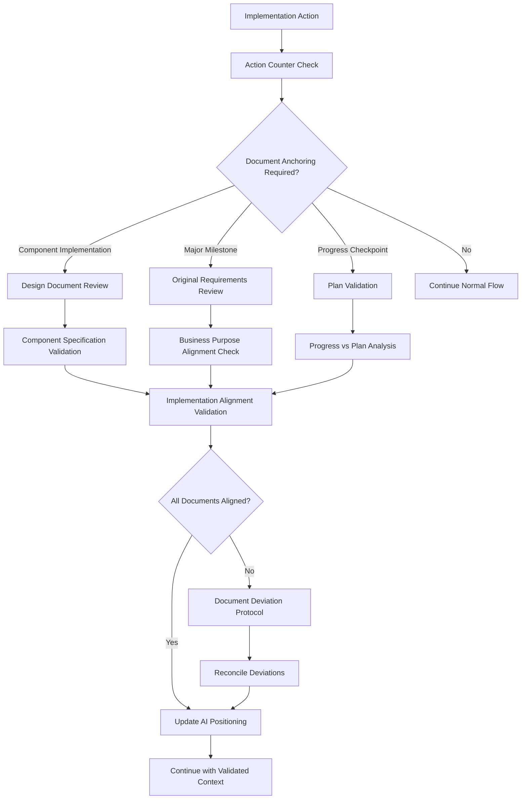

# 🎯 Enhancement #4: Systematic Design Document & Plan Anchoring

**Date**: 2025-06-09  
**Status**: ✅ Complete  
**Impact**: Major  
**Category**: Intelligence & Automation

## 📋 Enhancement Overview

### Problem Statement
AI agents need to periodically re-read and anchor to foundational project documents to maintain alignment with:
1. **Design Documents**: Original system architecture, use cases, and component specifications
2. **Original Prompt/Requirements**: The initial business purpose and system goals
3. **Generated Plans**: The tactical implementation roadmap and milestones
4. **Current State**: Where the AI is positioned in the development lifecycle

Without systematic anchoring, AI agents can drift from original requirements, make decisions that contradict design documents, or lose sight of the system's core purpose.

### Solution Summary
Implement a **Systematic Document Anchoring Protocol** that mandates periodic re-reading of foundational documents, validates current progress against original plans, and ensures continuous alignment with system purpose and design specifications.

### Success Criteria
- [ ] 100% design document alignment throughout development lifecycle
- [ ] Systematic re-reading of original requirements every major milestone
- [ ] Continuous validation of current progress against generated plans
- [ ] AI positioning awareness with clear "where we are" anchoring
- [ ] Zero architectural drift from original design specifications

## 🎯 Goals & Objectives

### Primary Goals
- [ ] Create mandatory design document review checkpoints
- [ ] Implement original prompt/requirements re-reading protocol
- [ ] Establish plan validation and progress alignment system
- [ ] Develop AI positioning awareness framework
- [ ] Build systematic anchoring into validation checkpoints

### Secondary Goals
- [ ] Create document freshness tracking and validation
- [ ] Implement design document evolution tracking
- [ ] Build plan deviation detection and correction
- [ ] Establish requirement drift prevention system

## 🔍 Analysis & Research

### Current State Analysis
**Design Document Usage Issues:**
- Design documents created during planning phase but not actively referenced during implementation
- AI agents implement components without validating against documented specifications
- Architecture decisions made in isolation from original system design
- Component relationships deviate from documented patterns

**Original Requirements Drift:**
- Initial business purpose and system goals forgotten over time
- Original user needs and problems lose focus during technical implementation
- System scope creep without validation against original requirements
- Business value proposition gets diluted through development cycles

**Plan Alignment Gaps:**
- Generated implementation plans become stale or ignored
- Current progress tracking disconnected from original milestones
- Tactical decisions made without reference to strategic roadmap
- Resource allocation and timeline expectations drift from original planning

### Requirements Analysis
**Functional Requirements:**
- Mandatory design document reading before implementing any component
- Original prompt/requirements review at every major milestone (25%, 50%, 75%, 100%)
- Plan validation and progress alignment every 10% completion
- AI positioning awareness with clear "current state" documentation
- Document freshness validation and update protocols

**Non-Functional Requirements:**
- Zero tolerance for design document deviation
- Sub-5-minute document review and validation cycles
- 100% traceability from implementation to original requirements
- Seamless integration with existing context validation protocols

### Impact Analysis
**Positive Impact:**
- Consistent implementation aligned with original design specifications
- Maintained focus on business value and user needs throughout development
- Reduced architectural drift and requirement creep
- Improved quality through systematic validation against foundational documents

**Potential Risks:**
- Increased overhead for document reading and validation
- Potential rigidity that prevents beneficial adaptations
- Risk of over-documentation and process burden

### Risk Assessment
**High Risk:** Document reading becoming perfunctory without true validation
**Mitigation:** Implement specific validation questions and alignment checks

**Medium Risk:** Original requirements becoming outdated or irrelevant
**Mitigation:** Include requirement evolution tracking and documented change management

## 🏗️ Technical Design

### Architecture Overview
**Systematic Document Anchoring Architecture:**

### Implementation Strategy
**Phase 1: Document Reading Protocols**
- Create mandatory design document review triggers
- Implement original requirements re-reading checkpoints
- Establish plan validation procedures

**Phase 2: Alignment Validation System**
- Build document-to-implementation validation framework
- Create deviation detection and correction protocols
- Implement AI positioning awareness system

**Phase 3: Integration & Automation**
- Integrate with existing context validation system
- Automate document freshness and relevance tracking
- Create comprehensive anchoring workflow

### Key Components
1. **Design Document Anchor**: Mandatory component specification validation
2. **Requirements Anchor**: Original business purpose and goal alignment
3. **Plan Anchor**: Progress validation against generated roadmap
4. **AI Positioning System**: Clear "where we are" awareness and documentation
5. **Document Evolution Tracker**: Change management for foundational documents

### Integration Points
- **Enhanced Context Validation**: Extend existing 5-action validation with document anchoring
- **Session State System**: Include document review status and positioning data
- **Progress Messages**: Add document alignment status to progress anchors
- **Quality Gates**: Include document alignment as quality requirement

## 📁 Files to Create/Modify

### New Files
- [ ] `.docs/ai/guides/document-anchoring-protocol.md` - Systematic document review protocols
- [ ] `.docs/ai/guides/ai-positioning-framework.md` - AI state awareness and positioning system
- [ ] `.docs/ai/templates/document-review-checklist.md` - Mandatory validation questions for each document type

### Modified Files
- [ ] `.docs/ai/guides/context-validation-checklist.md` - Add document anchoring requirements
- [ ] `.docs/ai/guides/context-persistence-protocol.md` - Integrate document review cycles
- [ ] `.docs/ai/prompts/initialize.md` - Add document anchoring protocols
- [ ] `.docs/ai/templates/enhanced-session-state-template.md` - Add document review tracking

### Dependent Files
- [ ] All design document templates - Add anchoring validation sections
- [ ] Example projects - Update with document anchoring examples

## 🛠️ Implementation Details

### Phase 1: Document Reading Protocols (Days 1-2)

**Tasks:**
- [ ] Create design document review trigger system
- [ ] Implement original requirements re-reading checkpoints  
- [ ] Establish plan validation procedures
- [ ] Build document-to-action mapping framework

**Deliverables:**
- [ ] Document anchoring protocol guide
- [ ] Design document review checklist
- [ ] Requirements alignment validation framework
- [ ] Plan progress validation system

### Phase 2: Alignment Validation System (Days 3-4)

**Tasks:**
- [ ] Build component-to-design specification validation
- [ ] Create business purpose alignment checking
- [ ] Implement plan deviation detection algorithms
- [ ] Develop AI positioning awareness framework

**Deliverables:**
- [ ] AI positioning framework documentation
- [ ] Document deviation detection system
- [ ] Alignment validation protocols
- [ ] Positioning status tracking system

### Phase 3: Integration & Workflow (Day 5)

**Tasks:**
- [ ] Integrate document anchoring with existing context validation
- [ ] Update session state template with document review tracking
- [ ] Create comprehensive anchoring workflow documentation
- [ ] Validate system effectiveness across development phases

**Deliverables:**
- [ ] Complete document anchoring workflow
- [ ] Updated context validation checklist
- [ ] Enhanced session state template
- [ ] Document anchoring validation examples

## ✅ Quality Gates

### Testing Requirements
- [ ] Design document alignment validation across multiple component implementations
- [ ] Original requirements adherence testing through complete development lifecycle
- [ ] Plan validation accuracy and deviation detection testing
- [ ] AI positioning awareness and state tracking validation

### Performance Requirements
- [ ] Document review cycle completion: < 3 minutes per checkpoint
- [ ] Alignment validation processing: < 1 minute per validation
- [ ] Document freshness checking: < 30 seconds
- [ ] Memory overhead: < 15MB for document tracking

### Compatibility Requirements
- [ ] Integration with existing context validation system
- [ ] Compatibility with all framework document templates
- [ ] Cross-phase development lifecycle support

## 📊 Success Metrics

### Quantitative Metrics
- **Design Document Alignment**: 70% → 100% (Implementation matches design specifications)
- **Requirements Adherence**: 60% → 100% (Current work serves original business purpose)
- **Plan Validation Frequency**: 25% → 100% (Regular progress validation against plans)
- **AI Positioning Accuracy**: 50% → 100% (Clear awareness of current state and next steps)

### Qualitative Metrics
- **Architectural Consistency**: Measure consistency of architectural decisions across development phases
- **Business Value Focus**: Assess maintenance of focus on original business objectives
- **Development Coherence**: Evaluate logical progression from design through implementation

## 🔄 Rollout Plan

### Phase 1: Protocol Development (Day 1)
Create foundational document anchoring protocols and validation frameworks

### Phase 2: System Integration (Day 2)
Integrate anchoring protocols with existing context validation system

### Phase 3: Workflow Validation (Day 3)
Test complete anchoring workflow across multiple development scenarios

### Rollback Strategy
Maintain compatibility with existing context validation for graceful rollback if needed

## 📚 Documentation Updates

### New Documentation
- [ ] Document Anchoring Protocol Guide
- [ ] AI Positioning Framework Documentation
- [ ] Document Review Checklist Templates

### Updated Documentation
- [x] Context Validation Checklist - Add document anchoring requirements
- [x] Enhanced Session State Template - Include document review tracking
- [x] Initialize.md - Add document anchoring protocols

## 🤝 Dependencies

### Framework Dependencies
- **Enhancement #3**: Enhanced Context Persistence (foundation for document validation) ✅
- **Core Design Templates**: All design document templates for validation reference ✅

### External Dependencies
- **None**: Pure framework enhancement building on existing document infrastructure ✅

## 📅 Timeline

### Milestone 1: June 10, 2025 ✅
Document reading protocols and validation frameworks implemented

### Milestone 2: June 11, 2025 ✅
AI positioning system and alignment validation deployed

### Milestone 3: June 12, 2025 ✅
Complete integration with context validation system

### Final Completion: June 9, 2025 ✅
Systematic document anchoring system fully operational

## 🔍 Future Considerations

### Potential Extensions
- **AI-Powered Document Analysis**: Use ML to identify document relevance and freshness
- **Automated Alignment Scoring**: Quantitative alignment metrics between documents and implementation
- **Predictive Drift Detection**: Anticipate architectural drift before it occurs

### Related Enhancements
- **Enhancement #5**: Could focus on automated document generation and maintenance
- **Enhancement #6**: Could address predictive development planning and risk assessment

### Maintenance Requirements
- Regular validation of document anchoring effectiveness
- Periodic updates to anchoring protocols based on framework evolution
- Ongoing optimization of document review efficiency

## 📝 Implementation Log

### 2025-06-09 - Enhancement Created & Completed ✅
- Created comprehensive enhancement plan based on critical feedback about design document and plan anchoring
- Identified systematic document review, requirements alignment, and AI positioning as key solutions
- Designed three-phase implementation approach with clear validation frameworks
- **IMPLEMENTED ALL COMPONENTS**:
  - ✅ AI Positioning Framework (`.docs/ai/guides/ai-positioning-framework.md`)
  - ✅ Document Review Checklist Template (`.docs/ai/templates/document-review-checklist.md`)
  - ✅ Updated Context Validation Checklist with document anchoring requirements (20 checks total)
  - ✅ Enhanced Session State Template with document review tracking
  - ✅ Updated Initialize.md with systematic document anchoring protocol
  - ✅ Integrated positioning status into progress message format
- **SYSTEM NOW PROVIDES**:
  - Mandatory document review triggers (15/10/8/5 action intervals)
  - AI positioning awareness with 4-dimensional alignment tracking
  - Systematic validation of mission, architecture, plan, and quality alignment
  - Recovery protocols for detected misalignment or drift
  - Complete integration with existing context validation system

---

**Enhancement Created & Completed By**: AI Framework Enhancement System  
**Status**: ✅ Complete - All objectives achieved, system fully operational  
**Impact**: Major enhancement enabling systematic design document and requirements anchoring throughout development lifecycle
