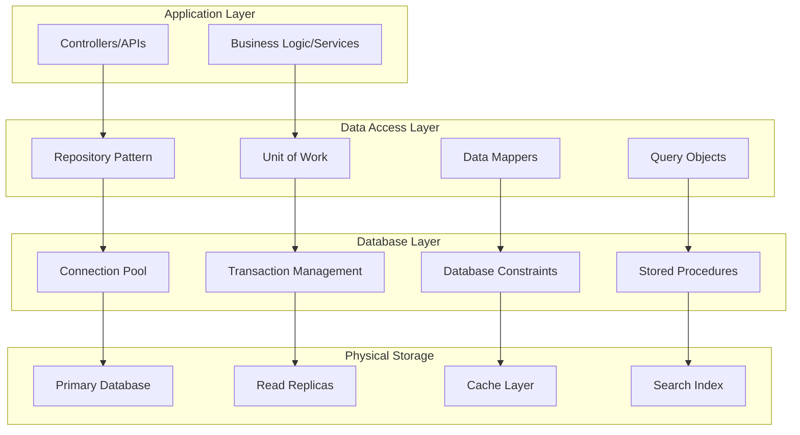
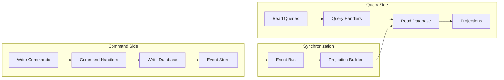

[<< Back](../../../README.md)

# Database Design Patterns Guide

## Overview

This guide provides comprehensive database design patterns, data modeling best practices, and implementation strategies for building scalable, maintainable, and performant data layers. It covers relational design, NoSQL patterns, caching strategies, and data migration approaches.

## Database Architecture Patterns

### 1. Layered Database Architecture



### 2. CQRS with Database Separation



## Entity Relationship Design

### 1. Domain-Driven Design Entities

```csharp
// Core Entity Base Class
public abstract class Entity<TId> : IEquatable<Entity<TId>>
    where TId : IEquatable<TId>
{
    public TId Id { get; protected set; } = default!;
    public DateTime CreatedAt { get; protected set; }
    public DateTime? UpdatedAt { get; protected set; }
    public string CreatedBy { get; protected set; } = string.Empty;
    public string? UpdatedBy { get; protected set; }
    public byte[] RowVersion { get; protected set; } = Array.Empty<byte>();

    private readonly List<IDomainEvent> _domainEvents = new();
    public IReadOnlyList<IDomainEvent> DomainEvents => _domainEvents.AsReadOnly();

    protected Entity() { }

    protected Entity(TId id)
    {
        Id = id;
        CreatedAt = DateTime.UtcNow;
    }

    public void AddDomainEvent(IDomainEvent eventItem)
    {
        _domainEvents.Add(eventItem);
    }

    public void RemoveDomainEvent(IDomainEvent eventItem)
    {
        _domainEvents.Remove(eventItem);
    }

    public void ClearDomainEvents()
    {
        _domainEvents.Clear();
    }

    public void MarkAsUpdated(string updatedBy)
    {
        UpdatedAt = DateTime.UtcNow;
        UpdatedBy = updatedBy;
    }

    public bool Equals(Entity<TId>? other)
    {
        if (other is null) return false;
        if (ReferenceEquals(this, other)) return true;
        return Id.Equals(other.Id);
    }

    public override bool Equals(object? obj)
    {
        return Equals(obj as Entity<TId>);
    }

    public override int GetHashCode()
    {
        return Id.GetHashCode();
    }

    public static bool operator ==(Entity<TId>? left, Entity<TId>? right)
    {
        return Equals(left, right);
    }

    public static bool operator !=(Entity<TId>? left, Entity<TId>? right)
    {
        return !Equals(left, right);
    }
}

// Aggregate Root
public abstract class AggregateRoot<TId> : Entity<TId>
    where TId : IEquatable<TId>
{
    protected AggregateRoot() { }
    protected AggregateRoot(TId id) : base(id) { }
}

// Value Object Base
public abstract class ValueObject : IEquatable<ValueObject>
{
    protected abstract IEnumerable<object> GetEqualityComponents();

    public override bool Equals(object? obj)
    {
        if (obj == null || obj.GetType() != GetType())
            return false;

        var other = (ValueObject)obj;
        return GetEqualityComponents().SequenceEqual(other.GetEqualityComponents());
    }

    public bool Equals(ValueObject? other)
    {
        return Equals((object?)other);
    }

    public override int GetHashCode()
    {
        return GetEqualityComponents()
            .Select(x => x?.GetHashCode() ?? 0)
            .Aggregate((x, y) => x ^ y);
    }

    public static bool operator ==(ValueObject? left, ValueObject? right)
    {
        return Equals(left, right);
    }

    public static bool operator !=(ValueObject? left, ValueObject? right)
    {
        return !Equals(left, right);
    }
}
```

### 2. Comprehensive Domain Models

```csharp
// User Aggregate
public class User : AggregateRoot<int>
{
    private readonly List<UserRole> _roles = new();
    private readonly List<UserPreference> _preferences = new();

    public Email Email { get; private set; } = null!;
    public PersonName Name { get; private set; } = null!;
    public PhoneNumber? PhoneNumber { get; private set; }
    public UserStatus Status { get; private set; }
    public DateTime? LastLoginAt { get; private set; }
    public DateTime? EmailVerifiedAt { get; private set; }
    public string PasswordHash { get; private set; } = string.Empty;
    public Address? Address { get; private set; }

    // Navigation properties
    public IReadOnlyList<UserRole> Roles => _roles.AsReadOnly();
    public IReadOnlyList<UserPreference> Preferences => _preferences.AsReadOnly();
    public Profile? Profile { get; private set; }

    protected User() { } // For EF Core

    private User(Email email, PersonName name, string passwordHash, string createdBy)
        : base()
    {
        Email = email;
        Name = name;
        PasswordHash = passwordHash;
        Status = UserStatus.Active;
        CreatedBy = createdBy;

        AddDomainEvent(new UserCreatedDomainEvent(Id, email.Value));
    }

    public static User Create(Email email, PersonName name, string passwordHash, string createdBy)
    {
        // Domain validation
        if (string.IsNullOrWhiteSpace(passwordHash))
            throw new ArgumentException("Password hash cannot be empty", nameof(passwordHash));

        return new User(email, name, passwordHash, createdBy);
    }

    public void UpdateEmail(Email newEmail, string updatedBy)
    {
        if (Email.Equals(newEmail)) return;

        var oldEmail = Email;
        Email = newEmail;
        EmailVerifiedAt = null; // Reset verification when email changes
        MarkAsUpdated(updatedBy);

        AddDomainEvent(new UserEmailChangedDomainEvent(Id, oldEmail.Value, newEmail.Value));
    }

    public void VerifyEmail(string updatedBy)
    {
        if (EmailVerifiedAt.HasValue) return;

        EmailVerifiedAt = DateTime.UtcNow;
        MarkAsUpdated(updatedBy);

        AddDomainEvent(new UserEmailVerifiedDomainEvent(Id, Email.Value));
    }

    public void UpdateProfile(PersonName name, PhoneNumber? phoneNumber, Address? address, string updatedBy)
    {
        Name = name;
        PhoneNumber = phoneNumber;
        Address = address;
        MarkAsUpdated(updatedBy);

        AddDomainEvent(new UserProfileUpdatedDomainEvent(Id));
    }

    public void AssignRole(Role role, DateTime? expiresAt, string assignedBy)
    {
        if (_roles.Any(ur => ur.RoleId == role.Id && (ur.ExpiresAt == null || ur.ExpiresAt > DateTime.UtcNow)))
            return; // Role already active

        var userRole = UserRole.Create(Id, role.Id, expiresAt, assignedBy);
        _roles.Add(userRole);

        AddDomainEvent(new UserRoleAssignedDomainEvent(Id, role.Id, assignedBy));
    }

    public void RevokeRole(int roleId, string revokedBy)
    {
        var userRole = _roles.FirstOrDefault(ur => ur.RoleId == roleId &&
            (ur.ExpiresAt == null || ur.ExpiresAt > DateTime.UtcNow));

        if (userRole == null) return;

        userRole.Revoke(revokedBy);
        AddDomainEvent(new UserRoleRevokedDomainEvent(Id, roleId, revokedBy));
    }

    public void RecordLogin()
    {
        LastLoginAt = DateTime.UtcNow;
        AddDomainEvent(new UserLoggedInDomainEvent(Id, Email.Value));
    }

    public void Deactivate(string deactivatedBy)
    {
        if (Status == UserStatus.Inactive) return;

        Status = UserStatus.Inactive;
        MarkAsUpdated(deactivatedBy);

        AddDomainEvent(new UserDeactivatedDomainEvent(Id, Email.Value));
    }

    public bool HasRole(string roleName)
    {
        return _roles.Any(ur => ur.Role.Name.Equals(roleName, StringComparison.OrdinalIgnoreCase) &&
                               (ur.ExpiresAt == null || ur.ExpiresAt > DateTime.UtcNow) &&
                               ur.RevokedAt == null);
    }

    public bool HasPermission(string permission)
    {
        return _roles
            .Where(ur => (ur.ExpiresAt == null || ur.ExpiresAt > DateTime.UtcNow) && ur.RevokedAt == null)
            .SelectMany(ur => ur.Role.Permissions)
            .Any(p => p.Name.Equals(permission, StringComparison.OrdinalIgnoreCase));
    }
}

// Value Objects
public class Email : ValueObject
{
    public string Value { get; private set; }

    private Email(string value)
    {
        Value = value;
    }

    public static Email Create(string email)
    {
        if (string.IsNullOrWhiteSpace(email))
            throw new ArgumentException("Email cannot be empty", nameof(email));

        if (!IsValidEmail(email))
            throw new ArgumentException("Invalid email format", nameof(email));

        return new Email(email.ToLowerInvariant());
    }

    private static bool IsValidEmail(string email)
    {
        try
        {
            var addr = new System.Net.Mail.MailAddress(email);
            return addr.Address == email;
        }
        catch
        {
            return false;
        }
    }

    protected override IEnumerable<object> GetEqualityComponents()
    {
        yield return Value;
    }

    public override string ToString() => Value;

    public static implicit operator string(Email email) => email.Value;
}

public class PersonName : ValueObject
{
    public string FirstName { get; private set; }
    public string LastName { get; private set; }
    public string? MiddleName { get; private set; }

    private PersonName(string firstName, string lastName, string? middleName = null)
    {
        FirstName = firstName;
        LastName = lastName;
        MiddleName = middleName;
    }

    public static PersonName Create(string firstName, string lastName, string? middleName = null)
    {
        if (string.IsNullOrWhiteSpace(firstName))
            throw new ArgumentException("First name cannot be empty", nameof(firstName));

        if (string.IsNullOrWhiteSpace(lastName))
            throw new ArgumentException("Last name cannot be empty", nameof(lastName));

        return new PersonName(firstName.Trim(), lastName.Trim(), middleName?.Trim());
    }

    public string FullName => string.IsNullOrEmpty(MiddleName)
        ? $"{FirstName} {LastName}"
        : $"{FirstName} {MiddleName} {LastName}";

    protected override IEnumerable<object> GetEqualityComponents()
    {
        yield return FirstName;
        yield return LastName;
        yield return MiddleName ?? string.Empty;
    }

    public override string ToString() => FullName;
}

public class Address : ValueObject
{
    public string Street { get; private set; }
    public string City { get; private set; }
    public string State { get; private set; }
    public string ZipCode { get; private set; }
    public string Country { get; private set; }

    private Address(string street, string city, string state, string zipCode, string country)
    {
        Street = street;
        City = city;
        State = state;
        ZipCode = zipCode;
        Country = country;
    }

    public static Address Create(string street, string city, string state, string zipCode, string country)
    {
        if (string.IsNullOrWhiteSpace(street)) throw new ArgumentException("Street cannot be empty");
        if (string.IsNullOrWhiteSpace(city)) throw new ArgumentException("City cannot be empty");
        if (string.IsNullOrWhiteSpace(state)) throw new ArgumentException("State cannot be empty");
        if (string.IsNullOrWhiteSpace(zipCode)) throw new ArgumentException("Zip code cannot be empty");
        if (string.IsNullOrWhiteSpace(country)) throw new ArgumentException("Country cannot be empty");

        return new Address(street.Trim(), city.Trim(), state.Trim(), zipCode.Trim(), country.Trim());
    }

    protected override IEnumerable<object> GetEqualityComponents()
    {
        yield return Street;
        yield return City;
        yield return State;
        yield return ZipCode;
        yield return Country;
    }
}

// Domain Enums
public enum UserStatus
{
    Active = 1,
    Inactive = 2,
    Suspended = 3,
    PendingVerification = 4
}
```

### 3. Entity Framework Configuration

```csharp
// Entity Configurations
public class UserConfiguration : IEntityTypeConfiguration<User>
{
    public void Configure(EntityTypeBuilder<User> builder)
    {
        // Table configuration
        builder.ToTable("Users");
        builder.HasKey(u => u.Id);

        // Primary key
        builder.Property(u => u.Id)
            .ValueGeneratedOnAdd();

        // Row version for optimistic concurrency
        builder.Property(u => u.RowVersion)
            .IsRowVersion();

        // Value object configurations
        builder.OwnsOne(u => u.Email, email =>
        {
            email.Property(e => e.Value)
                .HasColumnName("Email")
                .HasMaxLength(254)
                .IsRequired();

            email.HasIndex(e => e.Value)
                .IsUnique()
                .HasDatabaseName("IX_Users_Email");
        });

        builder.OwnsOne(u => u.Name, name =>
        {
            name.Property(n => n.FirstName)
                .HasColumnName("FirstName")
                .HasMaxLength(50)
                .IsRequired();

            name.Property(n => n.LastName)
                .HasColumnName("LastName")
                .HasMaxLength(50)
                .IsRequired();

            name.Property(n => n.MiddleName)
                .HasColumnName("MiddleName")
                .HasMaxLength(50);
        });

        builder.OwnsOne(u => u.PhoneNumber, phone =>
        {
            phone.Property(p => p.Value)
                .HasColumnName("PhoneNumber")
                .HasMaxLength(20);
        });

        builder.OwnsOne(u => u.Address, address =>
        {
            address.Property(a => a.Street).HasColumnName("AddressStreet").HasMaxLength(200);
            address.Property(a => a.City).HasColumnName("AddressCity").HasMaxLength(100);
            address.Property(a => a.State).HasColumnName("AddressState").HasMaxLength(100);
            address.Property(a => a.ZipCode).HasColumnName("AddressZipCode").HasMaxLength(20);
            address.Property(a => a.Country).HasColumnName("AddressCountry").HasMaxLength(100);
        });

        // Regular properties
        builder.Property(u => u.PasswordHash)
            .HasMaxLength(500)
            .IsRequired();

        builder.Property(u => u.Status)
            .HasConversion<int>()
            .IsRequired();

        builder.Property(u => u.CreatedAt)
            .IsRequired();

        builder.Property(u => u.CreatedBy)
            .HasMaxLength(100)
            .IsRequired();

        builder.Property(u => u.UpdatedBy)
            .HasMaxLength(100);

        // Relationships
        builder.HasMany(u => u.Roles)
            .WithOne(ur => ur.User)
            .HasForeignKey(ur => ur.UserId)
            .OnDelete(DeleteBehavior.Cascade);

        builder.HasOne(u => u.Profile)
            .WithOne(p => p.User)
            .HasForeignKey<Profile>(p => p.UserId)
            .OnDelete(DeleteBehavior.Cascade);

        // Indexes
        builder.HasIndex(u => u.Status)
            .HasDatabaseName("IX_Users_Status");

        builder.HasIndex(u => u.CreatedAt)
            .HasDatabaseName("IX_Users_CreatedAt");

        builder.HasIndex(u => u.LastLoginAt)
            .HasDatabaseName("IX_Users_LastLoginAt");

        // Ignore domain events
        builder.Ignore(u => u.DomainEvents);
    }
}

public class UserRoleConfiguration : IEntityTypeConfiguration<UserRole>
{
    public void Configure(EntityTypeBuilder<UserRole> builder)
    {
        builder.ToTable("UserRoles");

        // Composite key
        builder.HasKey(ur => new { ur.UserId, ur.RoleId });

        // Properties
        builder.Property(ur => ur.AssignedAt)
            .IsRequired();

        builder.Property(ur => ur.AssignedBy)
            .HasMaxLength(100)
            .IsRequired();

        builder.Property(ur => ur.RevokedBy)
            .HasMaxLength(100);

        // Relationships
        builder.HasOne(ur => ur.User)
            .WithMany(u => u.Roles)
            .HasForeignKey(ur => ur.UserId)
            .OnDelete(DeleteBehavior.Cascade);

        builder.HasOne(ur => ur.Role)
            .WithMany()
            .HasForeignKey(ur => ur.RoleId)
            .OnDelete(DeleteBehavior.Restrict);

        // Indexes
        builder.HasIndex(ur => ur.ExpiresAt)
            .HasDatabaseName("IX_UserRoles_ExpiresAt");

        builder.HasIndex(ur => ur.RevokedAt)
            .HasDatabaseName("IX_UserRoles_RevokedAt");
    }
}
```

## Repository & Unit of Work Patterns

### 1. Generic Repository Pattern

```csharp
// Generic Repository Interface
public interface IRepository<TEntity, TId>
    where TEntity : Entity<TId>
    where TId : IEquatable<TId>
{
    Task<TEntity?> GetByIdAsync(TId id, CancellationToken cancellationToken = default);
    Task<TEntity?> GetByIdAsync(TId id, params Expression<Func<TEntity, object>>[] includes);
    Task<List<TEntity>> GetAllAsync(CancellationToken cancellationToken = default);
    Task<List<TEntity>> GetAllAsync(params Expression<Func<TEntity, object>>[] includes);
    Task<PagedResult<TEntity>> GetPagedAsync(IQueryParameters parameters, CancellationToken cancellationToken = default);
    Task<List<TEntity>> FindAsync(Expression<Func<TEntity, bool>> predicate, CancellationToken cancellationToken = default);
    Task<TEntity?> FindFirstAsync(Expression<Func<TEntity, bool>> predicate, CancellationToken cancellationToken = default);
    Task<bool> ExistsAsync(Expression<Func<TEntity, bool>> predicate, CancellationToken cancellationToken = default);
    Task<int> CountAsync(Expression<Func<TEntity, bool>>? predicate = null, CancellationToken cancellationToken = default);

    void Add(TEntity entity);
    void AddRange(IEnumerable<TEntity> entities);
    void Update(TEntity entity);
    void UpdateRange(IEnumerable<TEntity> entities);
    void Remove(TEntity entity);
    void RemoveRange(IEnumerable<TEntity> entities);

    IQueryable<TEntity> AsQueryable();
}

// Generic Repository Implementation
public class Repository<TEntity, TId> : IRepository<TEntity, TId>
    where TEntity : class, Entity<TId>
    where TId : IEquatable<TId>
{
    protected readonly DbContext Context;
    protected readonly DbSet<TEntity> DbSet;
    private readonly ILogger<Repository<TEntity, TId>> _logger;

    public Repository(DbContext context, ILogger<Repository<TEntity, TId>> logger)
    {
        Context = context;
        DbSet = context.Set<TEntity>();
        _logger = logger;
    }

    public virtual async Task<TEntity?> GetByIdAsync(TId id, CancellationToken cancellationToken = default)
    {
        try
        {
            return await DbSet.FindAsync(new object[] { id! }, cancellationToken);
        }
        catch (Exception ex)
        {
            _logger.LogError(ex, "Error retrieving entity {EntityType} with id {Id}", typeof(TEntity).Name, id);
            throw;
        }
    }

    public virtual async Task<TEntity?> GetByIdAsync(TId id, params Expression<Func<TEntity, object>>[] includes)
    {
        try
        {
            IQueryable<TEntity> query = DbSet;

            foreach (var include in includes)
            {
                query = query.Include(include);
            }

            return await query.FirstOrDefaultAsync(e => e.Id.Equals(id));
        }
        catch (Exception ex)
        {
            _logger.LogError(ex, "Error retrieving entity {EntityType} with id {Id} and includes", typeof(TEntity).Name, id);
            throw;
        }
    }

    public virtual async Task<List<TEntity>> GetAllAsync(CancellationToken cancellationToken = default)
    {
        try
        {
            return await DbSet.ToListAsync(cancellationToken);
        }
        catch (Exception ex)
        {
            _logger.LogError(ex, "Error retrieving all entities of type {EntityType}", typeof(TEntity).Name);
            throw;
        }
    }

    public virtual async Task<PagedResult<TEntity>> GetPagedAsync(IQueryParameters parameters, CancellationToken cancellationToken = default)
    {
        try
        {
            var query = ApplyFilters(DbSet.AsQueryable(), parameters);
            var totalCount = await query.CountAsync(cancellationToken);

            query = ApplySorting(query, parameters);
            query = ApplyPaging(query, parameters);

            var items = await query.ToListAsync(cancellationToken);

            return new PagedResult<TEntity>
            {
                Items = items,
                TotalCount = totalCount,
                PageNumber = parameters.PageNumber,
                PageSize = parameters.PageSize
            };
        }
        catch (Exception ex)
        {
            _logger.LogError(ex, "Error retrieving paged entities of type {EntityType}", typeof(TEntity).Name);
            throw;
        }
    }

    public virtual async Task<List<TEntity>> FindAsync(Expression<Func<TEntity, bool>> predicate, CancellationToken cancellationToken = default)
    {
        try
        {
            return await DbSet.Where(predicate).ToListAsync(cancellationToken);
        }
        catch (Exception ex)
        {
            _logger.LogError(ex, "Error finding entities of type {EntityType} with predicate", typeof(TEntity).Name);
            throw;
        }
    }

    public virtual async Task<bool> ExistsAsync(Expression<Func<TEntity, bool>> predicate, CancellationToken cancellationToken = default)
    {
        try
        {
            return await DbSet.AnyAsync(predicate, cancellationToken);
        }
        catch (Exception ex)
        {
            _logger.LogError(ex, "Error checking existence of entity {EntityType}", typeof(TEntity).Name);
            throw;
        }
    }

    public virtual void Add(TEntity entity)
    {
        DbSet.Add(entity);
    }

    public virtual void Update(TEntity entity)
    {
        DbSet.Update(entity);
    }

    public virtual void Remove(TEntity entity)
    {
        DbSet.Remove(entity);
    }

    public virtual IQueryable<TEntity> AsQueryable()
    {
        return DbSet.AsQueryable();
    }

    protected virtual IQueryable<TEntity> ApplyFilters(IQueryable<TEntity> query, IQueryParameters parameters)
    {
        // Apply search if supported
        if (!string.IsNullOrEmpty(parameters.Search) && typeof(TEntity).GetInterfaces().Contains(typeof(ISearchable)))
        {
            var searchMethod = typeof(TEntity).GetMethod(nameof(ISearchable.ApplySearch));
            if (searchMethod != null)
            {
                query = (IQueryable<TEntity>)searchMethod.Invoke(null, new object[] { query, parameters.Search })!;
            }
        }

        // Apply custom filters
        foreach (var filter in parameters.Filters)
        {
            query = ApplyFilter(query, filter.Key, filter.Value);
        }

        return query;
    }

    protected virtual IQueryable<TEntity> ApplyFilter(IQueryable<TEntity> query, string propertyName, string value)
    {
        var parameter = Expression.Parameter(typeof(TEntity), "x");
        var property = Expression.Property(parameter, propertyName);
        var constant = Expression.Constant(value);
        var equals = Expression.Equal(property, constant);
        var lambda = Expression.Lambda<Func<TEntity, bool>>(equals, parameter);

        return query.Where(lambda);
    }

    protected virtual IQueryable<TEntity> ApplySorting(IQueryable<TEntity> query, IQueryParameters parameters)
    {
        if (string.IsNullOrEmpty(parameters.SortBy))
            return query;

        var parameter = Expression.Parameter(typeof(TEntity), "x");
        var property = Expression.Property(parameter, parameters.SortBy);
        var lambda = Expression.Lambda(property, parameter);

        var methodName = parameters.SortDirection == SortDirection.Ascending ? "OrderBy" : "OrderByDescending";
        var method = typeof(Queryable).GetMethods()
            .First(m => m.Name == methodName && m.GetParameters().Length == 2)
            .MakeGenericMethod(typeof(TEntity), property.Type);

        return (IQueryable<TEntity>)method.Invoke(null, new object[] { query, lambda })!;
    }

    protected virtual IQueryable<TEntity> ApplyPaging(IQueryable<TEntity> query, IQueryParameters parameters)
    {
        return query
            .Skip((parameters.PageNumber - 1) * parameters.PageSize)
            .Take(parameters.PageSize);
    }
}
```

### 2. Specific Repository Implementations

```csharp
// User Repository Interface
public interface IUserRepository : IRepository<User, int>
{
    Task<User?> GetByEmailAsync(string email, CancellationToken cancellationToken = default);
    Task<List<User>> GetActiveUsersAsync(CancellationToken cancellationToken = default);
    Task<List<User>> GetUsersByRoleAsync(string roleName, CancellationToken cancellationToken = default);
    Task<bool> EmailExistsAsync(string email, int? excludeUserId = null, CancellationToken cancellationToken = default);
    Task<PagedResult<User>> SearchUsersAsync(UserSearchCriteria criteria, CancellationToken cancellationToken = default);
    Task<Dictionary<int, string>> GetUserEmailMappingAsync(IEnumerable<int> userIds, CancellationToken cancellationToken = default);
}

// User Repository Implementation
public class UserRepository : Repository<User, int>, IUserRepository
{
    public UserRepository(ApplicationDbContext context, ILogger<UserRepository> logger)
        : base(context, logger)
    {
    }

    public async Task<User?> GetByEmailAsync(string email, CancellationToken cancellationToken = default)
    {
        return await DbSet
            .Include(u => u.Roles)
                .ThenInclude(ur => ur.Role)
            .Include(u => u.Profile)
            .FirstOrDefaultAsync(u => u.Email.Value == email.ToLower(), cancellationToken);
    }

    public async Task<List<User>> GetActiveUsersAsync(CancellationToken cancellationToken = default)
    {
        return await DbSet
            .Where(u => u.Status == UserStatus.Active)
            .OrderBy(u => u.Name.LastName)
            .ThenBy(u => u.Name.FirstName)
            .ToListAsync(cancellationToken);
    }

    public async Task<List<User>> GetUsersByRoleAsync(string roleName, CancellationToken cancellationToken = default)
    {
        return await DbSet
            .Include(u => u.Roles)
                .ThenInclude(ur => ur.Role)
            .Where(u => u.Roles.Any(ur =>
                ur.Role.Name == roleName &&
                (ur.ExpiresAt == null || ur.ExpiresAt > DateTime.UtcNow) &&
                ur.RevokedAt == null))
            .ToListAsync(cancellationToken);
    }

    public async Task<bool> EmailExistsAsync(string email, int? excludeUserId = null, CancellationToken cancellationToken = default)
    {
        var query = DbSet.Where(u => u.Email.Value == email.ToLower());

        if (excludeUserId.HasValue)
        {
            query = query.Where(u => u.Id != excludeUserId.Value);
        }

        return await query.AnyAsync(cancellationToken);
    }

    public async Task<PagedResult<User>> SearchUsersAsync(UserSearchCriteria criteria, CancellationToken cancellationToken = default)
    {
        var query = DbSet.AsQueryable();

        // Apply search criteria
        if (!string.IsNullOrEmpty(criteria.Search))
        {
            var searchLower = criteria.Search.ToLower();
            query = query.Where(u =>
                u.Email.Value.Contains(searchLower) ||
                u.Name.FirstName.ToLower().Contains(searchLower) ||
                u.Name.LastName.ToLower().Contains(searchLower));
        }

        if (criteria.Status.HasValue)
        {
            query = query.Where(u => u.Status == criteria.Status.Value);
        }

        if (criteria.Roles?.Any() == true)
        {
            query = query.Where(u => u.Roles.Any(ur =>
                criteria.Roles.Contains(ur.Role.Name) &&
                (ur.ExpiresAt == null || ur.ExpiresAt > DateTime.UtcNow) &&
                ur.RevokedAt == null));
        }

        if (criteria.CreatedAfter.HasValue)
        {
            query = query.Where(u => u.CreatedAt >= criteria.CreatedAfter.Value);
        }

        if (criteria.CreatedBefore.HasValue)
        {
            query = query.Where(u => u.CreatedAt <= criteria.CreatedBefore.Value);
        }

        if (criteria.LastLoginAfter.HasValue)
        {
            query = query.Where(u => u.LastLoginAt >= criteria.LastLoginAfter.Value);
        }

        // Get total count
        var totalCount = await query.CountAsync(cancellationToken);

        // Apply sorting
        query = criteria.SortBy?.ToLower() switch
        {
            "email" => criteria.SortDirection == SortDirection.Ascending
                ? query.OrderBy(u => u.Email.Value)
                : query.OrderByDescending(u => u.Email.Value),
            "name" => criteria.SortDirection == SortDirection.Ascending
                ? query.OrderBy(u => u.Name.LastName).ThenBy(u => u.Name.FirstName)
                : query.OrderByDescending(u => u.Name.LastName).ThenByDescending(u => u.Name.FirstName),
            "createdat" => criteria.SortDirection == SortDirection.Ascending
                ? query.OrderBy(u => u.CreatedAt)
                : query.OrderByDescending(u => u.CreatedAt),
            "lastlogin" => criteria.SortDirection == SortDirection.Ascending
                ? query.OrderBy(u => u.LastLoginAt)
                : query.OrderByDescending(u => u.LastLoginAt),
            _ => query.OrderBy(u => u.Id)
        };

        // Apply pagination
        var items = await query
            .Skip((criteria.PageNumber - 1) * criteria.PageSize)
            .Take(criteria.PageSize)
            .Include(u => u.Roles)
                .ThenInclude(ur => ur.Role)
            .ToListAsync(cancellationToken);

        return new PagedResult<User>
        {
            Items = items,
            TotalCount = totalCount,
            PageNumber = criteria.PageNumber,
            PageSize = criteria.PageSize
        };
    }

    public async Task<Dictionary<int, string>> GetUserEmailMappingAsync(IEnumerable<int> userIds, CancellationToken cancellationToken = default)
    {
        return await DbSet
            .Where(u => userIds.Contains(u.Id))
            .ToDictionaryAsync(u => u.Id, u => u.Email.Value, cancellationToken);
    }
}
```

### 3. Unit of Work Pattern

```csharp
// Unit of Work Interface
public interface IUnitOfWork : IDisposable
{
    IUserRepository Users { get; }
    IRoleRepository Roles { get; }
    IPermissionRepository Permissions { get; }

    Task<int> SaveChangesAsync(CancellationToken cancellationToken = default);
    Task<int> SaveChangesAsync(string userId, CancellationToken cancellationToken = default);
    Task BeginTransactionAsync(CancellationToken cancellationToken = default);
    Task CommitTransactionAsync(CancellationToken cancellationToken = default);
    Task RollbackTransactionAsync(CancellationToken cancellationToken = default);
    void DetachAllEntities();
}

// Unit of Work Implementation
public class UnitOfWork : IUnitOfWork
{
    private readonly ApplicationDbContext _context;
    private readonly IDomainEventDispatcher _domainEventDispatcher;
    private readonly ILogger<UnitOfWork> _logger;
    private IDbContextTransaction? _transaction;

    private IUserRepository? _users;
    private IRoleRepository? _roles;
    private IPermissionRepository? _permissions;

    public UnitOfWork(
        ApplicationDbContext context,
        IDomainEventDispatcher domainEventDispatcher,
        ILogger<UnitOfWork> logger)
    {
        _context = context;
        _domainEventDispatcher = domainEventDispatcher;
        _logger = logger;
    }

    public IUserRepository Users => _users ??= new UserRepository(_context,
        _context.ServiceProvider.GetRequiredService<ILogger<UserRepository>>());

    public IRoleRepository Roles => _roles ??= new RoleRepository(_context,
        _context.ServiceProvider.GetRequiredService<ILogger<RoleRepository>>());

    public IPermissionRepository Permissions => _permissions ??= new PermissionRepository(_context,
        _context.ServiceProvider.GetRequiredService<ILogger<PermissionRepository>>());

    public async Task<int> SaveChangesAsync(CancellationToken cancellationToken = default)
    {
        return await SaveChangesAsync("System", cancellationToken);
    }

    public async Task<int> SaveChangesAsync(string userId, CancellationToken cancellationToken = default)
    {
        try
        {
            // Update audit fields
            UpdateAuditFields(userId);

            // Collect domain events before saving
            var entitiesWithEvents = _context.ChangeTracker.Entries<Entity<int>>()
                .Where(e => e.Entity.DomainEvents.Any())
                .Select(e => e.Entity)
                .ToList();

            var domainEvents = entitiesWithEvents
                .SelectMany(e => e.DomainEvents)
                .ToList();

            // Clear domain events from entities
            entitiesWithEvents.ForEach(e => e.ClearDomainEvents());

            // Save changes
            var result = await _context.SaveChangesAsync(cancellationToken);

            // Dispatch domain events after successful save
            foreach (var domainEvent in domainEvents)
            {
                await _domainEventDispatcher.DispatchAsync(domainEvent, cancellationToken);
            }

            _logger.LogInformation("Successfully saved {ChangeCount} changes and dispatched {EventCount} domain events",
                result, domainEvents.Count);

            return result;
        }
        catch (DbUpdateConcurrencyException ex)
        {
            _logger.LogError(ex, "Concurrency conflict occurred while saving changes");
            throw new ConcurrencyException("The record has been modified by another user. Please refresh and try again.", ex);
        }
        catch (DbUpdateException ex)
        {
            _logger.LogError(ex, "Database update error occurred while saving changes");
            throw new DataException("An error occurred while saving data. Please try again.", ex);
        }
        catch (Exception ex)
        {
            _logger.LogError(ex, "Unexpected error occurred while saving changes");
            throw;
        }
    }

    public async Task BeginTransactionAsync(CancellationToken cancellationToken = default)
    {
        if (_transaction != null)
        {
            throw new InvalidOperationException("A transaction is already active");
        }

        _transaction = await _context.Database.BeginTransactionAsync(cancellationToken);
        _logger.LogInformation("Database transaction started");
    }

    public async Task CommitTransactionAsync(CancellationToken cancellationToken = default)
    {
        if (_transaction == null)
        {
            throw new InvalidOperationException("No active transaction to commit");
        }

        try
        {
            await _transaction.CommitAsync(cancellationToken);
            _logger.LogInformation("Database transaction committed successfully");
        }
        catch (Exception ex)
        {
            _logger.LogError(ex, "Error occurred while committing transaction");
            await RollbackTransactionAsync(cancellationToken);
            throw;
        }
        finally
        {
            await _transaction.DisposeAsync();
            _transaction = null;
        }
    }

    public async Task RollbackTransactionAsync(CancellationToken cancellationToken = default)
    {
        if (_transaction == null) return;

        try
        {
            await _transaction.RollbackAsync(cancellationToken);
            _logger.LogInformation("Database transaction rolled back");
        }
        catch (Exception ex)
        {
            _logger.LogError(ex, "Error occurred while rolling back transaction");
        }
        finally
        {
            await _transaction.DisposeAsync();
            _transaction = null;
        }
    }

    public void DetachAllEntities()
    {
        var entries = _context.ChangeTracker.Entries().ToList();
        foreach (var entry in entries)
        {
            entry.State = EntityState.Detached;
        }

        _logger.LogInformation("Detached {EntityCount} entities from context", entries.Count);
    }

    private void UpdateAuditFields(string userId)
    {
        var entries = _context.ChangeTracker.Entries<Entity<int>>()
            .Where(e => e.State == EntityState.Added || e.State == EntityState.Modified)
            .ToList();

        foreach (var entry in entries)
        {
            if (entry.State == EntityState.Added)
            {
                entry.Property(nameof(Entity<int>.CreatedAt)).CurrentValue = DateTime.UtcNow;
                entry.Property(nameof(Entity<int>.CreatedBy)).CurrentValue = userId;
            }
            else if (entry.State == EntityState.Modified)
            {
                entry.Entity.MarkAsUpdated(userId);
                entry.Property(nameof(Entity<int>.CreatedAt)).IsModified = false;
                entry.Property(nameof(Entity<int>.CreatedBy)).IsModified = false;
            }
        }
    }

    public void Dispose()
    {
        _transaction?.Dispose();
        _context.Dispose();
    }
}
```

## Caching Strategies

### 1. Multi-Level Caching

```csharp
// Caching Service Interface
public interface ICachingService
{
    Task<T?> GetAsync<T>(string key, CancellationToken cancellationToken = default) where T : class;
    Task SetAsync<T>(string key, T value, TimeSpan? expiry = null, CancellationToken cancellationToken = default) where T : class;
    Task RemoveAsync(string key, CancellationToken cancellationToken = default);
    Task RemoveByPatternAsync(string pattern, CancellationToken cancellationToken = default);
    Task<T> GetOrSetAsync<T>(string key, Func<Task<T>> factory, TimeSpan? expiry = null, CancellationToken cancellationToken = default) where T : class;
}

// Multi-Level Caching Implementation
public class MultiLevelCachingService : ICachingService
{
    private readonly IMemoryCache _memoryCache;
    private readonly IDistributedCache _distributedCache;
    private readonly ILogger<MultiLevelCachingService> _logger;
    private readonly JsonSerializerOptions _jsonOptions;

    public MultiLevelCachingService(
        IMemoryCache memoryCache,
        IDistributedCache distributedCache,
        ILogger<MultiLevelCachingService> logger)
    {
        _memoryCache = memoryCache;
        _distributedCache = distributedCache;
        _logger = logger;
        _jsonOptions = new JsonSerializerOptions
        {
            PropertyNamingPolicy = JsonNamingPolicy.CamelCase,
            WriteIndented = false
        };
    }

    public async Task<T?> GetAsync<T>(string key, CancellationToken cancellationToken = default) where T : class
    {
        try
        {
            // Try L1 cache (memory) first
            if (_memoryCache.TryGetValue(key, out T? memoryValue))
            {
                _logger.LogDebug("Cache hit in L1 (memory) for key: {Key}", key);
                return memoryValue;
            }

            // Try L2 cache (distributed)
            var distributedValue = await _distributedCache.GetStringAsync(key, cancellationToken);
            if (!string.IsNullOrEmpty(distributedValue))
            {
                var deserializedValue = JsonSerializer.Deserialize<T>(distributedValue, _jsonOptions);

                // Back-fill L1 cache
                var memoryEntryOptions = new MemoryCacheEntryOptions
                {
                    AbsoluteExpirationRelativeToNow = TimeSpan.FromMinutes(5),
                    SlidingExpiration = TimeSpan.FromMinutes(2),
                    Size = 1
                };
                _memoryCache.Set(key, deserializedValue, memoryEntryOptions);

                _logger.LogDebug("Cache hit in L2 (distributed) for key: {Key}, back-filled to L1", key);
                return deserializedValue;
            }

            _logger.LogDebug("Cache miss for key: {Key}", key);
            return null;
        }
        catch (Exception ex)
        {
            _logger.LogError(ex, "Error retrieving from cache for key: {Key}", key);
            return null;
        }
    }

    public async Task SetAsync<T>(string key, T value, TimeSpan? expiry = null, CancellationToken cancellationToken = default) where T : class
    {
        try
        {
            var absoluteExpiry = expiry ?? TimeSpan.FromMinutes(30);

            // Set in L1 cache (memory)
            var memoryEntryOptions = new MemoryCacheEntryOptions
            {
                AbsoluteExpirationRelativeToNow = TimeSpan.FromMinutes(Math.Min(5, absoluteExpiry.TotalMinutes)),
                SlidingExpiration = TimeSpan.FromMinutes(2),
                Size = 1
            };
            _memoryCache.Set(key, value, memoryEntryOptions);

            // Set in L2 cache (distributed)
            var serializedValue = JsonSerializer.Serialize(value, _jsonOptions);
            var distributedEntryOptions = new DistributedCacheEntryOptions
            {
                AbsoluteExpirationRelativeToNow = absoluteExpiry
            };
            await _distributedCache.SetStringAsync(key, serializedValue, distributedEntryOptions, cancellationToken);

            _logger.LogDebug("Cached value for key: {Key} with expiry: {Expiry}", key, absoluteExpiry);
        }
        catch (Exception ex)
        {
            _logger.LogError(ex, "Error setting cache for key: {Key}", key);
        }
    }

    public async Task<T> GetOrSetAsync<T>(string key, Func<Task<T>> factory, TimeSpan? expiry = null, CancellationToken cancellationToken = default) where T : class
    {
        var cachedValue = await GetAsync<T>(key, cancellationToken);
        if (cachedValue != null)
        {
            return cachedValue;
        }

        var value = await factory();
        if (value != null)
        {
            await SetAsync(key, value, expiry, cancellationToken);
        }

        return value;
    }

    public async Task RemoveAsync(string key, CancellationToken cancellationToken = default)
    {
        try
        {
            _memoryCache.Remove(key);
            await _distributedCache.RemoveAsync(key, cancellationToken);
            _logger.LogDebug("Removed cache entry for key: {Key}", key);
        }
        catch (Exception ex)
        {
            _logger.LogError(ex, "Error removing cache for key: {Key}", key);
        }
    }
}

// Repository with Caching
public class CachedUserRepository : IUserRepository
{
    private readonly IUserRepository _innerRepository;
    private readonly ICachingService _cachingService;
    private readonly ILogger<CachedUserRepository> _logger;

    public CachedUserRepository(
        IUserRepository innerRepository,
        ICachingService cachingService,
        ILogger<CachedUserRepository> logger)
    {
        _innerRepository = innerRepository;
        _cachingService = cachingService;
        _logger = logger;
    }

    public async Task<User?> GetByIdAsync(int id, CancellationToken cancellationToken = default)
    {
        var cacheKey = $"user:id:{id}";

        return await _cachingService.GetOrSetAsync(cacheKey,
            async () => await _innerRepository.GetByIdAsync(id, cancellationToken),
            TimeSpan.FromMinutes(15),
            cancellationToken);
    }

    public async Task<User?> GetByEmailAsync(string email, CancellationToken cancellationToken = default)
    {
        var cacheKey = $"user:email:{email.ToLower()}";

        return await _cachingService.GetOrSetAsync(cacheKey,
            async () => await _innerRepository.GetByEmailAsync(email, cancellationToken),
            TimeSpan.FromMinutes(10),
            cancellationToken);
    }

    public void Update(User entity)
    {
        _innerRepository.Update(entity);

        // Invalidate cache
        InvalidateUserCache(entity.Id, entity.Email.Value);
    }

    private async void InvalidateUserCache(int userId, string email)
    {
        try
        {
            await _cachingService.RemoveAsync($"user:id:{userId}");
            await _cachingService.RemoveAsync($"user:email:{email.ToLower()}");
            await _cachingService.RemoveByPatternAsync($"users:*"); // Invalidate list caches
        }
        catch (Exception ex)
        {
            _logger.LogError(ex, "Error invalidating cache for user {UserId}", userId);
        }
    }

    // Delegate other methods to inner repository...
    public Task<List<User>> GetAllAsync(CancellationToken cancellationToken = default) =>
        _innerRepository.GetAllAsync(cancellationToken);

    // ... (implement other interface methods)
}
```

## Integration with AI Agent

The AI agent should automatically implement database patterns based on:

### 1. **Domain Analysis:**

- **Identify aggregates and entities** from use cases and business rules
- **Design value objects** for domain concepts that have validation rules
- **Create proper relationships** based on business requirements and data consistency needs
- **Implement domain events** for cross-aggregate communication

### 2. **Performance Optimization:**

- **Add appropriate indexes** based on query patterns and performance requirements
- **Implement caching strategies** for frequently accessed data
- **Configure connection pooling** and query optimization
- **Set up read replicas** for read-heavy workloads

### 3. **Data Consistency:**

- **Implement Unit of Work** for transaction management
- **Add optimistic concurrency control** with row versions
- **Design proper foreign key constraints** and cascade behaviors
- **Implement audit trails** for sensitive data changes

### 4. **Scalability Patterns:**

- **Database sharding** for large datasets
- **CQRS implementation** for read/write separation
- **Event sourcing** for audit requirements
- **Database partitioning** for time-series data

This comprehensive database framework ensures that the AI agent can build robust, scalable, and maintainable data layers that follow domain-driven design principles and industry best practices.

[<< Back](../../../README.md)
