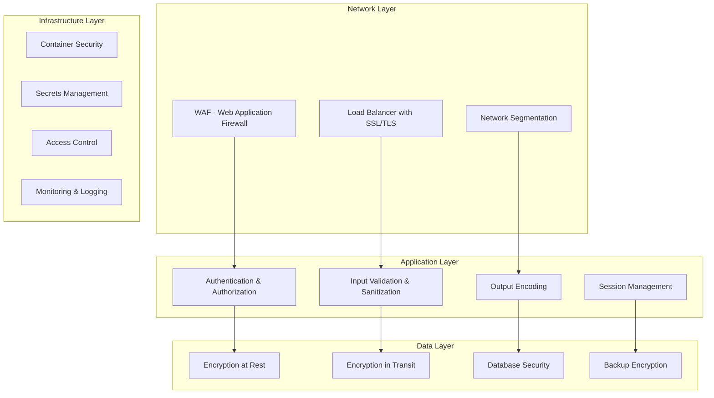
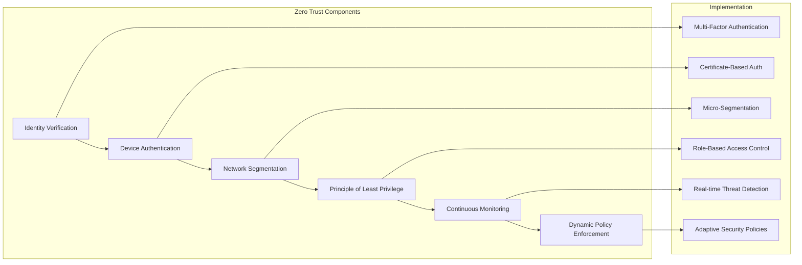
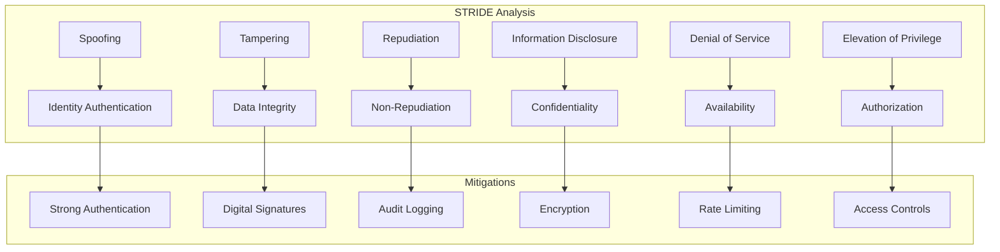

[<< Back](../../../README.md)

# Security Framework Guide

## Overview

This guide provides comprehensive security patterns, practices, and implementations for building secure software systems. It covers security by design, threat modeling, secure coding practices, and security testing integration.

## Security by Design Principles

### 1. Defense in Depth



### 2. Zero Trust Architecture



## Threat Modeling

### STRIDE Threat Model



### Security Assessment Matrix

| Component                   | Threat Level | Mitigation Strategy                        | Implementation Priority |
| --------------------------- | ------------ | ------------------------------------------ | ----------------------- |
| User Authentication         | **High**     | Multi-factor auth, OAuth 2.0 + OIDC        | **Critical**            |
| API Endpoints               | **High**     | Rate limiting, input validation, JWT       | **Critical**            |
| Data Storage                | **High**     | Encryption at rest, field-level encryption | **Critical**            |
| Inter-service Communication | **Medium**   | mTLS, service mesh security                | **High**                |
| Frontend Security           | **Medium**   | CSP, SRI, XSS protection                   | **High**                |
| Infrastructure              | **High**     | Container scanning, secrets management     | **Critical**            |

## Authentication & Authorization

### 1. OAuth 2.0 + OpenID Connect Implementation

```csharp
// Program.cs - Authentication Configuration
public static void ConfigureAuthentication(this IServiceCollection services, IConfiguration configuration)
{
    services.AddAuthentication(options =>
    {
        options.DefaultAuthenticateScheme = JwtBearerDefaults.AuthenticationScheme;
        options.DefaultChallengeScheme = JwtBearerDefaults.AuthenticationScheme;
    })
    .AddJwtBearer(options =>
    {
        options.Authority = configuration["Auth:Authority"];
        options.Audience = configuration["Auth:Audience"];
        options.RequireHttpsMetadata = true;

        options.TokenValidationParameters = new TokenValidationParameters
        {
            ValidateIssuer = true,
            ValidateAudience = true,
            ValidateLifetime = true,
            ValidateIssuerSigningKey = true,
            ClockSkew = TimeSpan.FromMinutes(1),
            RoleClaimType = ClaimTypes.Role
        };

        options.Events = new JwtBearerEvents
        {
            OnAuthenticationFailed = context =>
            {
                // Log authentication failures
                var logger = context.HttpContext.RequestServices.GetRequiredService<ILogger<Program>>();
                logger.LogWarning("Authentication failed: {Error}", context.Exception.Message);
                return Task.CompletedTask;
            },
            OnTokenValidated = context =>
            {
                // Additional token validation logic
                var logger = context.HttpContext.RequestServices.GetRequiredService<ILogger<Program>>();
                logger.LogInformation("Token validated for user: {UserId}",
                    context.Principal?.FindFirst(ClaimTypes.NameIdentifier)?.Value);
                return Task.CompletedTask;
            }
        };
    });
}

// Authorization Policies
public static void ConfigureAuthorization(this IServiceCollection services)
{
    services.AddAuthorization(options =>
    {
        // Minimum age requirement
        options.AddPolicy("MinimumAge", policy =>
            policy.Requirements.Add(new MinimumAgeRequirement(18)));

        // Role-based policies
        options.AddPolicy("AdminOnly", policy =>
            policy.RequireRole("Administrator"));

        options.AddPolicy("ManagerOrAdmin", policy =>
            policy.RequireRole("Manager", "Administrator"));

        // Claims-based policies
        options.AddPolicy("CanReadUsers", policy =>
            policy.RequireClaim("permissions", "users:read"));

        // Custom policy with multiple requirements
        options.AddPolicy("SeniorEmployee", policy =>
            policy.Requirements.Add(new SeniorEmployeeRequirement()));
    });

    // Register custom authorization handlers
    services.AddScoped<IAuthorizationHandler, MinimumAgeAuthorizationHandler>();
    services.AddScoped<IAuthorizationHandler, SeniorEmployeeAuthorizationHandler>();
}
```

### 2. Role-Based Access Control (RBAC)

```csharp
// Models/Security/Role.cs
public class Role
{
    public int Id { get; set; }
    public string Name { get; set; } = string.Empty;
    public string Description { get; set; } = string.Empty;
    public List<Permission> Permissions { get; set; } = new();
    public DateTime CreatedAt { get; set; }
    public DateTime? UpdatedAt { get; set; }
}

public class Permission
{
    public int Id { get; set; }
    public string Name { get; set; } = string.Empty;
    public string Resource { get; set; } = string.Empty;
    public string Action { get; set; } = string.Empty;
    public string Description { get; set; } = string.Empty;
}

public class UserRole
{
    public int UserId { get; set; }
    public int RoleId { get; set; }
    public DateTime AssignedAt { get; set; }
    public DateTime? ExpiresAt { get; set; }
    public User User { get; set; } = null!;
    public Role Role { get; set; } = null!;
}

// Services/Authorization/RoleBasedAuthorizationService.cs
public interface IRoleBasedAuthorizationService
{
    Task<bool> UserHasPermissionAsync(int userId, string resource, string action);
    Task<List<string>> GetUserPermissionsAsync(int userId);
    Task<bool> AssignRoleToUserAsync(int userId, int roleId, DateTime? expiresAt = null);
    Task<bool> RevokeRoleFromUserAsync(int userId, int roleId);
}

public class RoleBasedAuthorizationService : IRoleBasedAuthorizationService
{
    private readonly IUserRepository _userRepository;
    private readonly IRoleRepository _roleRepository;
    private readonly IMemoryCache _cache;
    private readonly ILogger<RoleBasedAuthorizationService> _logger;

    public RoleBasedAuthorizationService(
        IUserRepository userRepository,
        IRoleRepository roleRepository,
        IMemoryCache cache,
        ILogger<RoleBasedAuthorizationService> logger)
    {
        _userRepository = userRepository;
        _roleRepository = roleRepository;
        _cache = cache;
        _logger = logger;
    }

    public async Task<bool> UserHasPermissionAsync(int userId, string resource, string action)
    {
        try
        {
            var cacheKey = $"user_permissions_{userId}";

            if (!_cache.TryGetValue(cacheKey, out List<Permission>? permissions))
            {
                permissions = await GetUserPermissionsInternalAsync(userId);
                _cache.Set(cacheKey, permissions, TimeSpan.FromMinutes(30));
            }

            return permissions?.Any(p =>
                p.Resource.Equals(resource, StringComparison.OrdinalIgnoreCase) &&
                p.Action.Equals(action, StringComparison.OrdinalIgnoreCase)) ?? false;
        }
        catch (Exception ex)
        {
            _logger.LogError(ex, "Error checking permission for user {UserId}, resource {Resource}, action {Action}",
                userId, resource, action);
            return false;
        }
    }

    private async Task<List<Permission>> GetUserPermissionsInternalAsync(int userId)
    {
        var userRoles = await _userRepository.GetUserRolesAsync(userId);
        var permissions = new List<Permission>();

        foreach (var userRole in userRoles.Where(ur => ur.ExpiresAt == null || ur.ExpiresAt > DateTime.UtcNow))
        {
            var role = await _roleRepository.GetByIdAsync(userRole.RoleId);
            if (role?.Permissions != null)
            {
                permissions.AddRange(role.Permissions);
            }
        }

        return permissions.DistinctBy(p => new { p.Resource, p.Action }).ToList();
    }
}
```

## Secure Coding Practices

### 1. Input Validation & Sanitization

```csharp
// Validators/UserCreateRequestValidator.cs
public class UserCreateRequestValidator : AbstractValidator<UserCreateRequest>
{
    private static readonly Regex EmailRegex = new(@"^[^@\s]+@[^@\s]+\.[^@\s]+$", RegexOptions.Compiled);
    private static readonly Regex PhoneRegex = new(@"^\+?[1-9]\d{1,14}$", RegexOptions.Compiled);

    public UserCreateRequestValidator()
    {
        RuleFor(x => x.Email)
            .NotEmpty().WithMessage("Email is required")
            .MaximumLength(254).WithMessage("Email must not exceed 254 characters")
            .Must(BeAValidEmail).WithMessage("Email format is invalid")
            .MustAsync(BeUniqueEmail).WithMessage("Email already exists");

        RuleFor(x => x.FirstName)
            .NotEmpty().WithMessage("First name is required")
            .Length(2, 50).WithMessage("First name must be between 2 and 50 characters")
            .Must(ContainOnlyLetters).WithMessage("First name must contain only letters");

        RuleFor(x => x.LastName)
            .NotEmpty().WithMessage("Last name is required")
            .Length(2, 50).WithMessage("Last name must be between 2 and 50 characters")
            .Must(ContainOnlyLetters).WithMessage("Last name must contain only letters");

        RuleFor(x => x.Password)
            .NotEmpty().WithMessage("Password is required")
            .MinimumLength(12).WithMessage("Password must be at least 12 characters")
            .Must(HaveStrongPassword).WithMessage("Password must contain uppercase, lowercase, number, and special character");

        RuleFor(x => x.PhoneNumber)
            .Must(BeAValidPhoneNumber).When(x => !string.IsNullOrEmpty(x.PhoneNumber))
            .WithMessage("Phone number format is invalid");
    }

    private bool BeAValidEmail(string email)
    {
        return EmailRegex.IsMatch(email);
    }

    private bool ContainOnlyLetters(string name)
    {
        return name.All(char.IsLetter);
    }

    private bool HaveStrongPassword(string password)
    {
        return password.Any(char.IsUpper) &&
               password.Any(char.IsLower) &&
               password.Any(char.IsDigit) &&
               password.Any(c => "!@#$%^&*()_+-=[]{}|;:,.<>?".Contains(c));
    }

    private bool BeAValidPhoneNumber(string? phoneNumber)
    {
        return string.IsNullOrEmpty(phoneNumber) || PhoneRegex.IsMatch(phoneNumber);
    }

    private async Task<bool> BeUniqueEmail(string email, CancellationToken cancellationToken)
    {
        // Implement email uniqueness check
        return true; // Placeholder
    }
}

// Middleware/InputSanitizationMiddleware.cs
public class InputSanitizationMiddleware
{
    private readonly RequestDelegate _next;
    private readonly ILogger<InputSanitizationMiddleware> _logger;

    public InputSanitizationMiddleware(RequestDelegate next, ILogger<InputSanitizationMiddleware> logger)
    {
        _next = next;
        _logger = logger;
    }

    public async Task InvokeAsync(HttpContext context)
    {
        if (context.Request.HasJsonContentType())
        {
            context.Request.EnableBuffering();

            var body = await new StreamReader(context.Request.Body).ReadToEndAsync();
            context.Request.Body.Position = 0;

            if (ContainsPotentiallyMaliciousContent(body))
            {
                _logger.LogWarning("Potentially malicious content detected in request from {RemoteIpAddress}",
                    context.Connection.RemoteIpAddress);

                context.Response.StatusCode = 400;
                await context.Response.WriteAsync("Invalid request content");
                return;
            }
        }

        await _next(context);
    }

    private static bool ContainsPotentiallyMaliciousContent(string content)
    {
        var maliciousPatterns = new[]
        {
            "<script", "</script>", "javascript:", "vbscript:",
            "onload=", "onerror=", "onclick=", "onmouseover=",
            "eval(", "Function(", "setTimeout(", "setInterval(",
            "document.cookie", "document.write", "innerHTML",
            "../../", "..\\", "file://", "ftp://",
            "DROP TABLE", "DELETE FROM", "UPDATE SET", "INSERT INTO",
            "UNION SELECT", "OR 1=1", "' OR '1'='1", "; --"
        };

        return maliciousPatterns.Any(pattern =>
            content.Contains(pattern, StringComparison.OrdinalIgnoreCase));
    }
}
```

### 2. SQL Injection Prevention

```csharp
// Data/Repositories/UserRepository.cs
public class UserRepository : IUserRepository
{
    private readonly DbContext _context;
    private readonly ILogger<UserRepository> _logger;

    public UserRepository(DbContext context, ILogger<UserRepository> logger)
    {
        _context = context;
        _logger = logger;
    }

    // ✅ GOOD: Using parameterized queries
    public async Task<User?> GetByEmailAsync(string email)
    {
        return await _context.Users
            .Where(u => u.Email == email) // EF Core handles parameterization
            .FirstOrDefaultAsync();
    }

    // ✅ GOOD: Using stored procedures with parameters
    public async Task<List<User>> SearchUsersAsync(string searchTerm, int limit = 50)
    {
        var searchParam = new SqlParameter("@SearchTerm", $"%{searchTerm}%");
        var limitParam = new SqlParameter("@Limit", limit);

        return await _context.Users
            .FromSqlRaw("EXEC SearchUsers @SearchTerm, @Limit", searchParam, limitParam)
            .ToListAsync();
    }

    // ✅ GOOD: Using raw SQL with proper parameterization
    public async Task<bool> UpdateUserStatusAsync(int userId, string status)
    {
        var affectedRows = await _context.Database.ExecuteSqlInterpolatedAsync(
            $"UPDATE Users SET Status = {status}, UpdatedAt = {DateTime.UtcNow} WHERE Id = {userId}");

        return affectedRows > 0;
    }

    // ❌ BAD: Never do this - SQL injection vulnerability
    // public async Task<User?> GetUserByIdUnsafe(string userId)
    // {
    //     var sql = $"SELECT * FROM Users WHERE Id = {userId}";
    //     return await _context.Users.FromSqlRaw(sql).FirstOrDefaultAsync();
    // }
}
```

### 3. Cross-Site Scripting (XSS) Prevention

```csharp
// Frontend Security Headers
public class SecurityHeadersMiddleware
{
    private readonly RequestDelegate _next;

    public SecurityHeadersMiddleware(RequestDelegate next)
    {
        _next = next;
    }

    public async Task InvokeAsync(HttpContext context)
    {
        // Content Security Policy
        context.Response.Headers.Add("Content-Security-Policy",
            "default-src 'self'; " +
            "script-src 'self' 'unsafe-inline' https://cdn.jsdelivr.net; " +
            "style-src 'self' 'unsafe-inline' https://fonts.googleapis.com; " +
            "font-src 'self' https://fonts.gstatic.com; " +
            "img-src 'self' data: https:; " +
            "connect-src 'self' https://api.example.com;");

        // X-Frame-Options
        context.Response.Headers.Add("X-Frame-Options", "DENY");

        // X-Content-Type-Options
        context.Response.Headers.Add("X-Content-Type-Options", "nosniff");

        // X-XSS-Protection
        context.Response.Headers.Add("X-XSS-Protection", "1; mode=block");

        // Referrer Policy
        context.Response.Headers.Add("Referrer-Policy", "strict-origin-when-cross-origin");

        // Strict Transport Security
        if (context.Request.IsHttps)
        {
            context.Response.Headers.Add("Strict-Transport-Security",
                "max-age=31536000; includeSubDomains; preload");
        }

        await _next(context);
    }
}

// HTML Encoding Service
public interface IHtmlEncodingService
{
    string EncodeForHtml(string input);
    string EncodeForHtmlAttribute(string input);
    string EncodeForJavaScript(string input);
    string EncodeForUrl(string input);
}

public class HtmlEncodingService : IHtmlEncodingService
{
    private readonly HtmlEncoder _htmlEncoder;
    private readonly JavaScriptEncoder _jsEncoder;
    private readonly UrlEncoder _urlEncoder;

    public HtmlEncodingService()
    {
        _htmlEncoder = HtmlEncoder.Create(UnicodeRanges.BasicLatin, UnicodeRanges.Latin1Supplement);
        _jsEncoder = JavaScriptEncoder.Create(UnicodeRanges.BasicLatin, UnicodeRanges.Latin1Supplement);
        _urlEncoder = UrlEncoder.Create(UnicodeRanges.BasicLatin, UnicodeRanges.Latin1Supplement);
    }

    public string EncodeForHtml(string input) => _htmlEncoder.Encode(input);
    public string EncodeForHtmlAttribute(string input) => _htmlEncoder.Encode(input);
    public string EncodeForJavaScript(string input) => _jsEncoder.Encode(input);
    public string EncodeForUrl(string input) => _urlEncoder.Encode(input);
}
```

## Data Protection & Encryption

### 1. Encryption at Rest

```csharp
// Services/Encryption/FieldEncryptionService.cs
public interface IFieldEncryptionService
{
    string EncryptField(string plainText, string fieldName);
    string DecryptField(string encryptedText, string fieldName);
    Task<string> EncryptSensitiveDataAsync(string data);
    Task<string> DecryptSensitiveDataAsync(string encryptedData);
}

public class FieldEncryptionService : IFieldEncryptionService
{
    private readonly IDataProtectionProvider _dataProtectionProvider;
    private readonly IKeyVaultService _keyVaultService;
    private readonly ILogger<FieldEncryptionService> _logger;

    public FieldEncryptionService(
        IDataProtectionProvider dataProtectionProvider,
        IKeyVaultService keyVaultService,
        ILogger<FieldEncryptionService> logger)
    {
        _dataProtectionProvider = dataProtectionProvider;
        _keyVaultService = keyVaultService;
        _logger = logger;
    }

    public string EncryptField(string plainText, string fieldName)
    {
        try
        {
            var protector = _dataProtectionProvider.CreateProtector($"FieldEncryption.{fieldName}");
            return protector.Protect(plainText);
        }
        catch (Exception ex)
        {
            _logger.LogError(ex, "Failed to encrypt field {FieldName}", fieldName);
            throw;
        }
    }

    public string DecryptField(string encryptedText, string fieldName)
    {
        try
        {
            var protector = _dataProtectionProvider.CreateProtector($"FieldEncryption.{fieldName}");
            return protector.Unprotect(encryptedText);
        }
        catch (Exception ex)
        {
            _logger.LogError(ex, "Failed to decrypt field {FieldName}", fieldName);
            throw;
        }
    }

    public async Task<string> EncryptSensitiveDataAsync(string data)
    {
        try
        {
            var encryptionKey = await _keyVaultService.GetSecretAsync("data-encryption-key");

            using var aes = Aes.Create();
            aes.Key = Convert.FromBase64String(encryptionKey);
            aes.GenerateIV();

            using var encryptor = aes.CreateEncryptor();
            using var msEncrypt = new MemoryStream();
            using var csEncrypt = new CryptoStream(msEncrypt, encryptor, CryptoStreamMode.Write);
            using var swEncrypt = new StreamWriter(csEncrypt);

            swEncrypt.Write(data);
            csEncrypt.FlushFinalBlock();

            var iv = aes.IV;
            var encryptedBytes = msEncrypt.ToArray();
            var result = new byte[iv.Length + encryptedBytes.Length];

            Buffer.BlockCopy(iv, 0, result, 0, iv.Length);
            Buffer.BlockCopy(encryptedBytes, 0, result, iv.Length, encryptedBytes.Length);

            return Convert.ToBase64String(result);
        }
        catch (Exception ex)
        {
            _logger.LogError(ex, "Failed to encrypt sensitive data");
            throw;
        }
    }
}

// Entity Framework Value Converters for Automatic Encryption
public class EncryptedStringConverter : ValueConverter<string, string>
{
    public EncryptedStringConverter(IFieldEncryptionService encryptionService, string fieldName)
        : base(
            plainText => encryptionService.EncryptField(plainText, fieldName),
            encryptedText => encryptionService.DecryptField(encryptedText, fieldName))
    {
    }
}

// Usage in DbContext
public class ApplicationDbContext : DbContext
{
    private readonly IFieldEncryptionService _encryptionService;

    public ApplicationDbContext(DbContextOptions<ApplicationDbContext> options,
        IFieldEncryptionService encryptionService) : base(options)
    {
        _encryptionService = encryptionService;
    }

    protected override void OnModelCreating(ModelBuilder modelBuilder)
    {
        // Encrypt sensitive fields
        modelBuilder.Entity<User>()
            .Property(e => e.SocialSecurityNumber)
            .HasConversion(new EncryptedStringConverter(_encryptionService, "SSN"));

        modelBuilder.Entity<PaymentMethod>()
            .Property(e => e.CardNumber)
            .HasConversion(new EncryptedStringConverter(_encryptionService, "CardNumber"));
    }
}
```

### 2. Secrets Management

```csharp
// Services/Secrets/KeyVaultService.cs
public interface IKeyVaultService
{
    Task<string> GetSecretAsync(string secretName);
    Task SetSecretAsync(string secretName, string secretValue);
    Task<bool> DeleteSecretAsync(string secretName);
    Task<Dictionary<string, string>> GetSecretsAsync(string[] secretNames);
}

public class KeyVaultService : IKeyVaultService
{
    private readonly SecretClient _secretClient;
    private readonly IMemoryCache _cache;
    private readonly ILogger<KeyVaultService> _logger;

    public KeyVaultService(SecretClient secretClient, IMemoryCache cache, ILogger<KeyVaultService> logger)
    {
        _secretClient = secretClient;
        _cache = cache;
        _logger = logger;
    }

    public async Task<string> GetSecretAsync(string secretName)
    {
        var cacheKey = $"secret:{secretName}";

        if (_cache.TryGetValue(cacheKey, out string? cachedSecret))
        {
            return cachedSecret!;
        }

        try
        {
            var secret = await _secretClient.GetSecretAsync(secretName);

            // Cache for 15 minutes
            _cache.Set(cacheKey, secret.Value.Value, TimeSpan.FromMinutes(15));

            return secret.Value.Value;
        }
        catch (Exception ex)
        {
            _logger.LogError(ex, "Failed to retrieve secret {SecretName}", secretName);
            throw;
        }
    }

    public async Task SetSecretAsync(string secretName, string secretValue)
    {
        try
        {
            await _secretClient.SetSecretAsync(secretName, secretValue);

            // Invalidate cache
            _cache.Remove($"secret:{secretName}");

            _logger.LogInformation("Secret {SecretName} updated successfully", secretName);
        }
        catch (Exception ex)
        {
            _logger.LogError(ex, "Failed to set secret {SecretName}", secretName);
            throw;
        }
    }
}

// Configuration Service with Secrets Integration
public class SecureConfigurationService
{
    private readonly IKeyVaultService _keyVaultService;
    private readonly IConfiguration _configuration;
    private readonly ILogger<SecureConfigurationService> _logger;

    public SecureConfigurationService(
        IKeyVaultService keyVaultService,
        IConfiguration configuration,
        ILogger<SecureConfigurationService> logger)
    {
        _keyVaultService = keyVaultService;
        _configuration = configuration;
        _logger = logger;
    }

    public async Task<string> GetConnectionStringAsync(string name)
    {
        try
        {
            // Try to get from Key Vault first
            var secretName = $"connectionstring-{name.ToLowerInvariant()}";
            return await _keyVaultService.GetSecretAsync(secretName);
        }
        catch
        {
            // Fallback to configuration
            var connectionString = _configuration.GetConnectionString(name);
            if (string.IsNullOrEmpty(connectionString))
            {
                throw new InvalidOperationException($"Connection string '{name}' not found");
            }
            return connectionString;
        }
    }

    public async Task<T> GetConfigurationAsync<T>(string sectionName) where T : class, new()
    {
        var config = new T();
        var section = _configuration.GetSection(sectionName);

        // Bind configuration
        section.Bind(config);

        // Replace secrets placeholders
        await ReplaceSecretsInConfiguration(config);

        return config;
    }

    private async Task ReplaceSecretsInConfiguration<T>(T config) where T : class
    {
        var properties = typeof(T).GetProperties();

        foreach (var property in properties)
        {
            if (property.PropertyType == typeof(string))
            {
                var value = property.GetValue(config) as string;
                if (!string.IsNullOrEmpty(value) && value.StartsWith("secret:"))
                {
                    var secretName = value.Substring(7); // Remove "secret:" prefix
                    var secretValue = await _keyVaultService.GetSecretAsync(secretName);
                    property.SetValue(config, secretValue);
                }
            }
        }
    }
}
```

## Security Testing Integration

### 1. Automated Security Testing

```yaml
# .github/workflows/security-testing.yml
name: Security Testing Pipeline

on:
  push:
    branches: [main, develop]
  pull_request:
    branches: [main]

jobs:
  # === SAST - Static Application Security Testing ===
  static-analysis:
    runs-on: ubuntu-latest
    steps:
      - uses: actions/checkout@v4

      - name: Run CodeQL Analysis
        uses: github/codeql-action/init@v3
        with:
          languages: csharp, javascript

      - name: Autobuild
        uses: github/codeql-action/autobuild@v3

      - name: Perform CodeQL Analysis
        uses: github/codeql-action/analyze@v3

      - name: SonarQube Security Scan
        uses: sonarqube-quality-gate-action@master
        env:
          SONAR_TOKEN: ${{ secrets.SONAR_TOKEN }}

      - name: Semgrep Security Scan
        uses: returntocorp/semgrep-action@v1
        with:
          config: >-
            p/security-audit
            p/secrets
            p/owasp-top-ten

  # === Dependency Scanning ===
  dependency-scan:
    runs-on: ubuntu-latest
    steps:
      - uses: actions/checkout@v4

      - name: Run Snyk to check for vulnerabilities
        uses: snyk/actions/dotnet@master
        env:
          SNYK_TOKEN: ${{ secrets.SNYK_TOKEN }}
        with:
          args: --severity-threshold=high

      - name: OWASP Dependency Check
        uses: dependency-check/Dependency-Check_Action@main
        with:
          project: "myproject"
          path: "."
          format: "ALL"
          args: >
            --enableRetired
            --enableExperimental
            --failOnCVSS 7

  # === Container Security Scanning ===
  container-scan:
    runs-on: ubuntu-latest
    steps:
      - uses: actions/checkout@v4

      - name: Build Docker image
        run: docker build -t myapp:test .

      - name: Run Trivy vulnerability scanner
        uses: aquasecurity/trivy-action@master
        with:
          image-ref: "myapp:test"
          format: "sarif"
          output: "trivy-results.sarif"

      - name: Upload Trivy scan results
        uses: github/codeql-action/upload-sarif@v3
        with:
          sarif_file: "trivy-results.sarif"

  # === DAST - Dynamic Application Security Testing ===
  dynamic-security-test:
    needs: [static-analysis, dependency-scan]
    runs-on: ubuntu-latest
    services:
      app:
        image: myapp:test
        ports:
          - 8080:80

    steps:
      - name: Wait for application to start
        run: |
          timeout 300 bash -c 'until curl -f http://localhost:8080/health; do sleep 5; done'

      - name: OWASP ZAP Baseline Scan
        uses: zaproxy/action-baseline@v0.7.0
        with:
          target: "http://localhost:8080"
          rules_file_name: ".zap/rules.tsv"
          cmd_options: "-a"

      - name: OWASP ZAP Full Scan
        uses: zaproxy/action-full-scan@v0.4.0
        with:
          target: "http://localhost:8080"
          rules_file_name: ".zap/rules.tsv"
          cmd_options: "-a"

  # === API Security Testing ===
  api-security-test:
    runs-on: ubuntu-latest
    steps:
      - uses: actions/checkout@v4

      - name: API Security Testing with Postman
        run: |
          npm install -g newman
          newman run tests/security/api-security-tests.json \
            --environment tests/security/test-environment.json \
            --reporters cli,json \
            --reporter-json-export results.json

      - name: Upload test results
        uses: actions/upload-artifact@v4
        if: always()
        with:
          name: api-security-results
          path: results.json
```

### 2. Security Test Cases

```csharp
// Tests/Security/AuthenticationSecurityTests.cs
[TestClass]
public class AuthenticationSecurityTests
{
    private readonly TestContext _context;
    private readonly ITestOutputHelper _output;

    public AuthenticationSecurityTests(ITestOutputHelper output)
    {
        _output = output;
        _context = new TestContextBuilder()
            .WithInMemoryDatabase()
            .WithTestAuthentication()
            .Build();
    }

    [TestMethod]
    public async Task Authentication_ShouldRejectInvalidTokens()
    {
        // Arrange
        var client = _context.CreateClient();
        var invalidToken = "invalid.jwt.token";

        // Act
        client.DefaultRequestHeaders.Authorization = new AuthenticationHeaderValue("Bearer", invalidToken);
        var response = await client.GetAsync("/api/users/profile");

        // Assert
        Assert.AreEqual(HttpStatusCode.Unauthorized, response.StatusCode);
    }

    [TestMethod]
    public async Task Authentication_ShouldRejectExpiredTokens()
    {
        // Arrange
        var client = _context.CreateClient();
        var expiredToken = GenerateExpiredJwtToken();

        // Act
        client.DefaultRequestHeaders.Authorization = new AuthenticationHeaderValue("Bearer", expiredToken);
        var response = await client.GetAsync("/api/users/profile");

        // Assert
        Assert.AreEqual(HttpStatusCode.Unauthorized, response.StatusCode);
    }

    [TestMethod]
    public async Task RateLimiting_ShouldBlockExcessiveRequests()
    {
        // Arrange
        var client = _context.CreateClient();
        var tasks = new List<Task<HttpResponseMessage>>();

        // Act - Send 100 concurrent requests
        for (int i = 0; i < 100; i++)
        {
            tasks.Add(client.GetAsync("/api/auth/login"));
        }

        var responses = await Task.WhenAll(tasks);

        // Assert - Should have some 429 (Too Many Requests) responses
        var tooManyRequestsCount = responses.Count(r => r.StatusCode == HttpStatusCode.TooManyRequests);
        Assert.IsTrue(tooManyRequestsCount > 0, "Rate limiting should block excessive requests");
    }

    [TestMethod]
    public async Task InputValidation_ShouldRejectSqlInjectionAttempts()
    {
        // Arrange
        var client = _context.CreateClient();
        var maliciousInputs = new[]
        {
            "'; DROP TABLE Users; --",
            "' OR '1'='1",
            "admin' --",
            "' UNION SELECT * FROM Users --"
        };

        // Act & Assert
        foreach (var maliciousInput in maliciousInputs)
        {
            var loginRequest = new { Email = maliciousInput, Password = "password" };
            var response = await client.PostAsJsonAsync("/api/auth/login", loginRequest);

            // Should return 400 Bad Request, not 500 Internal Server Error
            Assert.IsTrue(response.StatusCode == HttpStatusCode.BadRequest ||
                         response.StatusCode == HttpStatusCode.Unauthorized,
                         $"SQL injection attempt should be handled gracefully: {maliciousInput}");
        }
    }

    [TestMethod]
    public async Task XssProtection_ShouldSanitizeUserInput()
    {
        // Arrange
        var client = _context.CreateAuthenticatedClient();
        var xssPayloads = new[]
        {
            "<script>alert('xss')</script>",
            "",
            "javascript:alert('xss')",
            "<svg onload=alert('xss')>"
        };

        // Act & Assert
        foreach (var payload in xssPayloads)
        {
            var userUpdate = new { FirstName = payload };
            var response = await client.PutAsJsonAsync("/api/users/profile", userUpdate);

            Assert.AreEqual(HttpStatusCode.BadRequest, response.StatusCode,
                $"XSS payload should be rejected: {payload}");
        }
    }

    private string GenerateExpiredJwtToken()
    {
        var key = new SymmetricSecurityKey(Encoding.UTF8.GetBytes("test-key-that-is-long-enough-for-hmac-sha256"));
        var credentials = new SigningCredentials(key, SecurityAlgorithms.HmacSha256);

        var token = new JwtSecurityToken(
            issuer: "test-issuer",
            audience: "test-audience",
            expires: DateTime.UtcNow.AddMinutes(-1), // Expired 1 minute ago
            signingCredentials: credentials
        );

        return new JwtSecurityTokenHandler().WriteToken(token);
    }
}
```

## Integration with AI Agent

### Automatic Security Implementation

The AI agent should automatically implement security measures based on:

1. **Project Type Detection:**

   - Web Applications → CSRF protection, XSS prevention, secure headers
   - APIs → Rate limiting, input validation, JWT authentication
   - Microservices → mTLS, service mesh security, distributed tracing
   - Data-intensive → Field-level encryption, audit logging, data classification

2. **Threat Level Assessment:**

   - **High-risk applications** (financial, healthcare) → Advanced encryption, comprehensive audit trails
   - **Medium-risk applications** → Standard security controls, regular scanning
   - **Low-risk applications** → Basic security measures, automated scanning

3. **Compliance Requirements:**

   - **GDPR** → Data minimization, consent management, right to erasure
   - **HIPAA** → PHI encryption, access controls, audit logging
   - **PCI DSS** → Payment data protection, secure transmission, tokenization
   - **SOX** → Data integrity, access controls, audit trails

4. **Security Testing Integration:**

   - Automatically add appropriate security tests based on application type
   - Configure security scanning tools in CI/CD pipeline
   - Set up security monitoring and alerting

5. **Secure Development Lifecycle:**
   - Implement security checkpoints in the development process
   - Automate security code reviews
   - Integrate threat modeling into design phase
   - Set up vulnerability management processes

This security framework ensures that every application built with the AI agent follows security best practices from the ground up, making security a core part of the development process rather than an afterthought.

[<< Back](../../../README.md)
