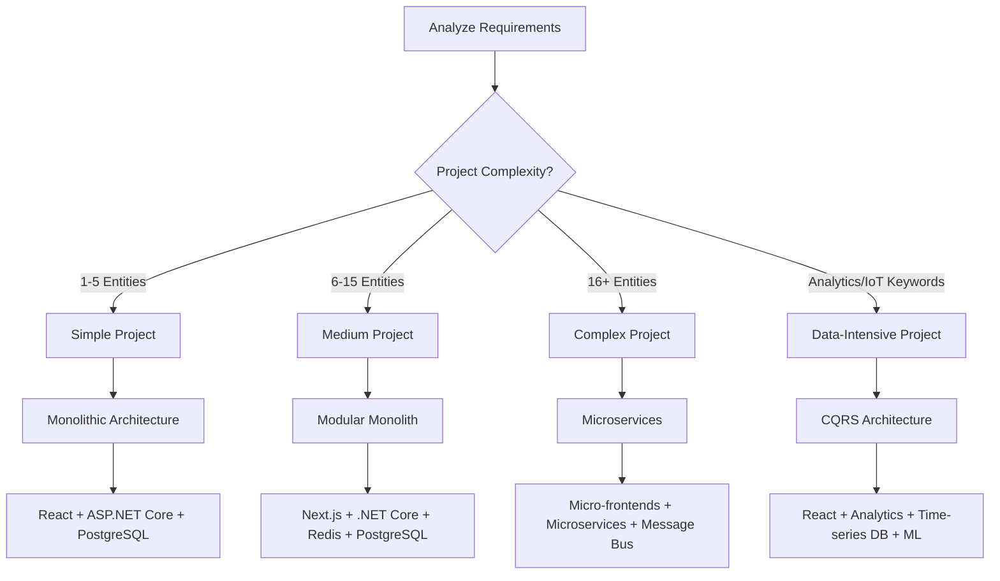
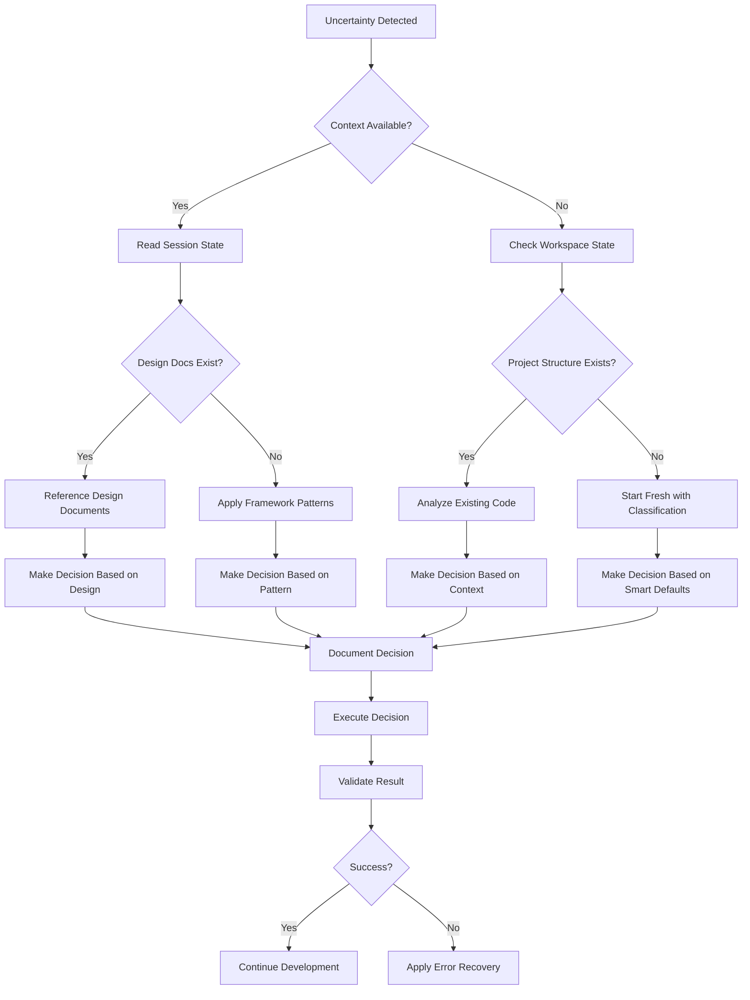

# 🎯 Smart Decision Tree Implementation Guide

## AI Agent Decision-Making Automation

This guide provides AI agents with structured decision trees and protocols for autonomous navigation through complex development scenarios while maintaining framework compliance and quality standards.

## 1. Architecture Decision Tree

### Technology Stack Selection Decision Flow



### Framework Pattern Selection

```markdown
**Decision Matrix:**

IF project has:

- User management + CRUD operations → task-manager pattern
- Payment processing + inventory → ecommerce pattern
- Real-time feeds + social features → social-media pattern
- Analytics + time-series data → iot-dashboard pattern

**Implementation Steps:**

1. Identify matching pattern automatically
2. Read corresponding example documentation
3. Apply architectural decisions from example
4. Adapt patterns to specific requirements
5. Document pattern selection reasoning
```

## 2. Development Phase Navigation

### Discovery Phase Decision Tree

```markdown
**Requirements Gathering Protocol:**

START → Gather Initial Requirements
├── Technical Requirements Clear?
│ ├── YES → Proceed to Architecture Design
│ └── NO → Ask 1 clarifying question, then proceed
├── Visual Design Direction Provided?
│ ├── YES → Process design inspiration
│ └── NO → Apply persistent visual direction gathering
├── Performance Requirements Specified?
│ ├── YES → Factor into architecture decisions
│ └── NO → Apply smart defaults based on project type
└── Security Requirements Identified?
├── YES → Apply appropriate security patterns
└── NO → Apply framework security defaults

**Auto-Progression Rules:**

- After 3 requirements questions → Move to architecture
- If user provides visual inspiration → Process immediately
- If requirements are comprehensive → Skip detailed questions
- Always prefer framework smart defaults over questioning
```

### Implementation Phase Decision Tree

```markdown
**Component Implementation Priority:**

START → Review Design Documents
├── Backend First Approach:
│ ├── Database Models → Repositories → Services → Controllers
│ ├── Run tests after each layer
│ └── Verify API endpoints work
├── Frontend Integration:
│ ├── API client setup → UI components → Pages → Navigation
│ ├── Apply design system consistently
│ └── Test responsive behavior
└── Quality Gates:
├── Linting compliance → Build success → Test coverage
├── Security scan → Performance check
└── Design document alignment verification

**Decision Points:**

- Build fails → Execute error recovery protocol
- Tests fail → Fix business logic, don't skip
- Design misalignment → Update implementation to match design
- Quality gates fail → Auto-fix where possible, escalate if critical
```

## 3. Uncertainty Resolution Decision Tree

### When AI Agent Is Uncertain



### Uncertainty Categories & Responses

```markdown
**Technical Implementation Uncertainty:**

1. Check framework documentation for patterns
2. Reference matching example project
3. Apply iDesign architectural principles
4. Default to simple, working solution
5. Document decision for consistency

**Business Logic Uncertainty:**

1. Reference use case design documents
2. Apply common business patterns
3. Implement validation and error handling
4. Add comprehensive tests
5. Make implementation extensible

**UI/UX Design Uncertainty:**

1. Reference frontend design documents
2. Apply design system consistently
3. Follow accessibility best practices
4. Implement responsive design patterns
5. Use proven UI component libraries

**DevOps/Deployment Uncertainty:**

1. Apply framework CI/CD templates
2. Use containerization patterns
3. Implement monitoring and logging
4. Apply security best practices
5. Document deployment procedures
```

## 4. Quality Gate Decision Protocol

### Continuous Quality Decision Tree

```markdown
**After Each Component Implementation:**

Quality Check → Linting Status?
├── Pass → Continue to Build Check
├── Fail → Auto-fix if possible → Re-check
└── Critical Issues → Stop and resolve manually

Build Check → Compilation Status?
├── Pass → Continue to Test Check  
├── Fail → Apply build error recovery → Re-check
└── Dependency Issues → Install/update packages → Re-check

Test Check → Test Results?
├── Pass → Continue to Security Check
├── Fail → Fix business logic → Re-check
└── Coverage Low → Add missing tests → Re-check

Security Check → Vulnerability Scan?
├── Pass → Continue to Performance Check
├── Fail → Update dependencies → Re-check
└── Critical Issues → Apply security patches → Re-check

Performance Check → Benchmark Results?
├── Pass → Mark Component Complete
├── Fail → Apply optimizations → Re-check
└── Regression → Investigate and fix → Re-check
```

### Quality Gate Automation Commands

```bash
# Automated quality gate sequence
npm run lint:fix && \
npm run build && \
npm run test:coverage && \
npm audit fix && \
npm run build:prod

# Backend quality gate sequence
dotnet format && \
dotnet build --verbosity minimal && \
dotnet test --collect:"XPlat Code Coverage" && \
dotnet build --configuration Release
```

## 5. Error Recovery Decision Matrix

### Error Classification & Response

```markdown
**Build Errors:**
├── Syntax Errors → Auto-fix with formatting tools
├── Type Errors → Update type definitions
├── Import Errors → Install missing packages
├── Configuration Errors → Update config files
└── Environment Errors → Set environment variables

**Test Errors:**
├── Unit Test Failures → Fix business logic
├── Integration Test Failures → Check service setup
├── E2E Test Failures → Update UI components
├── Coverage Issues → Add missing tests
└── Performance Test Failures → Optimize code

**Deployment Errors:**
├── Docker Build Failures → Fix Dockerfile
├── Environment Issues → Update configurations
├── Database Migration Errors → Fix schema changes
├── Service Connection Issues → Update connection strings
└── Security Scan Failures → Update dependencies

**Recovery Decision Flow:**

1. Classify error type automatically
2. Check if auto-resolvable
3. Apply appropriate resolution strategy
4. Validate fix effectiveness
5. Update session state with resolution
```

## 6. Framework Compliance Decision Tree

### Architecture Compliance Validation

```markdown
**iDesign Pattern Compliance:**

Component Created → Check Layer Assignment
├── Is it a Manager? → Should handle HTTP/orchestration only
├── Is it an Engine? → Should contain business logic only  
├── Is it Data Access? → Should handle data operations only
└── Mixed Concerns? → Refactor into proper layers

Dependency Direction → Check Dependencies
├── Manager → Engine → Data Access? → ✅ Compliant
├── Cross-layer dependencies? → ❌ Refactor needed
├── Circular dependencies? → ❌ Break cycles
└── Framework violations? → ❌ Apply clean architecture

**Compliance Auto-Fixes:**

- Extract business logic to Engine layer
- Move data operations to Data Access layer
- Update dependency injection registrations
- Apply proper interface abstractions
```

### Code Quality Compliance

```markdown
**Quality Standards Checklist:**

Code Created → Run Quality Checks
├── Linting Compliance?
│ ├── ✅ Pass → Continue
│ └── ❌ Fail → Auto-fix with tools
├── Test Coverage?
│ ├── ✅ >90% → Continue
│ └── ❌ <90% → Add missing tests
├── Security Scan?
│ ├── ✅ Clean → Continue
│ └── ❌ Issues → Apply security fixes
└── Performance Check?
├── ✅ Within limits → Mark complete
└── ❌ Issues → Apply optimizations

**Auto-Resolution Commands:**

- npm run lint:fix → Fix linting issues
- npm run test:generate → Generate missing tests
- npm audit fix → Fix security vulnerabilities
- npm run optimize → Apply performance optimizations
```

## 7. AI Agent Decision Automation

### Smart Default Application

```markdown
**Technology Defaults by Project Type:**

Simple Projects:

- Database: PostgreSQL (reliable, full-featured)
- Backend: ASP.NET Core (mature, performant)
- Frontend: React + TypeScript (proven, maintainable)
- Auth: JWT (simple, stateless)
- Deployment: Docker (portable, scalable)

Medium Projects:

- Add: Redis (caching), MediatR (CQRS), FluentValidation
- Upgrade: Next.js (SSR), Entity Framework (ORM)
- Include: Role-based auth, API versioning

Complex Projects:

- Add: Message bus, API gateway, microservices
- Include: Distributed caching, event sourcing
- Implement: Service mesh, monitoring

**Application Protocol:**

1. Detect project characteristics
2. Apply appropriate defaults automatically
3. Document decisions in session state
4. Proceed without asking for confirmation
5. Allow overrides if user specifies alternatives
```

### Decision Documentation Protocol

```markdown
**Decision Tracking Format:**

📋 **DECISION: [Decision Name]**
🔍 **Context**: [Why decision was needed]
🎯 **Options Considered**: [Alternatives evaluated]
✅ **Decision Made**: [Final choice and reasoning]
📚 **Framework Reference**: [Which docs/patterns influenced decision]
⏰ **Timestamp**: [When decision was made]
🔄 **Impact**: [What this affects downstream]

**Storage Location**: .github/progress/decisions.md
**Update Frequency**: After each major decision
**Review Trigger**: Before milestone completion
```

## 8. Implementation Instructions for AI Agents

### Decision Automation Setup

```markdown
**1. Initialize Decision Context:**

- Read session state to understand current situation
- Review project requirements and constraints
- Identify applicable framework patterns
- Set up decision tracking system

**2. Apply Decision Trees:**

- Use appropriate decision tree for current phase
- Follow decision paths systematically
- Document decisions and reasoning
- Update session state with outcomes

**3. Validate Decisions:**

- Check framework compliance
- Verify quality standards met
- Ensure architectural consistency
- Test decision outcomes
```

### Decision Tree Execution

```javascript
// Pseudo-code for decision tree execution
class DecisionEngine {
  async makeArchitectureDecision(requirements) {
    const complexity = this.analyzeComplexity(requirements);
    const features = this.extractFeatures(requirements);

    if (features.includes("analytics") || features.includes("iot")) {
      return this.applyCQRSPattern();
    } else if (complexity > 15) {
      return this.applyMicroservicesPattern();
    } else if (complexity > 5) {
      return this.applyModularMonolithPattern();
    } else {
      return this.applyMonolithicPattern();
    }
  }

  async resolveUncertainty(context) {
    if (context.sessionState) {
      return this.readSessionStateAndDecide();
    } else if (context.designDocs) {
      return this.referenceDesignDocsAndDecide();
    } else {
      return this.applyFrameworkDefaultsAndDecide();
    }
  }
}
```

This smart decision tree system enables AI agents to navigate complex development scenarios autonomously while maintaining consistency with framework principles and quality standards, reducing the need for user intervention and ensuring production-ready outcomes.
