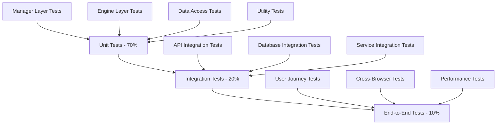

# Testing Strategy Guide

This document provides comprehensive testing strategies and patterns for different project types, following the iDesign architecture principles.

## Testing Pyramid Overview



## Test Strategy by Project Type

### Web Applications
```yaml
Testing Approach:
  Frontend:
    - Component Tests: React Testing Library + Jest
    - Visual Regression: Chromatic or Percy
    - Accessibility: axe-core integration
    - Performance: Lighthouse CI
  Backend:
    - Unit Tests: xUnit with Moq
    - API Tests: ASP.NET Core TestHost
    - Database Tests: In-memory provider or TestContainers
  E2E:
    - Framework: Playwright
    - Coverage: Critical user journeys
    - Environments: Chrome, Firefox, Safari
```

### Microservices
```yaml
Testing Approach:
  Service Tests:
    - Contract Tests: Pact.NET
    - Service Isolation: TestContainers
    - Message Testing: In-memory message bus
  Integration:
    - API Gateway Tests: Mock downstream services
    - Event Flow Tests: End-to-end message processing
    - Health Check Tests: Service availability
  Chaos Testing:
    - Network partitioning simulation
    - Service failure simulation
    - Resource exhaustion testing
```

### Data-Intensive Applications
```yaml
Testing Approach:
  Data Layer:
    - Repository Tests: Real database with transactions
    - Query Performance: Execution plan analysis
    - Data Migration Tests: Schema versioning
  CQRS Testing:
    - Command Handler Tests: Business logic validation
    - Query Handler Tests: Read model consistency
    - Event Sourcing Tests: Event replay scenarios
  Performance:
    - Load Testing: NBomber or k6
    - Database Load: Connection pooling stress
    - Caching Tests: Cache hit/miss scenarios
```

### Mobile-Backend Applications
```yaml
Testing Approach:
  API Testing:
    - Mobile-specific Headers: User-Agent, device info
    - Offline Scenarios: Connection interruption
    - Payload Optimization: Response size validation
  Authentication:
    - OAuth Flow Tests: Mobile-specific grants
    - Token Refresh Tests: Background refresh
    - Security Tests: Token validation
  Push Notifications:
    - Delivery Tests: FCM/APNS integration
    - Batch Processing: Large recipient lists
    - Failure Handling: Invalid tokens
```

## Testing Patterns by Architecture Layer

### Manager Layer Testing
```csharp
// Manager layer focuses on business logic orchestration
[Test]
public async Task ProcessOrder_ValidOrder_ShouldCompleteSuccessfully()
{
    // Arrange
    var mockInventoryEngine = new Mock<IInventoryEngine>();
    var mockPaymentEngine = new Mock<IPaymentEngine>();
    var mockNotificationEngine = new Mock<INotificationEngine>();
    
    var orderManager = new OrderManager(
        mockInventoryEngine.Object,
        mockPaymentEngine.Object,
        mockNotificationEngine.Object);
    
    var order = new Order { /* test data */ };
    
    mockInventoryEngine
        .Setup(x => x.ReserveItemsAsync(It.IsAny<IEnumerable<OrderItem>>()))
        .ReturnsAsync(new InventoryReservation { Success = true });
    
    // Act
    var result = await orderManager.ProcessOrderAsync(order);
    
    // Assert
    Assert.True(result.Success);
    mockInventoryEngine.Verify(x => x.ReserveItemsAsync(It.IsAny<IEnumerable<OrderItem>>()), Times.Once);
    mockPaymentEngine.Verify(x => x.ProcessPaymentAsync(It.IsAny<PaymentRequest>()), Times.Once);
}
```

### Engine Layer Testing
```csharp
// Engine layer focuses on core business rules and validation
[Test]
public async Task CalculateShipping_ValidAddress_ShouldReturnCorrectRate()
{
    // Arrange
    var mockAddressValidator = new Mock<IAddressValidationService>();
    var mockShippingRateProvider = new Mock<IShippingRateProvider>();
    
    var shippingEngine = new ShippingEngine(
        mockAddressValidator.Object,
        mockShippingRateProvider.Object);
    
    var address = new Address { /* test data */ };
    var package = new Package { Weight = 2.5m, Dimensions = new Dimensions(10, 10, 5) };
    
    mockAddressValidator
        .Setup(x => x.ValidateAsync(address))
        .ReturnsAsync(new ValidationResult { IsValid = true });
    
    // Act
    var rate = await shippingEngine.CalculateShippingRateAsync(address, package);
    
    // Assert
    Assert.NotNull(rate);
    Assert.True(rate.Amount > 0);
}
```

### Data Access Layer Testing
```csharp
// Data access layer focuses on data persistence and retrieval
[Test]
public async Task GetOrdersByCustomer_ExistingCustomer_ShouldReturnOrders()
{
    // Arrange
    using var context = CreateTestContext();
    var repository = new OrderRepository(context);
    
    var customerId = Guid.NewGuid();
    var orders = new[]
    {
        new Order { CustomerId = customerId, Status = OrderStatus.Completed },
        new Order { CustomerId = customerId, Status = OrderStatus.Pending }
    };
    
    context.Orders.AddRange(orders);
    await context.SaveChangesAsync();
    
    // Act
    var result = await repository.GetOrdersByCustomerAsync(customerId);
    
    // Assert
    Assert.Equal(2, result.Count());
    Assert.All(result, order => Assert.Equal(customerId, order.CustomerId));
}
```

## Frontend Testing Patterns

### Component Testing (React)
```typescript
// Component testing with React Testing Library
import { render, screen, fireEvent, waitFor } from '@testing-library/react';
import { OrderForm } from './OrderForm';
import { OrderService } from '../services/OrderService';

jest.mock('../services/OrderService');

describe('OrderForm', () => {
  const mockOrderService = OrderService as jest.Mocked<typeof OrderService>;
  
  beforeEach(() => {
    jest.clearAllMocks();
  });
  
  it('should submit valid order successfully', async () => {
    // Arrange
    mockOrderService.createOrder.mockResolvedValue({ id: '123', status: 'created' });
    
    render(<OrderForm />);
    
    // Act
    fireEvent.change(screen.getByLabelText(/customer name/i), {
      target: { value: 'John Doe' }
    });
    fireEvent.click(screen.getByRole('button', { name: /submit order/i }));
    
    // Assert
    await waitFor(() => {
      expect(mockOrderService.createOrder).toHaveBeenCalledWith(
        expect.objectContaining({ customerName: 'John Doe' })
      );
    });
    
    expect(screen.getByText(/order created successfully/i)).toBeInTheDocument();
  });
  
  it('should display validation errors for invalid input', async () => {
    // Arrange
    render(<OrderForm />);
    
    // Act
    fireEvent.click(screen.getByRole('button', { name: /submit order/i }));
    
    // Assert
    await waitFor(() => {
      expect(screen.getByText(/customer name is required/i)).toBeInTheDocument();
    });
  });
});
```

### Hook Testing
```typescript
// Custom hook testing
import { renderHook, act } from '@testing-library/react';
import { useOrderManager } from './useOrderManager';
import { OrderService } from '../services/OrderService';

jest.mock('../services/OrderService');

describe('useOrderManager', () => {
  const mockOrderService = OrderService as jest.Mocked<typeof OrderService>;
  
  it('should load orders on mount', async () => {
    // Arrange
    const mockOrders = [{ id: '1', status: 'pending' }];
    mockOrderService.getOrders.mockResolvedValue(mockOrders);
    
    // Act
    const { result } = renderHook(() => useOrderManager());
    
    // Assert
    await act(async () => {
      await new Promise(resolve => setTimeout(resolve, 0));
    });
    
    expect(result.current.orders).toEqual(mockOrders);
    expect(result.current.loading).toBe(false);
  });
});
```

## Integration Testing Patterns

### API Integration Tests
```csharp
// API integration testing with TestHost
public class OrderControllerIntegrationTests : IClassFixture<WebApplicationFactory<Program>>
{
    private readonly WebApplicationFactory<Program> _factory;
    private readonly HttpClient _client;
    
    public OrderControllerIntegrationTests(WebApplicationFactory<Program> factory)
    {
        _factory = factory;
        _client = _factory.CreateClient();
    }
    
    [Test]
    public async Task CreateOrder_ValidOrder_ShouldReturn201()
    {
        // Arrange
        var order = new CreateOrderRequest
        {
            CustomerName = "John Doe",
            Items = new[] { new OrderItem { ProductId = 1, Quantity = 2 } }
        };
        
        // Act
        var response = await _client.PostAsJsonAsync("/api/orders", order);
        
        // Assert
        Assert.Equal(HttpStatusCode.Created, response.StatusCode);
        
        var createdOrder = await response.Content.ReadFromJsonAsync<OrderResponse>();
        Assert.NotNull(createdOrder);
        Assert.Equal("John Doe", createdOrder.CustomerName);
    }
}
```

### Database Integration Tests
```csharp
// Database integration testing with TestContainers
public class OrderRepositoryIntegrationTests : IAsyncLifetime
{
    private readonly PostgreSqlContainer _container;
    private DbContext _context;
    
    public OrderRepositoryIntegrationTests()
    {
        _container = new PostgreSqlBuilder()
            .WithDatabase("testdb")
            .WithUsername("test")
            .WithPassword("test")
            .Build();
    }
    
    public async Task InitializeAsync()
    {
        await _container.StartAsync();
        
        var connectionString = _container.GetConnectionString();
        var options = new DbContextOptionsBuilder<ApplicationDbContext>()
            .UseNpgsql(connectionString)
            .Options;
            
        _context = new ApplicationDbContext(options);
        await _context.Database.EnsureCreatedAsync();
    }
    
    [Test]
    public async Task SaveOrder_ValidOrder_ShouldPersistToDatabase()
    {
        // Arrange
        var repository = new OrderRepository(_context);
        var order = new Order { CustomerName = "John Doe", Total = 100.00m };
        
        // Act
        await repository.AddAsync(order);
        await repository.SaveChangesAsync();
        
        // Assert
        var savedOrder = await repository.GetByIdAsync(order.Id);
        Assert.NotNull(savedOrder);
        Assert.Equal("John Doe", savedOrder.CustomerName);
    }
    
    public async Task DisposeAsync()
    {
        await _context.DisposeAsync();
        await _container.DisposeAsync();
    }
}
```

## End-to-End Testing Patterns

### Playwright E2E Tests
```typescript
// E2E testing with Playwright
import { test, expect } from '@playwright/test';

test.describe('Order Management', () => {
  test.beforeEach(async ({ page }) => {
    await page.goto('/login');
    await page.fill('[data-testid=username]', 'testuser');
    await page.fill('[data-testid=password]', 'testpass');
    await page.click('[data-testid=login-button]');
    await expect(page).toHaveURL('/dashboard');
  });
  
  test('should create order successfully', async ({ page }) => {
    // Navigate to order creation
    await page.click('[data-testid=create-order-button]');
    await expect(page).toHaveURL('/orders/new');
    
    // Fill order form
    await page.fill('[data-testid=customer-name]', 'John Doe');
    await page.selectOption('[data-testid=product-select]', 'product-1');
    await page.fill('[data-testid=quantity]', '2');
    
    // Submit order
    await page.click('[data-testid=submit-order]');
    
    // Verify success
    await expect(page.locator('[data-testid=success-message]')).toBeVisible();
    await expect(page).toHaveURL('/orders');
    
    // Verify order appears in list
    await expect(page.locator('[data-testid=order-list]')).toContainText('John Doe');
  });
  
  test('should handle validation errors', async ({ page }) => {
    await page.click('[data-testid=create-order-button]');
    await page.click('[data-testid=submit-order]');
    
    // Verify validation errors
    await expect(page.locator('[data-testid=error-customer-name]')).toBeVisible();
    await expect(page.locator('[data-testid=error-customer-name]')).toContainText('Customer name is required');
  });
});
```

## Performance Testing Guidelines

### Load Testing with NBomber (.NET)
```csharp
// Performance testing with NBomber
var scenario = Scenario.Create("order_creation", async context =>
{
    var client = new HttpClient();
    var order = new CreateOrderRequest
    {
        CustomerName = $"Customer_{context.InvocationNumber}",
        Items = new[] { new OrderItem { ProductId = 1, Quantity = 1 } }
    };
    
    var response = await client.PostAsJsonAsync("https://localhost:5001/api/orders", order);
    
    return response.IsSuccessStatusCode ? Response.Ok() : Response.Fail();
})
.WithLoadSimulations(
    Simulation.InjectPerSec(rate: 10, during: TimeSpan.FromMinutes(5))
);

NBomberRunner
    .RegisterScenarios(scenario)
    .Run();
```

### Frontend Performance Testing
```typescript
// Performance testing with Lighthouse CI
import { lighthouse } from 'lighthouse';
import { launch } from 'chrome-launcher';

describe('Performance Tests', () => {
  test('should meet performance budgets', async () => {
    const chrome = await launch({ chromeFlags: ['--headless'] });
    
    const options = {
      logLevel: 'info',
      output: 'json',
      onlyCategories: ['performance'],
      port: chrome.port,
    };
    
    const result = await lighthouse('http://localhost:3000', options);
    
    expect(result.lhr.categories.performance.score).toBeGreaterThan(0.9);
    expect(result.lhr.audits['first-contentful-paint'].numericValue).toBeLessThan(2000);
    expect(result.lhr.audits['largest-contentful-paint'].numericValue).toBeLessThan(4000);
    
    await chrome.kill();
  });
});
```

## Test Data Management

### Test Data Builders
```csharp
// Test data builder pattern
public class OrderBuilder
{
    private Order _order = new Order();
    
    public OrderBuilder WithCustomer(string customerName)
    {
        _order.CustomerName = customerName;
        return this;
    }
    
    public OrderBuilder WithItems(params OrderItem[] items)
    {
        _order.Items = items.ToList();
        return this;
    }
    
    public OrderBuilder WithStatus(OrderStatus status)
    {
        _order.Status = status;
        return this;
    }
    
    public Order Build() => _order;
    
    public static OrderBuilder AValidOrder() => 
        new OrderBuilder()
            .WithCustomer("John Doe")
            .WithItems(new OrderItem { ProductId = 1, Quantity = 1 })
            .WithStatus(OrderStatus.Pending);
}

// Usage in tests
[Test]
public void ProcessOrder_ValidOrder_ShouldSucceed()
{
    var order = OrderBuilder
        .AValidOrder()
        .WithCustomer("Jane Smith")
        .WithItems(new OrderItem { ProductId = 2, Quantity = 3 })
        .Build();
    
    // Test implementation
}
```

### Database Seeding for Tests
```csharp
// Database seeding utility
public static class TestDataSeeder
{
    public static async Task SeedOrdersAsync(DbContext context)
    {
        var orders = new[]
        {
            OrderBuilder.AValidOrder().WithCustomer("Customer 1").Build(),
            OrderBuilder.AValidOrder().WithCustomer("Customer 2").Build(),
            OrderBuilder.AValidOrder().WithCustomer("Customer 3").Build()
        };
        
        context.Orders.AddRange(orders);
        await context.SaveChangesAsync();
    }
    
    public static async Task CleanupAsync(DbContext context)
    {
        context.Orders.RemoveRange(context.Orders);
        await context.SaveChangesAsync();
    }
}
```

## Continuous Testing Integration

### Test Execution Strategy
```yaml
# Test execution pipeline
Test Phases:
  Pre-commit:
    - Unit tests (fast subset)
    - Linting and formatting
    - Type checking
  
  Pull Request:
    - Full unit test suite
    - Integration tests
    - Code coverage validation
    - Security scanning
  
  Main Branch:
    - Full test suite
    - E2E tests
    - Performance tests
    - Deployment validation
  
  Scheduled:
    - Extended E2E scenarios
    - Load testing
    - Chaos testing
    - Security penetration tests
```

### Test Coverage Requirements
```yaml
Coverage Thresholds:
  Overall: 90%
  Manager Layer: 95%
  Engine Layer: 90%
  Data Access Layer: 85%
  Frontend Components: 80%
  
Exemptions:
  - Generated code
  - Third-party integrations
  - Configuration files
  - Startup/bootstrapping code
```

## Testing Best Practices

### General Principles
1. **Test Pyramid**: More unit tests, fewer integration tests, minimal E2E tests
2. **Fail Fast**: Quick feedback for developers
3. **Deterministic**: Tests should be reliable and repeatable
4. **Independent**: Tests should not depend on each other
5. **Maintainable**: Tests should evolve with the codebase

### Naming Conventions
```csharp
// Method naming: MethodName_Scenario_ExpectedResult
[Test]
public void CalculateTotal_WithValidItems_ShouldReturnCorrectSum()
{
    // Test implementation
}

// Test class naming: ClassUnderTest + Tests
public class OrderManagerTests
{
    // Test methods
}
```

### Test Organization
```
tests/
├── unit/
│   ├── managers/
│   ├── engines/
│   ├── dataaccess/
│   └── utilities/
├── integration/
│   ├── api/
│   ├── database/
│   └── services/
├── e2e/
│   ├── user-journeys/
│   ├── cross-browser/
│   └── performance/
└── fixtures/
    ├── data/
    └── mocks/
```

This comprehensive testing strategy ensures robust quality assurance across all layers of your application while following the iDesign architecture principles.
