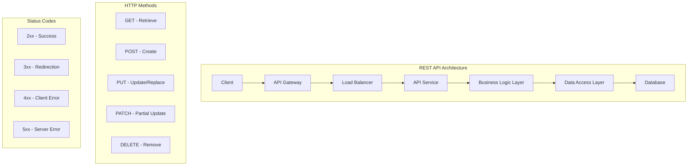

[<< Back](../README.md)

# API Design & Documentation Standards

## Overview
This guide provides comprehensive API design patterns, documentation standards, and implementation best practices for building robust, scalable, and developer-friendly APIs. It covers RESTful design, OpenAPI specifications, versioning strategies, and testing patterns.

## API Design Principles

### 1. RESTful Design Patterns


### 2. API Resource Design Hierarchy

```mermaid
graph LR
    subgraph "Resource Hierarchy"
        A[/api/v1] --> B[/users]
        A --> C[/orders]
        A --> D[/products]
        
        B --> E[/users/{id}]
        B --> F[/users/{id}/orders]
        B --> G[/users/{id}/preferences]
        
        C --> H[/orders/{id}]
        C --> I[/orders/{id}/items]
        C --> J[/orders/{id}/payments]
        
        D --> K[/products/{id}]
        D --> L[/products/{id}/reviews]
        D --> M[/products/{id}/variants]
    end
```

## API Design Standards

### 1. URL Structure & Naming Conventions

```csharp
// ✅ GOOD: RESTful URL patterns
[Route("api/v1/[controller]")]
[ApiController]
public class UsersController : ControllerBase
{
    // GET /api/v1/users
    [HttpGet]
    public async Task<ActionResult<PagedResult<UserDto>>> GetUsers(
        [FromQuery] UserQueryParameters parameters)
    {
        // Implementation
    }

    // GET /api/v1/users/{id}
    [HttpGet("{id:int}")]
    public async Task<ActionResult<UserDetailDto>> GetUser(int id)
    {
        // Implementation
    }

    // POST /api/v1/users
    [HttpPost]
    public async Task<ActionResult<UserDetailDto>> CreateUser(
        [FromBody] CreateUserRequest request)
    {
        // Implementation
    }

    // PUT /api/v1/users/{id}
    [HttpPut("{id:int}")]
    public async Task<ActionResult<UserDetailDto>> UpdateUser(
        int id, [FromBody] UpdateUserRequest request)
    {
        // Implementation
    }

    // PATCH /api/v1/users/{id}
    [HttpPatch("{id:int}")]
    public async Task<ActionResult<UserDetailDto>> PartialUpdateUser(
        int id, [FromBody] JsonPatchDocument<UpdateUserRequest> patchDocument)
    {
        // Implementation
    }

    // DELETE /api/v1/users/{id}
    [HttpDelete("{id:int}")]
    public async Task<ActionResult> DeleteUser(int id)
    {
        // Implementation
    }

    // GET /api/v1/users/{id}/orders
    [HttpGet("{id:int}/orders")]
    public async Task<ActionResult<PagedResult<OrderDto>>> GetUserOrders(
        int id, [FromQuery] OrderQueryParameters parameters)
    {
        // Implementation
    }
}

// URL Naming Best Practices
/*
✅ GOOD:
- /api/v1/users (plural nouns)
- /api/v1/users/123/orders (nested resources)
- /api/v1/products?category=electronics&sort=price (query parameters)

❌ BAD:
- /api/v1/getUsers (verbs in URLs)
- /api/v1/user (singular nouns)
- /api/v1/users/getUserOrders/123 (mixed patterns)
*/
```

### 2. Request/Response Models

```csharp
// Base Response Models
public class ApiResponse<T>
{
    public bool Success { get; set; }
    public T? Data { get; set; }
    public List<string> Errors { get; set; } = new();
    public Dictionary<string, object> Metadata { get; set; } = new();
    public DateTime Timestamp { get; set; } = DateTime.UtcNow;
    public string RequestId { get; set; } = Guid.NewGuid().ToString();
}

public class PagedResult<T>
{
    public List<T> Items { get; set; } = new();
    public int TotalCount { get; set; }
    public int PageNumber { get; set; }
    public int PageSize { get; set; }
    public int TotalPages => (int)Math.Ceiling((double)TotalCount / PageSize);
    public bool HasNextPage => PageNumber < TotalPages;
    public bool HasPreviousPage => PageNumber > 1;
    
    public PaginationLinks Links { get; set; } = new();
}

public class PaginationLinks
{
    public string? First { get; set; }
    public string? Previous { get; set; }
    public string? Next { get; set; }
    public string? Last { get; set; }
    public string? Self { get; set; }
}

// Query Parameters Base Class
public class QueryParameters
{
    private const int MaxPageSize = 100;
    private const int DefaultPageSize = 20;

    public int PageNumber { get; set; } = 1;
    
    private int _pageSize = DefaultPageSize;
    public int PageSize
    {
        get => _pageSize;
        set => _pageSize = value > MaxPageSize ? MaxPageSize : value;
    }

    public string? Search { get; set; }
    public string? SortBy { get; set; }
    public SortDirection SortDirection { get; set; } = SortDirection.Ascending;
    public List<string> Fields { get; set; } = new(); // Field selection
    public Dictionary<string, string> Filters { get; set; } = new();
}

public enum SortDirection
{
    Ascending,
    Descending
}

// Specific Query Parameters
public class UserQueryParameters : QueryParameters
{
    public UserStatus? Status { get; set; }
    public DateTime? CreatedAfter { get; set; }
    public DateTime? CreatedBefore { get; set; }
    public List<string> Roles { get; set; } = new();
    public bool? IsActive { get; set; }
}

// DTOs with Validation
public class CreateUserRequest
{
    [Required]
    [EmailAddress]
    [MaxLength(254)]
    public string Email { get; set; } = string.Empty;

    [Required]
    [MinLength(2)]
    [MaxLength(50)]
    public string FirstName { get; set; } = string.Empty;

    [Required]
    [MinLength(2)]
    [MaxLength(50)]
    public string LastName { get; set; } = string.Empty;

    [Required]
    [MinLength(8)]
    [DataType(DataType.Password)]
    public string Password { get; set; } = string.Empty;

    [Phone]
    public string? PhoneNumber { get; set; }

    public List<string> Roles { get; set; } = new();
    
    public Dictionary<string, object> Preferences { get; set; } = new();
}

public class UpdateUserRequest
{
    [EmailAddress]
    [MaxLength(254)]
    public string? Email { get; set; }

    [MinLength(2)]
    [MaxLength(50)]
    public string? FirstName { get; set; }

    [MinLength(2)]
    [MaxLength(50)]
    public string? LastName { get; set; }

    [Phone]
    public string? PhoneNumber { get; set; }

    public UserStatus? Status { get; set; }
    public List<string>? Roles { get; set; }
    public Dictionary<string, object>? Preferences { get; set; }
}

public class UserDto
{
    public int Id { get; set; }
    public string Email { get; set; } = string.Empty;
    public string FirstName { get; set; } = string.Empty;
    public string LastName { get; set; } = string.Empty;
    public string FullName => $"{FirstName} {LastName}";
    public string? PhoneNumber { get; set; }
    public UserStatus Status { get; set; }
    public DateTime CreatedAt { get; set; }
    public DateTime? UpdatedAt { get; set; }
    public DateTime? LastLoginAt { get; set; }
    public List<string> Roles { get; set; } = new();
    
    // Links for HATEOAS
    public Dictionary<string, Link> Links { get; set; } = new();
}

public class Link
{
    public string Href { get; set; } = string.Empty;
    public string Method { get; set; } = "GET";
    public string? Relation { get; set; }
}
```

### 3. Error Handling & Status Codes

```csharp
// Standardized Error Response
public class ErrorResponse
{
    public string Type { get; set; } = string.Empty;
    public string Title { get; set; } = string.Empty;
    public int Status { get; set; }
    public string Detail { get; set; } = string.Empty;
    public string Instance { get; set; } = string.Empty;
    public Dictionary<string, object> Extensions { get; set; } = new();
    public List<ValidationError> Errors { get; set; } = new();
}

public class ValidationError
{
    public string Field { get; set; } = string.Empty;
    public string Message { get; set; } = string.Empty;
    public object? AttemptedValue { get; set; }
}

// Global Exception Handler
public class GlobalExceptionMiddleware
{
    private readonly RequestDelegate _next;
    private readonly ILogger<GlobalExceptionMiddleware> _logger;
    private readonly IWebHostEnvironment _environment;

    public GlobalExceptionMiddleware(
        RequestDelegate next,
        ILogger<GlobalExceptionMiddleware> logger,
        IWebHostEnvironment environment)
    {
        _next = next;
        _logger = logger;
        _environment = environment;
    }

    public async Task InvokeAsync(HttpContext context)
    {
        try
        {
            await _next(context);
        }
        catch (Exception ex)
        {
            _logger.LogError(ex, "An unhandled exception occurred");
            await HandleExceptionAsync(context, ex);
        }
    }

    private async Task HandleExceptionAsync(HttpContext context, Exception exception)
    {
        context.Response.ContentType = "application/json";

        var errorResponse = exception switch
        {
            ValidationException validationEx => new ErrorResponse
            {
                Type = "https://tools.ietf.org/html/rfc7231#section-6.5.1",
                Title = "Validation Failed",
                Status = 400,
                Detail = "One or more validation errors occurred",
                Instance = context.Request.Path,
                Errors = validationEx.Errors.Select(e => new ValidationError
                {
                    Field = e.PropertyName,
                    Message = e.ErrorMessage,
                    AttemptedValue = e.AttemptedValue
                }).ToList()
            },

            NotFoundException notFoundEx => new ErrorResponse
            {
                Type = "https://tools.ietf.org/html/rfc7231#section-6.5.4",
                Title = "Resource Not Found",
                Status = 404,
                Detail = notFoundEx.Message,
                Instance = context.Request.Path
            },

            UnauthorizedException unauthorizedEx => new ErrorResponse
            {
                Type = "https://tools.ietf.org/html/rfc7235#section-3.1",
                Title = "Unauthorized",
                Status = 401,
                Detail = unauthorizedEx.Message,
                Instance = context.Request.Path
            },

            ForbiddenException forbiddenEx => new ErrorResponse
            {
                Type = "https://tools.ietf.org/html/rfc7231#section-6.5.3",
                Title = "Forbidden",
                Status = 403,
                Detail = forbiddenEx.Message,
                Instance = context.Request.Path
            },

            ConflictException conflictEx => new ErrorResponse
            {
                Type = "https://tools.ietf.org/html/rfc7231#section-6.5.8",
                Title = "Conflict",
                Status = 409,
                Detail = conflictEx.Message,
                Instance = context.Request.Path
            },

            _ => new ErrorResponse
            {
                Type = "https://tools.ietf.org/html/rfc7231#section-6.6.1",
                Title = "Internal Server Error",
                Status = 500,
                Detail = _environment.IsDevelopment() ? exception.Message : "An error occurred processing your request",
                Instance = context.Request.Path
            }
        };

        context.Response.StatusCode = errorResponse.Status;

        var jsonResponse = JsonSerializer.Serialize(errorResponse, new JsonSerializerOptions
        {
            PropertyNamingPolicy = JsonNamingPolicy.CamelCase,
            WriteIndented = true
        });

        await context.Response.WriteAsync(jsonResponse);
    }
}

// Custom Exceptions
public class ValidationException : Exception
{
    public IEnumerable<ValidationFailure> Errors { get; }

    public ValidationException(IEnumerable<ValidationFailure> errors)
        : base("Validation failed")
    {
        Errors = errors;
    }
}

public class NotFoundException : Exception
{
    public NotFoundException(string message) : base(message) { }
    public NotFoundException(string name, object key) : base($"{name} with key '{key}' was not found") { }
}

public class UnauthorizedException : Exception
{
    public UnauthorizedException(string message) : base(message) { }
}

public class ForbiddenException : Exception
{
    public ForbiddenException(string message) : base(message) { }
}

public class ConflictException : Exception
{
    public ConflictException(string message) : base(message) { }
}
```

## API Versioning Strategy

### 1. URL Path Versioning

```csharp
// Version 1
[Route("api/v1/[controller]")]
[ApiVersion("1.0")]
public class UsersV1Controller : ControllerBase
{
    [HttpGet("{id:int}")]
    public async Task<ActionResult<UserV1Dto>> GetUser(int id)
    {
        // V1 implementation
    }
}

// Version 2
[Route("api/v2/[controller]")]
[ApiVersion("2.0")]
public class UsersV2Controller : ControllerBase
{
    [HttpGet("{id:int}")]
    public async Task<ActionResult<UserV2Dto>> GetUser(int id)
    {
        // V2 implementation with additional fields
    }
}

// Shared Controller with Version-specific Actions
[Route("api/v{version:apiVersion}/[controller]")]
[ApiController]
public class UsersController : ControllerBase
{
    [HttpGet("{id:int}")]
    [MapToApiVersion("1.0")]
    public async Task<ActionResult<UserV1Dto>> GetUserV1(int id)
    {
        // V1 implementation
    }

    [HttpGet("{id:int}")]
    [MapToApiVersion("2.0")]
    public async Task<ActionResult<UserV2Dto>> GetUserV2(int id)
    {
        // V2 implementation
    }
}
```

### 2. Header-based Versioning

```csharp
// Configuration in Program.cs
builder.Services.AddApiVersioning(options =>
{
    options.DefaultApiVersion = new ApiVersion(1, 0);
    options.AssumeDefaultVersionWhenUnspecified = true;
    options.ApiVersionReader = ApiVersionReader.Combine(
        new UrlSegmentApiVersionReader(),
        new HeaderApiVersionReader("X-API-Version"),
        new MediaTypeApiVersionReader("version")
    );
});

// Controller implementation
[Route("api/[controller]")]
[ApiController]
public class UsersController : ControllerBase
{
    [HttpGet("{id:int}")]
    [MapToApiVersion("1.0")]
    public async Task<ActionResult<UserV1Dto>> GetUserV1(int id)
    {
        // Called with: X-API-Version: 1.0
    }

    [HttpGet("{id:int}")]
    [MapToApiVersion("2.0")]
    public async Task<ActionResult<UserV2Dto>> GetUserV2(int id)
    {
        // Called with: X-API-Version: 2.0
    }
}
```

## OpenAPI/Swagger Documentation

### 1. Enhanced OpenAPI Configuration

```csharp
// Program.cs - Swagger Configuration
public static void ConfigureSwagger(this IServiceCollection services, IConfiguration configuration)
{
    services.AddSwaggerGen(options =>
    {
        // API Information
        options.SwaggerDoc("v1", new OpenApiInfo
        {
            Version = "v1",
            Title = "User Management API",
            Description = "A comprehensive API for managing users, roles, and permissions",
            Contact = new OpenApiContact
            {
                Name = "API Support",
                Email = "api-support@example.com",
                Url = new Uri("https://example.com/support")
            },
            License = new OpenApiLicense
            {
                Name = "MIT License",
                Url = new Uri("https://opensource.org/licenses/MIT")
            },
            TermsOfService = new Uri("https://example.com/terms")
        });

        options.SwaggerDoc("v2", new OpenApiInfo
        {
            Version = "v2",
            Title = "User Management API v2",
            Description = "Enhanced version with additional features"
        });

        // Security Definitions
        options.AddSecurityDefinition("Bearer", new OpenApiSecurityScheme
        {
            Type = SecuritySchemeType.Http,
            Scheme = "bearer",
            BearerFormat = "JWT",
            Description = "Enter your JWT token in the format: Bearer {your token}"
        });

        options.AddSecurityDefinition("ApiKey", new OpenApiSecurityScheme
        {
            Type = SecuritySchemeType.ApiKey,
            In = ParameterLocation.Header,
            Name = "X-API-Key",
            Description = "API Key for accessing the endpoints"
        });

        // Global Security Requirement
        options.AddSecurityRequirement(new OpenApiSecurityRequirement
        {
            {
                new OpenApiSecurityScheme
                {
                    Reference = new OpenApiReference
                    {
                        Type = ReferenceType.SecurityScheme,
                        Id = "Bearer"
                    }
                },
                Array.Empty<string>()
            }
        });

        // XML Comments
        var xmlFile = $"{Assembly.GetExecutingAssembly().GetName().Name}.xml";
        var xmlPath = Path.Combine(AppContext.BaseDirectory, xmlFile);
        options.IncludeXmlComments(xmlPath);

        // Custom Schema Filters
        options.SchemaFilter<EnumSchemaFilter>();
        options.SchemaFilter<ExampleSchemaFilter>();
        
        // Operation Filters
        options.OperationFilter<AuthorizeOperationFilter>();
        options.OperationFilter<SwaggerDefaultValues>();
    });
}

// Enhanced Controller Documentation
[ApiController]
[Route("api/v1/[controller]")]
[Produces("application/json")]
[ProducesResponseType(typeof(ErrorResponse), StatusCodes.Status500InternalServerError)]
public class UsersController : ControllerBase
{
    /// <summary>
    /// Retrieves a paginated list of users
    /// </summary>
    /// <param name="parameters">Query parameters for filtering and pagination</param>
    /// <returns>A paginated list of users</returns>
    /// <response code="200">Returns the paginated list of users</response>
    /// <response code="400">If the query parameters are invalid</response>
    /// <response code="401">If the user is not authenticated</response>
    /// <response code="403">If the user doesn't have permission to view users</response>
    [HttpGet]
    [ProducesResponseType(typeof(PagedResult<UserDto>), StatusCodes.Status200OK)]
    [ProducesResponseType(typeof(ErrorResponse), StatusCodes.Status400BadRequest)]
    [ProducesResponseType(typeof(ErrorResponse), StatusCodes.Status401Unauthorized)]
    [ProducesResponseType(typeof(ErrorResponse), StatusCodes.Status403Forbidden)]
    public async Task<ActionResult<PagedResult<UserDto>>> GetUsers(
        [FromQuery] UserQueryParameters parameters)
    {
        // Implementation
    }

    /// <summary>
    /// Retrieves a specific user by ID
    /// </summary>
    /// <param name="id">The unique identifier of the user</param>
    /// <returns>The user details</returns>
    /// <response code="200">Returns the user details</response>
    /// <response code="404">If the user is not found</response>
    [HttpGet("{id:int}")]
    [ProducesResponseType(typeof(UserDetailDto), StatusCodes.Status200OK)]
    [ProducesResponseType(typeof(ErrorResponse), StatusCodes.Status404NotFound)]
    public async Task<ActionResult<UserDetailDto>> GetUser(int id)
    {
        // Implementation
    }

    /// <summary>
    /// Creates a new user
    /// </summary>
    /// <param name="request">The user creation request</param>
    /// <returns>The created user details</returns>
    /// <response code="201">Returns the newly created user</response>
    /// <response code="400">If the request is invalid</response>
    /// <response code="409">If a user with the same email already exists</response>
    [HttpPost]
    [ProducesResponseType(typeof(UserDetailDto), StatusCodes.Status201Created)]
    [ProducesResponseType(typeof(ErrorResponse), StatusCodes.Status400BadRequest)]
    [ProducesResponseType(typeof(ErrorResponse), StatusCodes.Status409Conflict)]
    public async Task<ActionResult<UserDetailDto>> CreateUser(
        [FromBody] CreateUserRequest request)
    {
        // Implementation
    }
}
```

### 2. Schema Examples and Filters

```csharp
// Schema Filters for Better Documentation
public class ExampleSchemaFilter : ISchemaFilter
{
    public void Apply(OpenApiSchema schema, SchemaFilterContext context)
    {
        if (context.Type == typeof(CreateUserRequest))
        {
            schema.Example = new OpenApiObject
            {
                ["email"] = new OpenApiString("john.doe@example.com"),
                ["firstName"] = new OpenApiString("John"),
                ["lastName"] = new OpenApiString("Doe"),
                ["password"] = new OpenApiString("SecurePassword123!"),
                ["phoneNumber"] = new OpenApiString("+1234567890"),
                ["roles"] = new OpenApiArray
                {
                    new OpenApiString("User"),
                    new OpenApiString("Customer")
                }
            };
        }
    }
}

public class EnumSchemaFilter : ISchemaFilter
{
    public void Apply(OpenApiSchema schema, SchemaFilterContext context)
    {
        if (context.Type.IsEnum)
        {
            schema.Enum.Clear();
            var enumNames = Enum.GetNames(context.Type);
            foreach (var name in enumNames)
            {
                schema.Enum.Add(new OpenApiString(name));
            }
        }
    }
}

// Operation Filter for Authorization
public class AuthorizeOperationFilter : IOperationFilter
{
    public void Apply(OpenApiOperation operation, OperationFilterContext context)
    {
        var hasAuthorize = context.MethodInfo.DeclaringType?.GetCustomAttributes(true)
            .Union(context.MethodInfo.GetCustomAttributes(true))
            .OfType<AuthorizeAttribute>()
            .Any() ?? false;

        if (hasAuthorize)
        {
            operation.Responses.TryAdd("401", new OpenApiResponse { Description = "Unauthorized" });
            operation.Responses.TryAdd("403", new OpenApiResponse { Description = "Forbidden" });

            operation.Security = new List<OpenApiSecurityRequirement>
            {
                new()
                {
                    [new OpenApiSecurityScheme
                    {
                        Reference = new OpenApiReference
                        {
                            Type = ReferenceType.SecurityScheme,
                            Id = "Bearer"
                        }
                    }] = Array.Empty<string>()
                }
            };
        }
    }
}
```

## API Testing Strategies

### 1. Integration Tests

```csharp
// API Integration Test Base
public class ApiIntegrationTestBase : IDisposable
{
    protected HttpClient Client { get; }
    protected IServiceScope Scope { get; }
    protected WebApplicationFactory<Program> Factory { get; }

    public ApiIntegrationTestBase()
    {
        Factory = new WebApplicationFactory<Program>()
            .WithWebHostBuilder(builder =>
            {
                builder.ConfigureTestServices(services =>
                {
                    // Replace database with in-memory
                    services.RemoveAll(typeof(DbContextOptions<ApplicationDbContext>));
                    services.AddDbContext<ApplicationDbContext>(options =>
                    {
                        options.UseInMemoryDatabase(Guid.NewGuid().ToString());
                    });

                    // Mock external services
                    services.AddScoped<IEmailService, MockEmailService>();
                    services.AddScoped<IPaymentService, MockPaymentService>();
                });

                builder.UseEnvironment("Testing");
            });

        Client = Factory.CreateClient();
        Scope = Factory.Services.CreateScope();
        
        SeedTestData();
    }

    protected virtual void SeedTestData()
    {
        using var context = Scope.ServiceProvider.GetRequiredService<ApplicationDbContext>();
        context.Database.EnsureCreated();
        
        // Seed test data
        var testUsers = new[]
        {
            new User { Email = "test1@example.com", FirstName = "Test", LastName = "User1" },
            new User { Email = "test2@example.com", FirstName = "Test", LastName = "User2" }
        };

        context.Users.AddRange(testUsers);
        context.SaveChanges();
    }

    protected async Task<T?> GetResponseContent<T>(HttpResponseMessage response)
    {
        var content = await response.Content.ReadAsStringAsync();
        return JsonSerializer.Deserialize<T>(content, new JsonSerializerOptions
        {
            PropertyNameCaseInsensitive = true
        });
    }

    public void Dispose()
    {
        Client?.Dispose();
        Scope?.Dispose();
        Factory?.Dispose();
    }
}

// Specific API Tests
public class UsersControllerTests : ApiIntegrationTestBase
{
    [Test]
    public async Task GetUsers_WithValidParameters_ReturnsPagedResults()
    {
        // Arrange
        var queryString = "?pageNumber=1&pageSize=10&search=test";

        // Act
        var response = await Client.GetAsync($"/api/v1/users{queryString}");

        // Assert
        response.StatusCode.Should().Be(HttpStatusCode.OK);
        
        var pagedResult = await GetResponseContent<PagedResult<UserDto>>(response);
        pagedResult.Should().NotBeNull();
        pagedResult!.Items.Should().NotBeEmpty();
        pagedResult.TotalCount.Should().BeGreaterThan(0);
        pagedResult.PageNumber.Should().Be(1);
        pagedResult.PageSize.Should().Be(10);
    }

    [Test]
    public async Task GetUser_WithValidId_ReturnsUser()
    {
        // Arrange
        var userId = 1;

        // Act
        var response = await Client.GetAsync($"/api/v1/users/{userId}");

        // Assert
        response.StatusCode.Should().Be(HttpStatusCode.OK);
        
        var user = await GetResponseContent<UserDetailDto>(response);
        user.Should().NotBeNull();
        user!.Id.Should().Be(userId);
        user.Email.Should().NotBeNullOrEmpty();
    }

    [Test]
    public async Task GetUser_WithInvalidId_ReturnsNotFound()
    {
        // Arrange
        var invalidUserId = 99999;

        // Act
        var response = await Client.GetAsync($"/api/v1/users/{invalidUserId}");

        // Assert
        response.StatusCode.Should().Be(HttpStatusCode.NotFound);
        
        var errorResponse = await GetResponseContent<ErrorResponse>(response);
        errorResponse.Should().NotBeNull();
        errorResponse!.Status.Should().Be(404);
        errorResponse.Title.Should().Be("Resource Not Found");
    }

    [Test]
    public async Task CreateUser_WithValidRequest_ReturnsCreatedUser()
    {
        // Arrange
        var createRequest = new CreateUserRequest
        {
            Email = "newuser@example.com",
            FirstName = "New",
            LastName = "User",
            Password = "SecurePassword123!",
            PhoneNumber = "+1234567890"
        };

        // Act
        var response = await Client.PostAsJsonAsync("/api/v1/users", createRequest);

        // Assert
        response.StatusCode.Should().Be(HttpStatusCode.Created);
        
        var createdUser = await GetResponseContent<UserDetailDto>(response);
        createdUser.Should().NotBeNull();
        createdUser!.Email.Should().Be(createRequest.Email);
        createdUser.FirstName.Should().Be(createRequest.FirstName);
        createdUser.LastName.Should().Be(createRequest.LastName);
        
        // Verify Location header
        response.Headers.Location.Should().NotBeNull();
        response.Headers.Location.ToString().Should().Contain($"/api/v1/users/{createdUser.Id}");
    }

    [Test]
    public async Task CreateUser_WithInvalidEmail_ReturnsBadRequest()
    {
        // Arrange
        var createRequest = new CreateUserRequest
        {
            Email = "invalid-email",
            FirstName = "Test",
            LastName = "User",
            Password = "SecurePassword123!"
        };

        // Act
        var response = await Client.PostAsJsonAsync("/api/v1/users", createRequest);

        // Assert
        response.StatusCode.Should().Be(HttpStatusCode.BadRequest);
        
        var errorResponse = await GetResponseContent<ErrorResponse>(response);
        errorResponse.Should().NotBeNull();
        errorResponse!.Status.Should().Be(400);
        errorResponse.Errors.Should().ContainSingle(e => e.Field == "Email");
    }
}
```

### 2. Contract Testing

```csharp
// Pact Contract Testing
public class UserApiConsumerTests : IClassFixture<PactFixture>
{
    private readonly PactFixture _pactFixture;
    private readonly IPactBuilderV2 _pactBuilder;

    public UserApiConsumerTests(PactFixture pactFixture)
    {
        _pactFixture = pactFixture;
        _pactBuilder = pactFixture.PactBuilder;
    }

    [Fact]
    public async Task GetUser_WhenUserExists_ReturnsUser()
    {
        // Arrange
        var userId = 1;
        var expectedUser = new
        {
            id = userId,
            email = "test@example.com",
            firstName = "Test",
            lastName = "User",
            status = "Active"
        };

        _pactBuilder
            .UponReceiving("A request for user 1")
            .Given("User 1 exists")
            .WithRequest(HttpMethod.Get, $"/api/v1/users/{userId}")
            .WithHeader("Authorization", "Bearer valid-token")
            .WillRespondWith()
            .WithStatus(HttpStatusCode.OK)
            .WithHeader("Content-Type", "application/json")
            .WithJsonBody(expectedUser);

        // Act & Assert
        await _pactBuilder.VerifyAsync(async ctx =>
        {
            var client = new HttpClient { BaseAddress = ctx.MockServerUri };
            client.DefaultRequestHeaders.Authorization = 
                new AuthenticationHeaderValue("Bearer", "valid-token");

            var response = await client.GetAsync($"/api/v1/users/{userId}");
            var content = await response.Content.ReadAsStringAsync();
            var user = JsonSerializer.Deserialize<UserDto>(content);

            response.StatusCode.Should().Be(HttpStatusCode.OK);
            user.Should().NotBeNull();
            user!.Id.Should().Be(userId);
            user.Email.Should().Be("test@example.com");
        });
    }
}
```

## API Performance & Monitoring

### 1. Response Time Optimization

```csharp
// Response Caching
[HttpGet]
[ResponseCache(Duration = 300, VaryByQueryKeys = new[] { "pageNumber", "pageSize", "search" })]
public async Task<ActionResult<PagedResult<UserDto>>> GetUsers(
    [FromQuery] UserQueryParameters parameters)
{
    // Implementation with caching
}

// ETags for Conditional Requests
[HttpGet("{id:int}")]
public async Task<ActionResult<UserDetailDto>> GetUser(int id)
{
    var user = await _userService.GetByIdAsync(id);
    if (user == null)
    {
        return NotFound();
    }

    var etag = GenerateETag(user);
    
    // Check If-None-Match header
    if (Request.Headers.IfNoneMatch.Any(tag => tag.Tag == etag))
    {
        return StatusCode(304); // Not Modified
    }

    Response.Headers.ETag = etag;
    return Ok(user);
}

// Compression
public void ConfigureServices(IServiceCollection services)
{
    services.AddResponseCompression(options =>
    {
        options.EnableForHttps = true;
        options.Providers.Add<BrotliCompressionProvider>();
        options.Providers.Add<GzipCompressionProvider>();
    });
}
```

### 2. Rate Limiting

```csharp
// Rate Limiting Configuration
public void ConfigureServices(IServiceCollection services)
{
    services.AddRateLimiter(options =>
    {
        // Global rate limit
        options.GlobalLimiter = PartitionedRateLimiter.Create<HttpContext, string>(context =>
            RateLimitPartition.GetFixedWindowLimiter("global",
                _ => new FixedWindowRateLimiterOptions
                {
                    PermitLimit = 1000,
                    Window = TimeSpan.FromMinutes(1)
                }));

        // Per-user rate limit
        options.AddPolicy("PerUser", httpContext =>
            RateLimitPartition.GetSlidingWindowLimiter(
                httpContext.User.Identity?.Name ?? httpContext.Connection.RemoteIpAddress?.ToString() ?? "anonymous",
                _ => new SlidingWindowRateLimiterOptions
                {
                    PermitLimit = 100,
                    Window = TimeSpan.FromMinutes(1),
                    SegmentsPerWindow = 6
                }));

        // API-specific limits
        options.AddPolicy("CreateUser", httpContext =>
            RateLimitPartition.GetTokenBucketLimiter(
                httpContext.Connection.RemoteIpAddress?.ToString() ?? "anonymous",
                _ => new TokenBucketRateLimiterOptions
                {
                    TokenLimit = 5,
                    QueueProcessingOrder = QueueProcessingOrder.OldestFirst,
                    QueueLimit = 10,
                    ReplenishmentPeriod = TimeSpan.FromMinutes(1),
                    TokensPerPeriod = 5
                }));
    });
}

// Apply rate limiting to controllers
[EnableRateLimiting("PerUser")]
public class UsersController : ControllerBase
{
    [HttpPost]
    [EnableRateLimiting("CreateUser")]
    public async Task<ActionResult<UserDetailDto>> CreateUser(
        [FromBody] CreateUserRequest request)
    {
        // Implementation
    }
}
```

## Integration with AI Agent

The AI agent should automatically implement API standards based on:

### 1. **Project Analysis:**
- **Domain complexity** → Choose appropriate API patterns (CQRS, event sourcing, etc.)
- **Expected load** → Implement caching, rate limiting, pagination
- **Security requirements** → Add authentication, authorization, input validation
- **Integration needs** → Design for API composition, webhooks, events

### 2. **Automatic API Generation:**
- **Generate OpenAPI specs** from domain models and use cases
- **Create standardized controllers** following REST principles
- **Implement proper error handling** with consistent error responses
- **Add comprehensive validation** with detailed error messages
- **Set up API versioning** strategy based on expected evolution

### 3. **Testing Strategy:**
- **Generate integration tests** for all endpoints
- **Create contract tests** for external API dependencies
- **Implement performance tests** for critical endpoints
- **Add security tests** for authentication and authorization

### 4. **Documentation & Monitoring:**
- **Auto-generate API documentation** with examples and schemas
- **Set up API monitoring** with health checks and metrics
- **Implement logging** for request/response tracking
- **Configure alerting** for API performance and errors

This comprehensive API framework ensures that every API built with the AI agent follows industry best practices, provides excellent developer experience, and maintains high standards for security, performance, and reliability.

[<< Back](../README.md)
