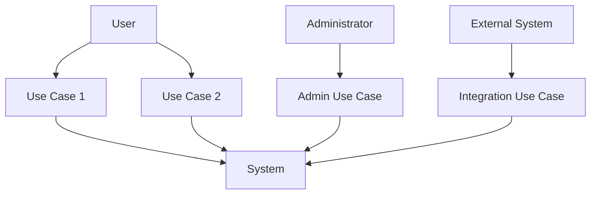
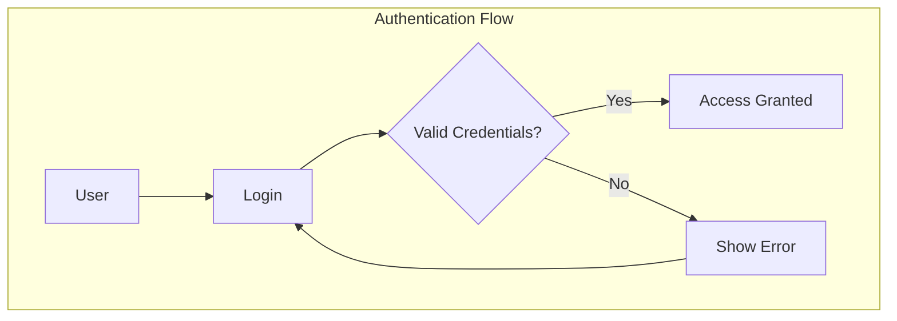

[<< Back](./../design.md)

# Use Cases
Below we elaborate on the system's use cases. These document various use cases that should be met, based on the system requirements.

We follow the iDesign principles as highlighted in the [design.md](./../design.md) file in this repository.

## System Requirements
*Document the high-level system requirements that drive these use cases*

### Functional Requirements
- **FR-001**: [Requirement Description]
- **FR-002**: [Requirement Description]
- **FR-003**: [Requirement Description]

### Non-Functional Requirements
- **NFR-001**: [Performance Requirements]
- **NFR-002**: [Security Requirements]
- **NFR-003**: [Scalability Requirements]
- **NFR-004**: [Usability Requirements]

## Actors
*Define the different types of users/systems that interact with the system*

- **Primary Actors**: [Users who directly interact with the system]
- **Secondary Actors**: [External systems or services]
- **Administrative Actors**: [System administrators, support staff]

## Use Case Diagrams

### High-Level System Overview

### Detailed Use Case Flows
*Add specific use case diagrams for each major workflow*

## Detailed Use Cases

### UC-001: [Use Case Name]
- **Actor**: [Primary Actor]
- **Precondition**: [What must be true before this use case can execute]
- **Trigger**: [What initiates this use case]
- **Main Success Scenario**:
  1. [Step 1]
  2. [Step 2]
  3. [Step 3]
  4. [Step 4]
- **Alternative Flows**:
  - **2a**: [Alternative scenario if step 2 has variations]
  - **3a**: [Alternative scenario if step 3 fails]
- **Exception Flows**:
  - **E1**: [What happens if system error occurs]
  - **E2**: [What happens if network fails]
- **Postcondition**: [What is true after successful completion]
- **Business Rules**: [Any business rules that apply]

### UC-002: [Use Case Name]
- **Actor**: [Primary Actor]
- **Precondition**: [Prerequisites]
- **Trigger**: [Initiating event]
- **Main Success Scenario**:
  1. [Step 1]
  2. [Step 2]
  3. [Step 3]
- **Alternative Flows**: [Variations]
- **Exception Flows**: [Error handling]
- **Postcondition**: [End state]
- **Business Rules**: [Applicable rules]

## Use Case Prioritization

### High Priority (Must Have)
- **UC-001**: [Use Case Name] - [Justification]
- **UC-002**: [Use Case Name] - [Justification]

### Medium Priority (Should Have)
- **UC-003**: [Use Case Name] - [Justification]
- **UC-004**: [Use Case Name] - [Justification]

### Low Priority (Could Have)
- **UC-005**: [Use Case Name] - [Justification]
- **UC-006**: [Use Case Name] - [Justification]

## Cross-Cutting Concerns

### Security Use Cases
- **Authentication**: How users prove their identity
- **Authorization**: How permissions are enforced
- **Data Protection**: How sensitive data is handled

### System Administration Use Cases
- **User Management**: CRUD operations for user accounts
- **System Monitoring**: Health checks and performance monitoring
- **Data Backup/Recovery**: System backup and restore procedures

### Integration Use Cases
- **External API Integration**: How the system communicates with external services
- **Data Import/Export**: Bulk data operations
- **Third-party Authentication**: OAuth, SAML integration

## Traceability Matrix
*Link use cases back to requirements and forward to system components*

| Use Case | Requirements | System Components | Test Cases |
|----------|-------------|-------------------|------------|
| UC-001   | FR-001, NFR-001 | [Component Names] | TC-001, TC-002 |
| UC-002   | FR-002, FR-003  | [Component Names] | TC-003, TC-004 |

## Acceptance Criteria
*High-level acceptance criteria for each use case*

### UC-001 Acceptance Criteria
- **Given** [Initial state]
- **When** [Action performed]
- **Then** [Expected outcome]

### UC-002 Acceptance Criteria
- **Given** [Initial state]
- **When** [Action performed]
- **Then** [Expected outcome]

---

**Template Instructions**: 
1. Replace all placeholder text in brackets with actual project-specific content
2. Add/remove use cases based on your system requirements
3. Ensure all use cases align with the business requirements
4. Include Mermaid diagrams for visual representation
5. Maintain traceability to requirements and system components

[<< Back](./../design.md)