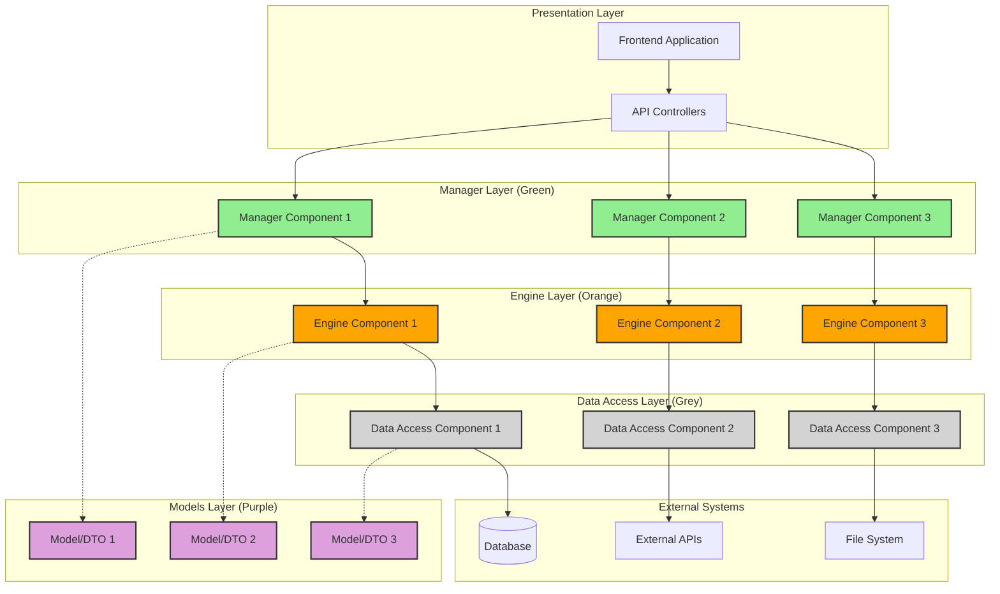
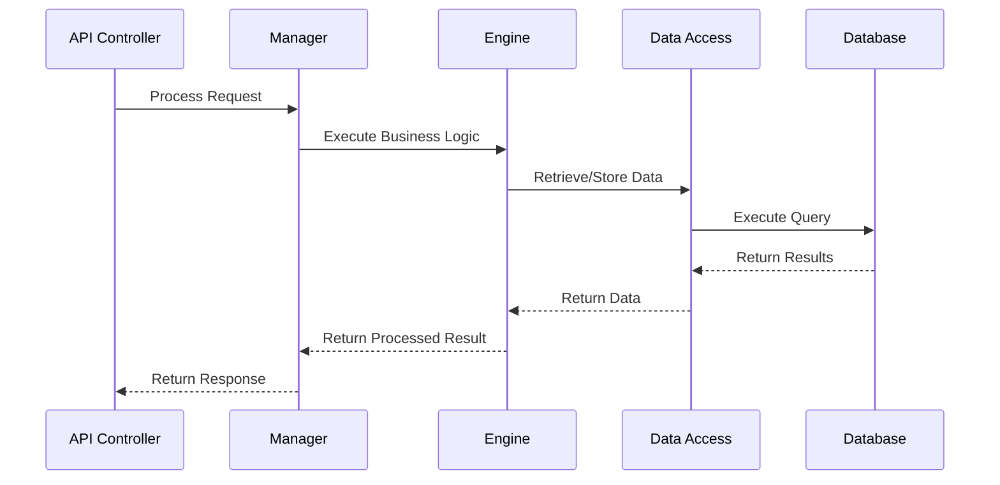
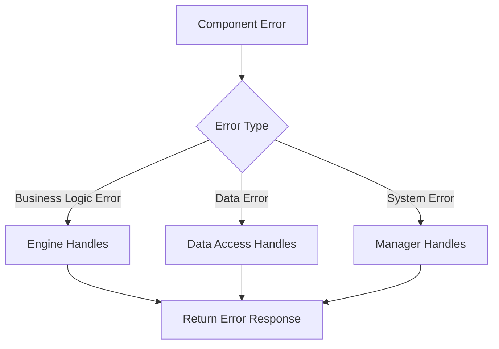
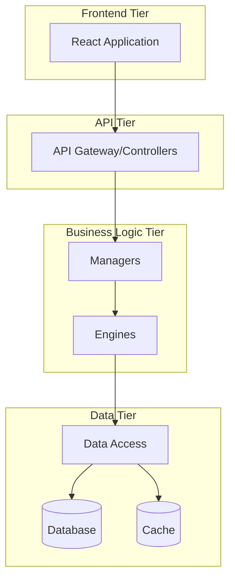

[<< Back](./../design.md)

# High-level System Components

Below we elaborate on the system's high-level components, based on the various use cases as seen [here](./1-use-cases.md).

We follow the iDesign principles as highlighted in the [design.md](./../design.md) file in this repository.

## System Architecture Overview

### Layered Architecture Diagram

## Managers (Green Components)

_These components orchestrate other code paths and facilitate use cases. They serve as the entry points to the application._

### [Manager Name 1]

- **Purpose**: [High-level description of what this manager orchestrates]
- **Responsibilities**:
  - [Responsibility 1]
  - [Responsibility 2]
  - [Responsibility 3]
- **Dependencies**:
  - **Engines**: [List of engines this manager depends on]
  - **Models**: [List of models/DTOs used]
- **Interfaces**: `I[ManagerName]Manager`
- **Use Cases Supported**: [List of use cases this manager handles]

### [Manager Name 2]

- **Purpose**: [Description]
- **Responsibilities**: [List]
- **Dependencies**: [Engines and models]
- **Interfaces**: `I[ManagerName]Manager`
- **Use Cases Supported**: [Related use cases]

### [Manager Name 3]

- **Purpose**: [Description]
- **Responsibilities**: [List]
- **Dependencies**: [Engines and models]
- **Interfaces**: `I[ManagerName]Manager`
- **Use Cases Supported**: [Related use cases]

## Engines (Orange Components)

_These components perform complex operations exclusively. They contain the core business logic._

### [Engine Name 1]

- **Purpose**: [Description of the complex operation this engine performs]
- **Core Operations**:
  - [Operation 1]
  - [Operation 2]
  - [Operation 3]
- **Dependencies**:
  - **Data Access**: [List of data access components used]
  - **Other Engines**: [If any engine-to-engine dependencies exist]
  - **Models**: [List of models/DTOs used]
- **Interfaces**: `I[EngineName]Engine`
- **Business Rules**: [Any business rules implemented by this engine]

### [Engine Name 2]

- **Purpose**: [Description]
- **Core Operations**: [List]
- **Dependencies**: [Data access components and models]
- **Interfaces**: `I[EngineName]Engine`
- **Business Rules**: [Applicable business rules]

### [Engine Name 3]

- **Purpose**: [Description]
- **Core Operations**: [List]
- **Dependencies**: [Data access components and models]
- **Interfaces**: `I[EngineName]Engine`
- **Business Rules**: [Applicable business rules]

## Data Access (Grey Components)

_These components perform IO operations exclusively. They handle all external data interactions._

### [Data Access Name 1]

- **Purpose**: [Description of what data/external system this component accesses]
- **IO Operations**:
  - [Operation 1 - e.g., Create, Read, Update, Delete]
  - [Operation 2]
  - [Operation 3]
- **External Dependencies**:
  - **Database**: [Which database/schema]
  - **External APIs**: [Which external services]
  - **File System**: [Which file operations]
- **Interfaces**: `I[DataAccessName]Data`
- **Data Models**: [List of entities/DTOs this component works with]
- **Connection Management**: [How connections are managed]

### [Data Access Name 2]

- **Purpose**: [Description]
- **IO Operations**: [List]
- **External Dependencies**: [Databases, APIs, files]
- **Interfaces**: `I[DataAccessName]Data`
- **Data Models**: [Related entities]
- **Connection Management**: [Strategy]

### [Data Access Name 3]

- **Purpose**: [Description]
- **IO Operations**: [List]
- **External Dependencies**: [External systems]
- **Interfaces**: `I[DataAccessName]Data`
- **Data Models**: [Related entities]
- **Connection Management**: [Strategy]

## Models (Purple Components)

_Simple data structures (DTOs), domain models, and enums._

### Domain Models

- **[Model Name 1]**: [Description and key properties]
- **[Model Name 2]**: [Description and key properties]
- **[Model Name 3]**: [Description and key properties]

### Data Transfer Objects (DTOs)

- **[DTO Name 1]**: [Purpose and usage context]
- **[DTO Name 2]**: [Purpose and usage context]
- **[DTO Name 3]**: [Purpose and usage context]

### Enumerations

- **[Enum Name 1]**: [Values and usage]
- **[Enum Name 2]**: [Values and usage]
- **[Enum Name 3]**: [Values and usage]

## Component Interaction Patterns

### Request/Response Flow

### Error Handling Flow

## Cross-Cutting Concerns

### Logging

- **Manager Layer**: High-level operation logging
- **Engine Layer**: Business logic execution logging
- **Data Access Layer**: Data operation and performance logging

### Exception Handling

- **Strategy**: [Describe the exception handling strategy across layers]
- **Error Propagation**: [How errors flow between layers]
- **User-Facing Errors**: [How technical errors are translated to user messages]

### Caching

- **Cache Locations**: [Where caching is implemented]
- **Cache Strategies**: [Cache invalidation and refresh strategies]
- **Performance Impact**: [Expected performance improvements]

### Security

- **Authentication**: [How authentication is handled across components]
- **Authorization**: [How permissions are enforced at each layer]
- **Data Protection**: [How sensitive data is protected]

## Deployment Architecture

### Component Distribution

### Scalability Considerations

- **Horizontal Scaling**: [Which components can be scaled horizontally]
- **Vertical Scaling**: [Resource requirements for vertical scaling]
- **Load Balancing**: [How load is distributed across component instances]

## Technology Mapping

### .NET Core Implementation

- **Managers**: Implemented as services with dependency injection
- **Engines**: Implemented as business logic services
- **Data Access**: Implemented using Entity Framework Core or Dapper
- **Models**: Implemented as C# classes with data annotations

### Interface Definitions

- **Naming Convention**: `I[ComponentName][LayerType]` (e.g., `IUserManager`, `IEmailEngine`, `IUserData`)
- **Dependency Injection**: All components registered in DI container
- **Lifetime Management**: [Singleton, Scoped, or Transient for each layer]

---

**Template Instructions**:

1. Replace all placeholder text in brackets with actual project-specific content
2. Ensure component names follow the iDesign naming conventions
3. Maintain clear separation of concerns between layers
4. Include actual Mermaid diagrams showing component relationships
5. Map each component to specific use cases from the use cases document

[<< Back](./../design.md)
