[<< Back](./../design.md)

# Class Diagrams & ERDs
Below we elaborate on the system's class diagrams and entity relational diagrams, for database projects.

We follow the iDesign principles as highlighted in the [design.md](./../design.md) file in this repository.

## Domain Model Overview

### Core Domain Entities
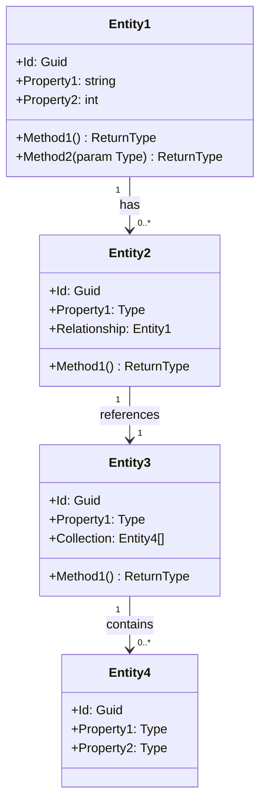

## Manager Layer Classes

### Manager Interfaces
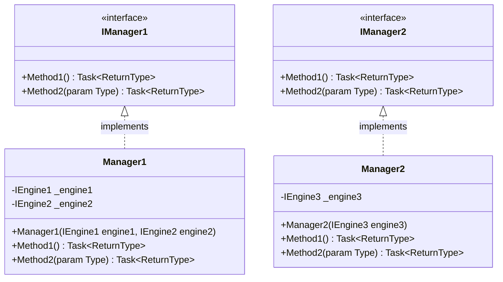

### Manager Dependencies
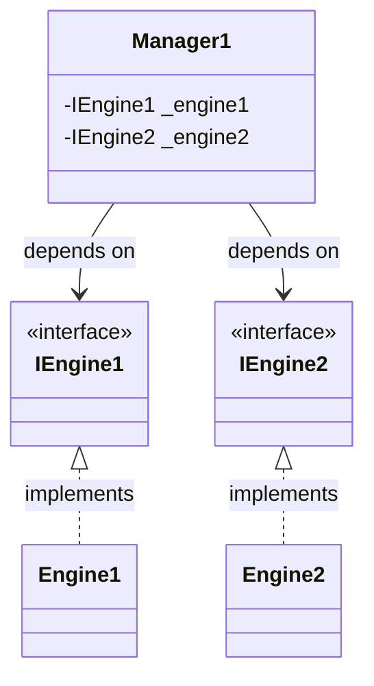

## Engine Layer Classes

### Engine Interfaces
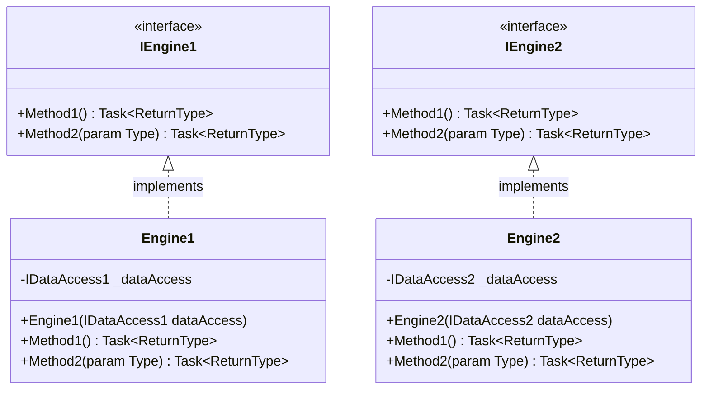

### Engine Dependencies
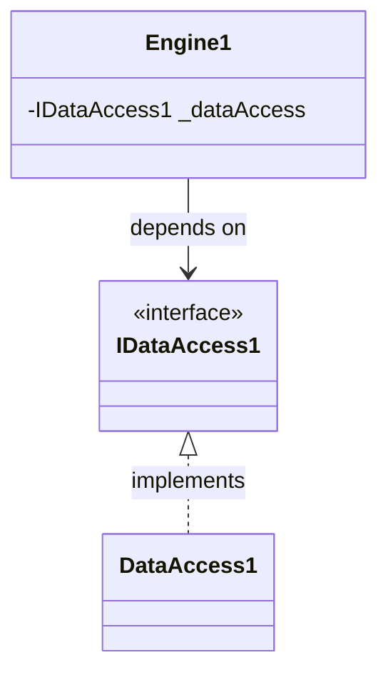

## Data Access Layer Classes

### Data Access Interfaces
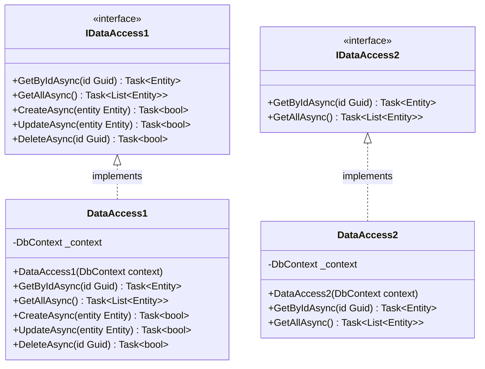

### Data Context
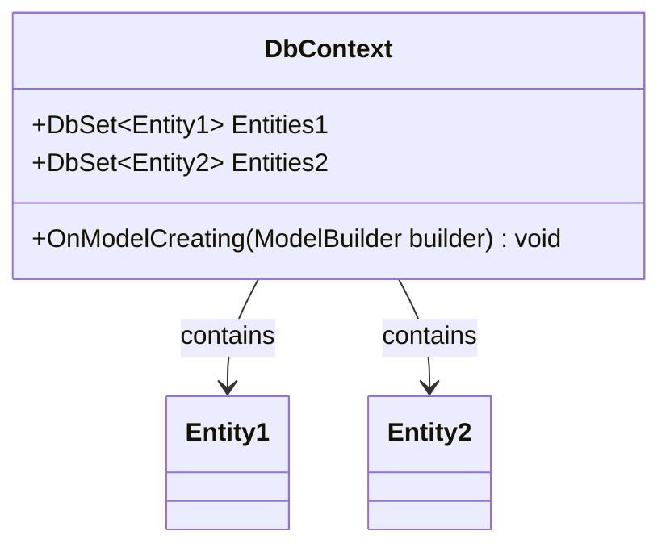

## Model Classes

### Domain Models
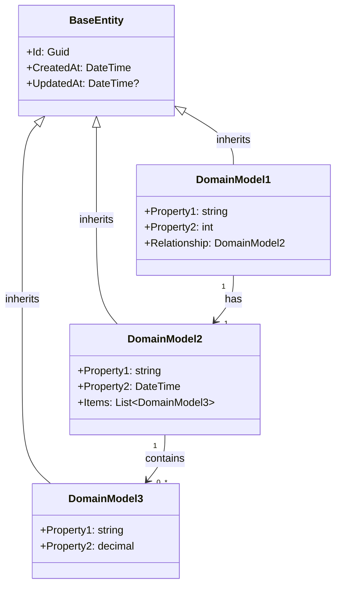

### DTOs (Data Transfer Objects)
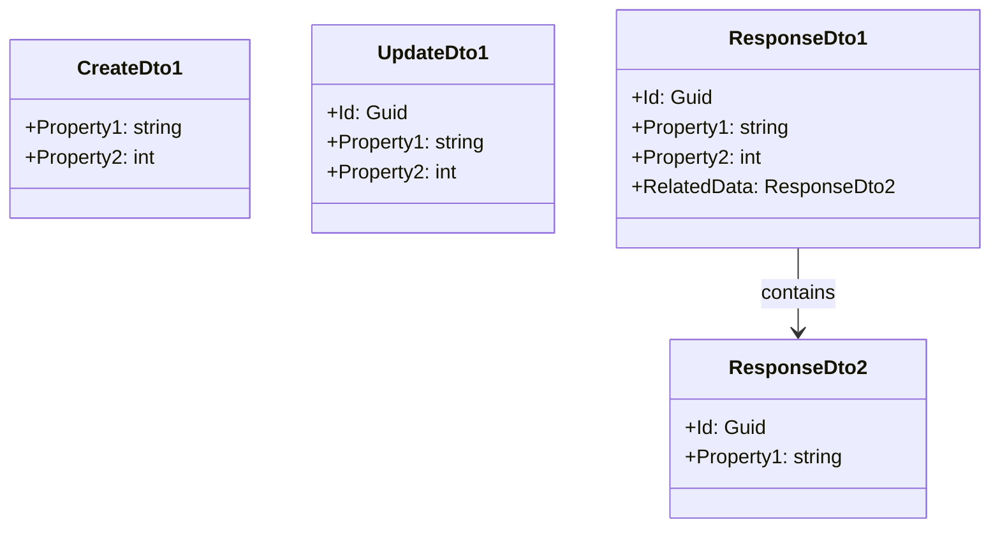

### Enumerations
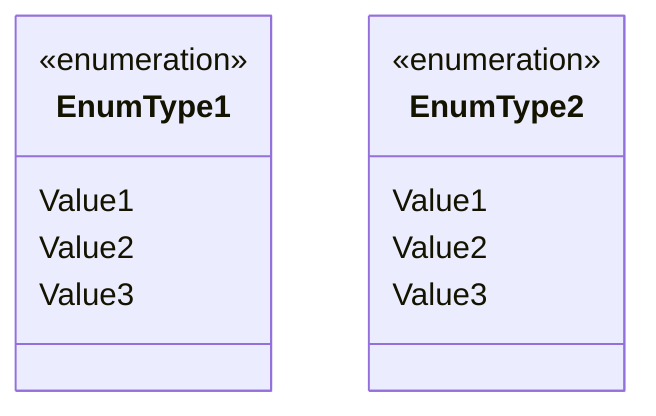

## Entity-Relationship Diagram (ERD)

### Database Schema
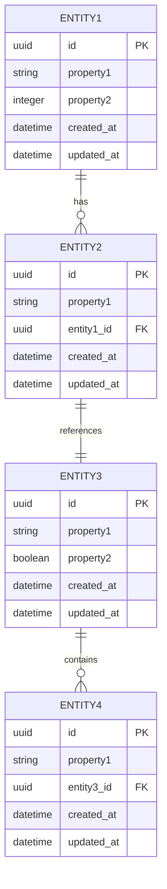

### Database Relationships
- **ENTITY1** to **ENTITY2**: One-to-Many (1:N)
  - A single ENTITY1 can have multiple ENTITY2s
  - Each ENTITY2 belongs to exactly one ENTITY1
  - Foreign key `entity1_id` in ENTITY2 table
  
- **ENTITY2** to **ENTITY3**: One-to-One (1:1)
  - Each ENTITY2 is associated with exactly one ENTITY3
  - Foreign key `entity2_id` could be in either table
  
- **ENTITY3** to **ENTITY4**: One-to-Many (1:N)
  - A single ENTITY3 can have multiple ENTITY4s
  - Each ENTITY4 belongs to exactly one ENTITY3
  - Foreign key `entity3_id` in ENTITY4 table

## Dependency Injection Setup
```csharp
// Register interfaces and implementations
services.AddScoped<IManager1, Manager1>();
services.AddScoped<IManager2, Manager2>();
services.AddScoped<IEngine1, Engine1>();
services.AddScoped<IEngine2, Engine2>();
services.AddScoped<IDataAccess1, DataAccess1>();
services.AddScoped<IDataAccess2, DataAccess2>();

// Register database context
services.AddDbContext<ApplicationDbContext>(options => 
    options.UseNpgsql(Configuration.GetConnectionString("DefaultConnection")));
```

## SOLID Principles Application

### Single Responsibility Principle
Each class in our design has a single responsibility:
- **Managers**: Orchestrate business operations and use cases
- **Engines**: Execute complex business logic
- **Data Access**: Handle persistence and retrieval operations
- **Models**: Hold data structure and validation rules

### Open/Closed Principle
Our design enables extension without modification:
- Interfaces define contracts that can be implemented by new classes
- New functionality can be added via new implementations without changing existing code

### Liskov Substitution Principle
- All implementations can be used anywhere their interfaces are expected
- Base classes can be replaced with derived classes without affecting functionality

### Interface Segregation Principle
- Interfaces are kept focused and specific
- Clients don't depend on methods they don't use

### Dependency Inversion Principle
- High-level modules depend on abstractions (interfaces)
- Low-level modules also depend on abstractions
- All dependencies are injected through constructors

---

**Template Instructions**:
1. Replace all placeholder classes, methods, and properties with actual project-specific elements
2. Ensure each interface explicitly states what its corresponding implementation will do
3. Maintain color coding: Managers (Green), Engines (Orange), Data Access (Grey), Models (Purple)
4. Include all relationships between classes with proper cardinality notation
5. Follow C# naming conventions for all elements

[<< Back](./../design.md)