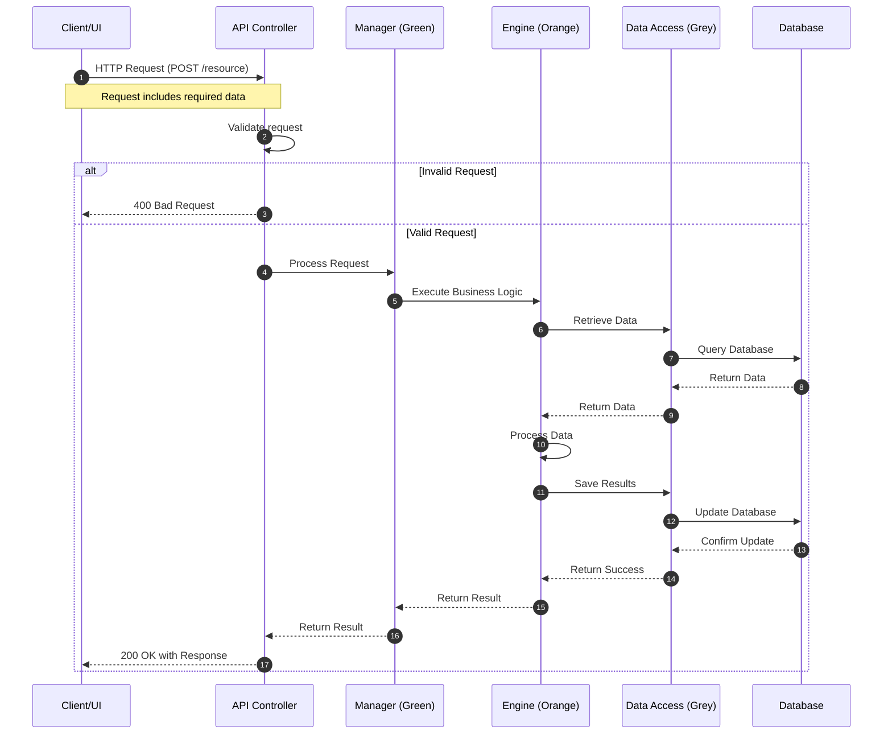
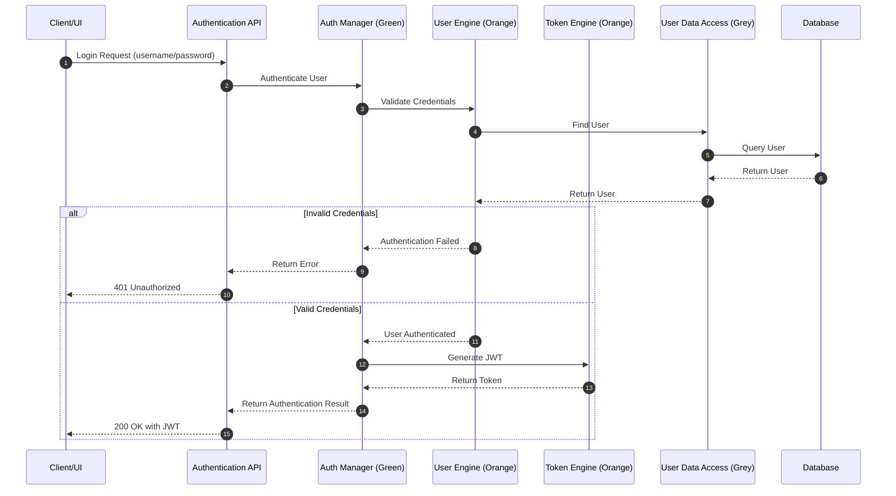
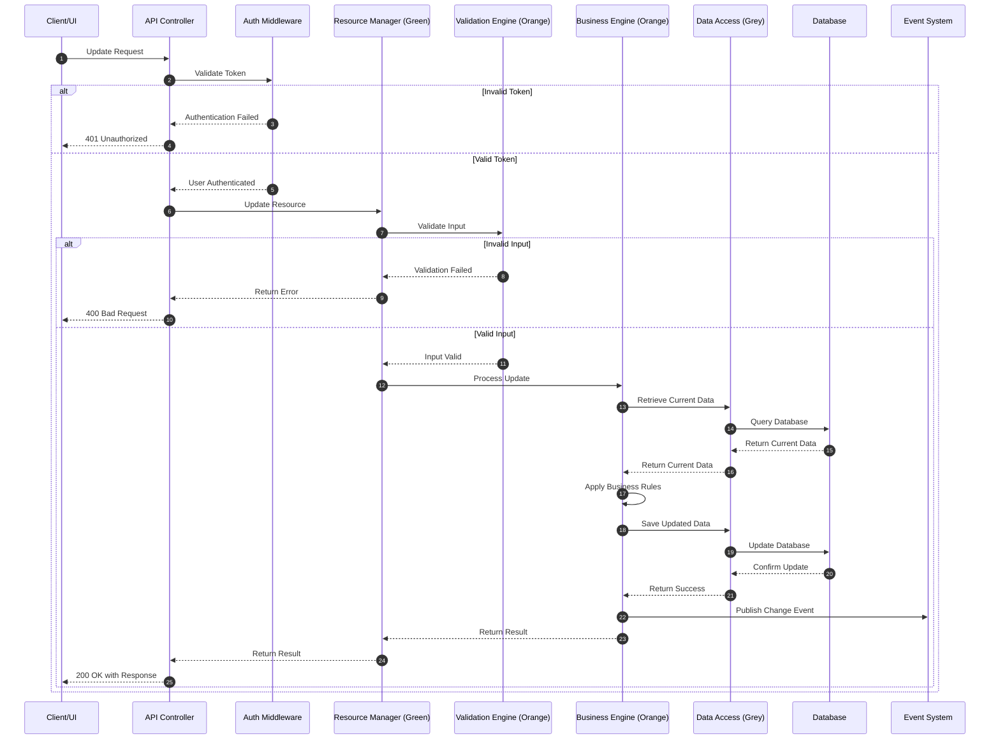
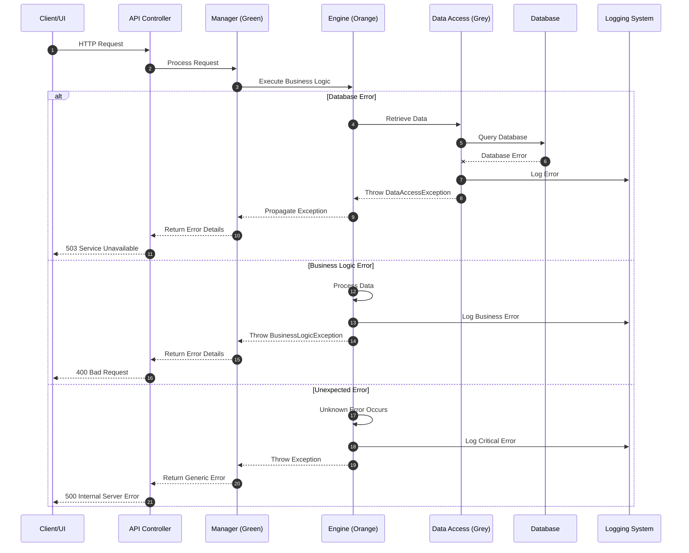
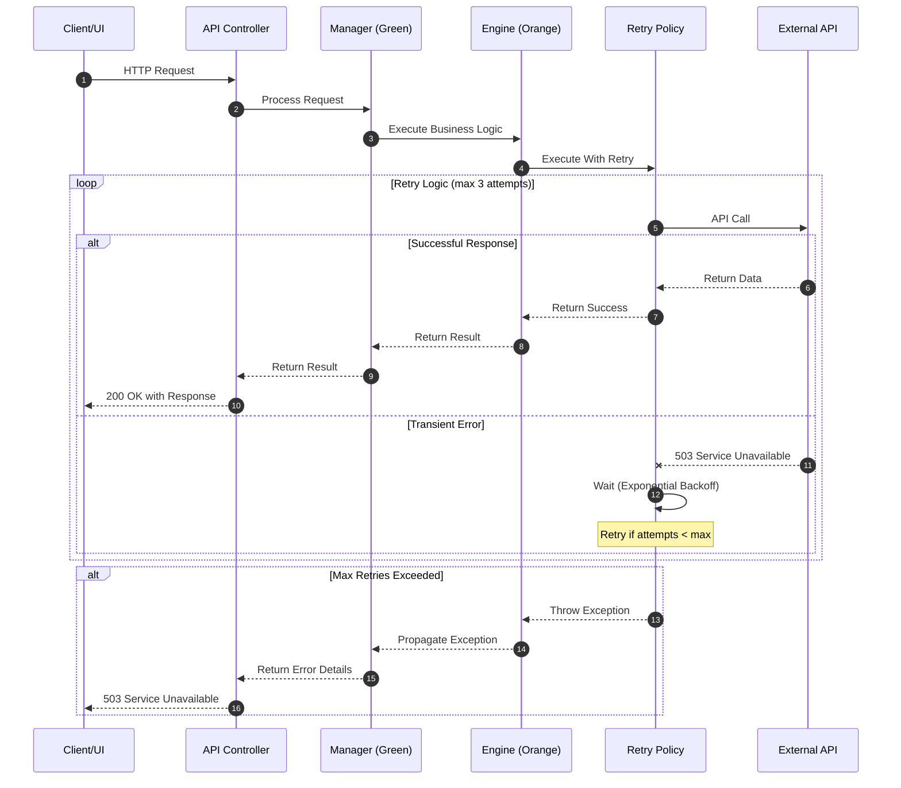
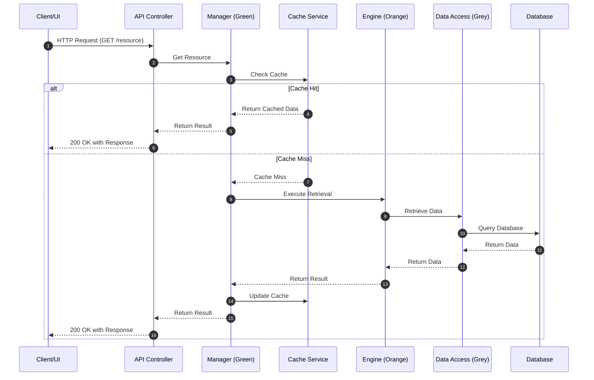
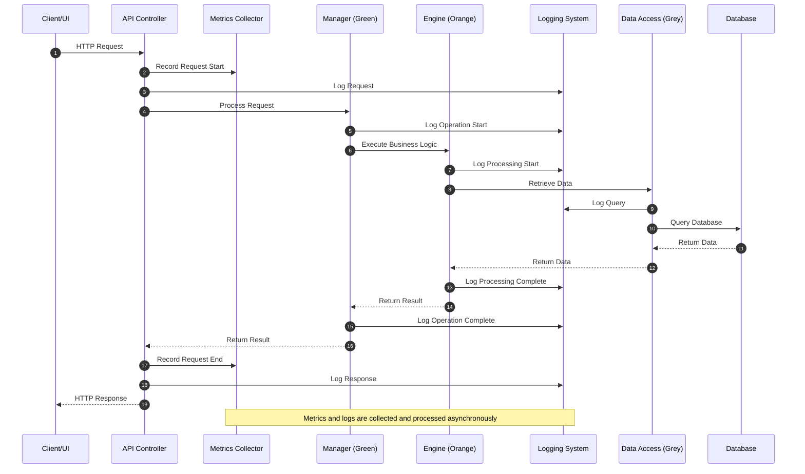
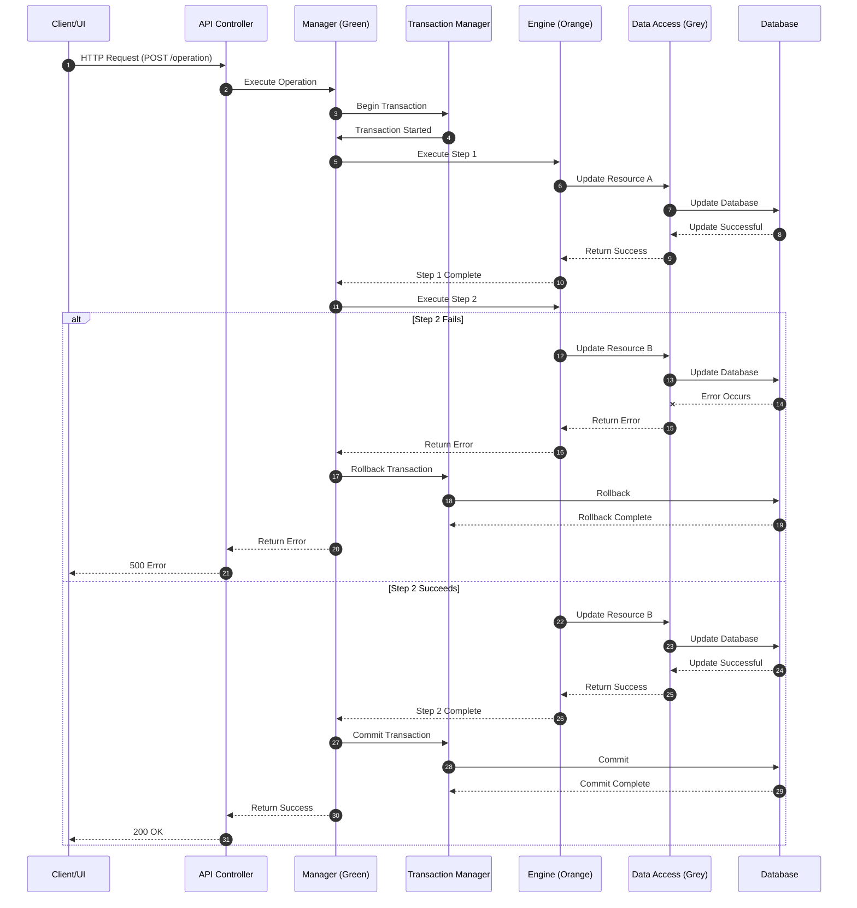

[<< Back](./../design.md)

# Sequence Diagrams

Below we elaborate on the system's sequence diagrams that are based on the [system components](./2-system-components.md) and the [class diagrams](./3-class.md).

We follow the iDesign principles as highlighted in the [design.md](./../design.md) file in this repository.

## Core Business Processes

### Primary User Flow: [Process Name]

### Authentication Flow

### Data Modification Flow

## Exception Handling Flows

### Error Handling Sequence

### Retry Pattern Flow

## Cross-Cutting Concerns

### Caching Sequence

### Logging and Monitoring Flow

## Transaction Management

### Transactional Process Flow

---

**Template Instructions**:

1. Replace all placeholder names and descriptions with actual project-specific elements
2. Ensure the sequence diagrams follow the iDesign layer principles:
   - API Controllers call Managers (Green)
   - Managers call Engines (Orange)
   - Engines call Data Access (Grey)
   - Data Access interacts with external systems
3. Include proper error handling and alternative flows in each diagram
4. Consider adding sequence diagrams for each major use case in your system
5. Use standard Mermaid sequenceDiagram syntax with proper participant labeling

[<< Back](./../design.md)
