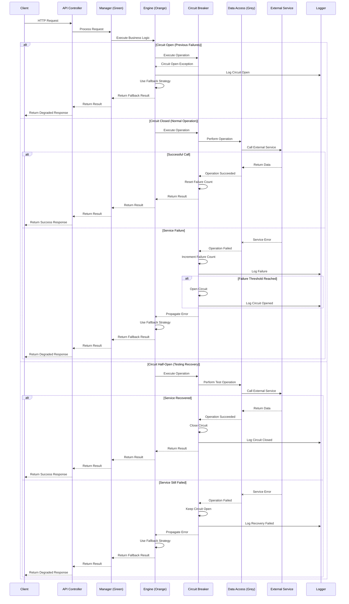
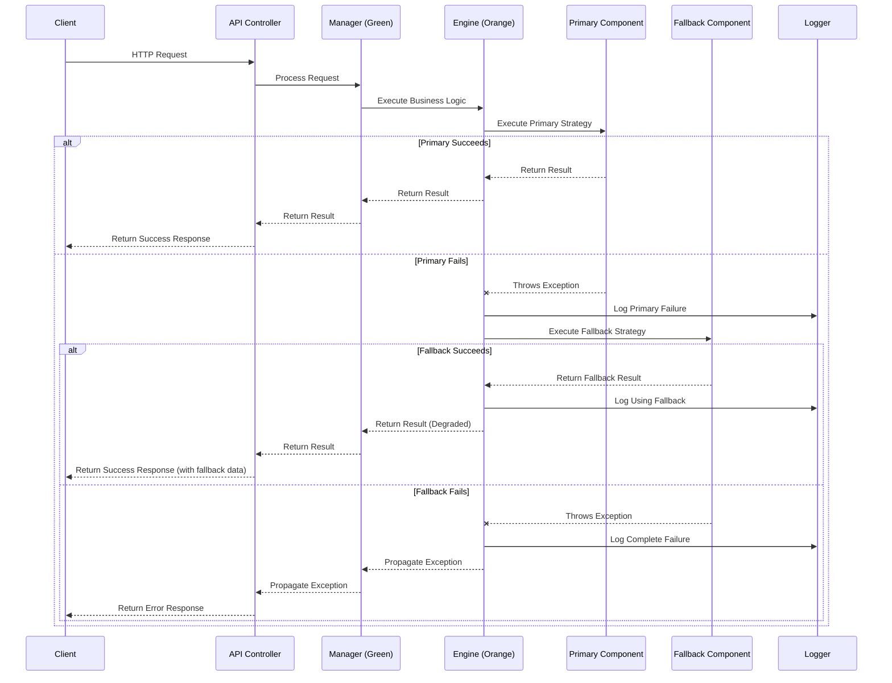
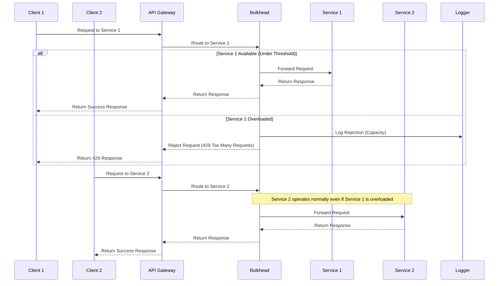
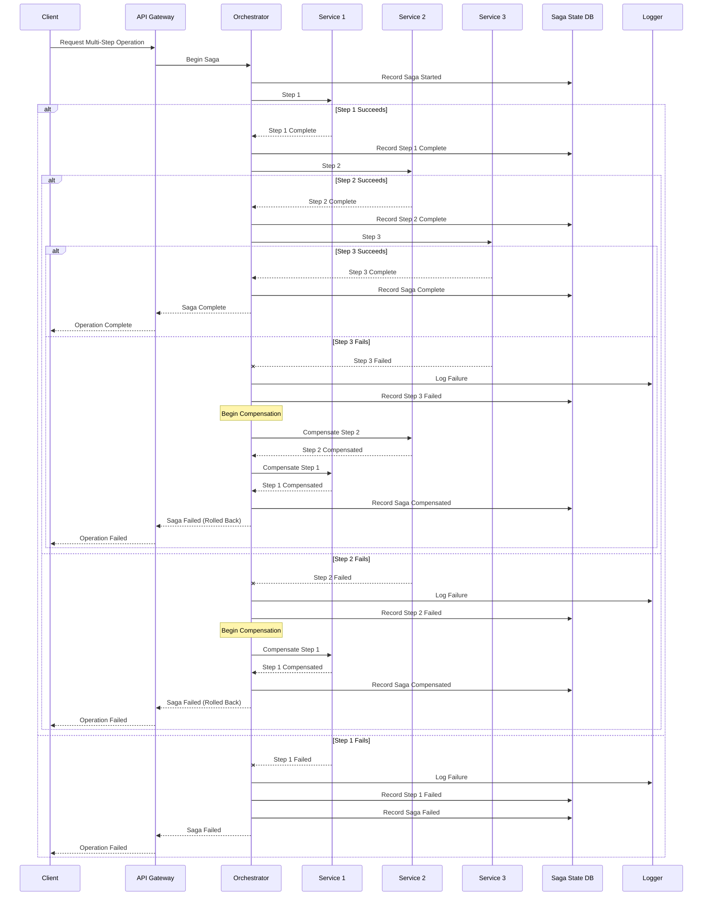

[<< Back](./../design.md)

# Error Handling Sequence Diagrams
This document provides sequence diagrams specifically for error handling flows. It shows how errors are propagated through the system layers and how recovery mechanisms work.

## Common Error Handling Flows

### HTTP API Error Handling Flow
```mermaid
sequenceDiagram
    participant C as Client
    participant API as API Controller
    participant G as Global Exception Handler
    participant M as Manager (Green)
    participant E as Engine (Orange)
    participant D as Data Access (Grey)
    participant DB as Database
    participant Log as Logger

    C->>API: HTTP Request
    activate API
    
    API->>M: Process Request
    activate M
    
    M->>E: Execute Business Logic
    activate E
    
    E->>D: Access Data
    activate D
    
    D->>DB: Execute Query
    activate DB
    
    alt Database Error
        DB-->>D: Throws SQLException
        deactivate DB
        
        D->>Log: Log Error (Warning)
        D-->>E: Throw DataAccessException
        deactivate D
        
        E->>Log: Log Error (Error)
        E-->>M: Propagate Exception
        deactivate E
        
        M-->>API: Propagate Exception
        deactivate M
        
        API->>G: Handle Exception
        activate G
        
        G->>Log: Log Error (Error)
        G-->>C: Return 503 Service Unavailable
        deactivate G
        deactivate API
        
    else Business Rule Violation
        DB-->>D: Return Data
        deactivate DB
        
        D-->>E: Return Data
        deactivate D
        
        E->>E: Business Rule Check Failed
        E->>Log: Log Business Violation (Info)
        E-->>M: Throw BusinessRuleException
        deactivate E
        
        M-->>API: Propagate Exception
        deactivate M
        
        API->>G: Handle Exception
        activate G
        
        G->>Log: Log Business Error (Info)
        G-->>C: Return 400 Bad Request with Details
        deactivate G
        deactivate API
        
    else Unexpected Error
        DB-->>D: Return Data
        deactivate DB
        
        D-->>E: Return Data
        deactivate D
        
        E->>E: Unexpected Error Occurs
        E->>Log: Log Critical Error
        E-->>M: Throw Exception
        deactivate E
        
        M-->>API: Propagate Exception
        deactivate M
        
        API->>G: Handle Exception
        activate G
        
        G->>Log: Log Error (Critical)
        G-->>C: Return 500 Internal Server Error
        deactivate G
        deactivate API
    end
```

### Retry Pattern Flow
```mermaid
sequenceDiagram
    participant C as Client
    participant API as API Controller
    participant M as Manager (Green)
    participant E as Engine (Orange)
    participant R as Retry Handler
    participant D as Data Access (Grey)
    participant ES as External Service
    participant Log as Logger

    C->>API: HTTP Request
    activate API
    
    API->>M: Process Request
    activate M
    
    M->>E: Execute Business Logic
    activate E
    
    E->>R: Execute with Retry
    activate R
    
    loop Retry Logic (max 3 attempts)
        R->>D: Perform Operation
        activate D
        
        D->>ES: Call External Service
        activate ES
        
        alt Successful Response
            ES-->>D: Return Data
            deactivate ES
            
            D-->>R: Operation Succeeded
            deactivate D
            
            R-->>E: Return Result
            deactivate R
            
            E-->>M: Return Result
            deactivate E
            
            M-->>API: Return Result
            deactivate M
            
            API-->>C: Return Success Response
            deactivate API
            
        else Transient Error (Attempt < Max)
            ES--xD: Throws Transient Error
            deactivate ES
            
            D->>Log: Log Retry Attempt
            D-->>R: Throw Transient Exception
            deactivate D
            
            R->>R: Wait (Exponential Backoff)
            R->>Log: Log Retry Attempt
            note over R: Retry with backoff
        end
    end
    
    alt Max Retries Exceeded
        R->>Log: Log Retry Exhausted
        R-->>E: Throw RetryExhaustedException
        deactivate R
        
        E->>Log: Log Service Unavailable
        E-->>M: Propagate Exception
        deactivate E
        
        M-->>API: Propagate Exception
        deactivate M
        
        API-->>C: Return 503 Service Unavailable
        deactivate API
    end
```

### Circuit Breaker Pattern Flow


### Fallback Pattern Flow


### Bulkhead Pattern Flow


### Timeout Pattern Flow
```mermaid
sequenceDiagram
    participant C as Client
    participant API as API Controller
    participant M as Manager (Green)
    participant E as Engine (Orange)
    participant TH as Timeout Handler
    participant D as Data Access (Grey)
    participant ES as External Service
    participant Log as Logger

    C->>API: HTTP Request
    activate API
    
    API->>M: Process Request
    activate M
    
    M->>E: Execute Business Logic
    activate E
    
    E->>TH: Execute with Timeout
    activate TH
    
    TH->>D: Perform Operation with Deadline
    activate D
    
    D->>ES: Call External Service
    activate ES
    
    alt Response Within Timeout
        ES-->>D: Return Data
        deactivate ES
        
        D-->>TH: Operation Completed
        deactivate D
        
        TH-->>E: Return Result
        deactivate TH
        
        E-->>M: Return Result
        deactivate E
        
        M-->>API: Return Result
        deactivate M
        
        API-->>C: Return Success Response
        deactivate API
        
    else Timeout Occurred
        note over ES: Still processing...
        
        TH->>Log: Log Timeout
        TH-->>E: Throw TimeoutException
        deactivate D
        deactivate TH
        
        E->>Log: Log Service Timeout
        E-->>M: Propagate Exception
        deactivate E
        
        M-->>API: Propagate Exception
        deactivate M
        
        API-->>C: Return 504 Gateway Timeout
        deactivate API
        
        note over ES: Eventually completes or abandons task
        deactivate ES
    end
```

## Transaction Management Flows

### Distributed Saga Pattern Flow


## Frontend Error Handling Flows

### API Error Handling in React
```mermaid
sequenceDiagram
    participant U as User
    participant C as React Component
    participant EB as Error Boundary
    participant H as API Hook
    participant A as API Client
    participant BE as Backend API
    participant TS as Toast Service
    
    U->>C: Interact (e.g., Submit Form)
    activate C
    
    C->>H: Call API Operation
    activate H
    
    H->>A: Execute API Call
    activate A
    
    A->>BE: HTTP Request
    activate BE
    
    alt Success Response
        BE-->>A: 200 OK with Data
        deactivate BE
        
        A-->>H: Return Data
        deactivate A
        
        H-->>C: Return Data
        deactivate H
        
        C->>C: Update UI with Data
        C-->>U: Show Success State
        deactivate C
        
    else Validation Error
        BE-->>A: 400 Bad Request
        deactivate BE
        
        A->>A: Parse Validation Errors
        A-->>H: Throw ApiRequestError
        deactivate A
        
        H->>H: Map to Form Errors
        H-->>C: Return Field Errors
        deactivate H
        
        C->>C: Display Field Errors
        C-->>U: Show Validation Issues
        deactivate C
        
    else Authentication Error
        BE-->>A: 401 Unauthorized
        deactivate BE
        
        A-->>H: Throw AuthError
        deactivate A
        
        H->>TS: Show Auth Error Toast
        H-->>C: Return Auth Error
        deactivate H
        
        C->>C: Redirect to Login
        C-->>U: Show Login Required
        deactivate C
        
    else Server Error
        BE-->>A: 500 Server Error
        deactivate BE
        
        A-->>H: Throw ServerError
        deactivate A
        
        H->>TS: Show Error Toast
        H-->>C: Return Error
        deactivate H
        
        C->>C: Show Error State
        C-->>U: Display Friendly Error
        deactivate C
        
    else Network Error
        A--xBE: Connection Failed
        A-->>H: Throw NetworkError
        deactivate A
        
        H->>TS: Show Network Error Toast
        H-->>C: Return Network Error
        deactivate H
        
        C->>C: Show Offline State
        C-->>U: Display Connection Issue
        deactivate C
    end
    
    alt Component Error (Uncaught)
        C->>C: Unexpected Error
        C--xEB: Propagate Error
        activate EB
        
        EB->>EB: Capture Error
        EB->>TS: Show Error Notification
        EB-->>U: Show Fallback UI
        deactivate EB
    end
```

[<< Back](./../design.md)
