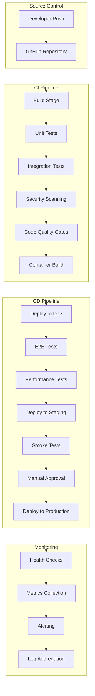

[<< Back](../README.md)

# DevOps & CI/CD Pipeline Guide

## Overview
This guide provides comprehensive CI/CD pipeline patterns and DevOps practices for production-ready software systems. It covers automated testing, deployment strategies, infrastructure as code, and monitoring integration.

## Pipeline Architecture

### Multi-Stage Pipeline Strategy


## Pipeline Templates

### 1. Full-Stack Web Application Pipeline

```yaml
# .github/workflows/fullstack-ci-cd.yml
name: Full-Stack CI/CD Pipeline

on:
  push:
    branches: [main, develop]
  pull_request:
    branches: [main]

env:
  NODE_VERSION: '18'
  DOTNET_VERSION: '8.0'
  DOCKER_REGISTRY: 'your-registry.com'

jobs:
  # === BUILD & TEST JOBS ===
  frontend-build:
    runs-on: ubuntu-latest
    defaults:
      run:
        working-directory: ./src/frontend
    
    steps:
    - uses: actions/checkout@v4
    
    - name: Setup Node.js
      uses: actions/setup-node@v4
      with:
        node-version: ${{ env.NODE_VERSION }}
        cache: 'npm'
        cache-dependency-path: src/frontend/package-lock.json
    
    - name: Install dependencies
      run: npm ci
    
    - name: Lint
      run: npm run lint
    
    - name: Type check
      run: npm run type-check
    
    - name: Unit tests
      run: npm run test:unit -- --coverage
    
    - name: Build
      run: npm run build
    
    - name: Upload build artifacts
      uses: actions/upload-artifact@v4
      with:
        name: frontend-build
        path: src/frontend/dist

  backend-build:
    runs-on: ubuntu-latest
    defaults:
      run:
        working-directory: ./src/backend
    
    steps:
    - uses: actions/checkout@v4
    
    - name: Setup .NET
      uses: actions/setup-dotnet@v4
      with:
        dotnet-version: ${{ env.DOTNET_VERSION }}
    
    - name: Restore dependencies
      run: dotnet restore
    
    - name: Build
      run: dotnet build --no-restore --configuration Release
    
    - name: Unit tests
      run: dotnet test --no-build --configuration Release --collect:"XPlat Code Coverage"
    
    - name: Publish
      run: dotnet publish --no-build --configuration Release --output ./publish
    
    - name: Upload build artifacts
      uses: actions/upload-artifact@v4
      with:
        name: backend-build
        path: src/backend/publish

  # === INTEGRATION TESTS ===
  integration-tests:
    needs: [frontend-build, backend-build]
    runs-on: ubuntu-latest
    
    services:
      postgres:
        image: postgres:15
        env:
          POSTGRES_PASSWORD: test
          POSTGRES_DB: testdb
        options: >-
          --health-cmd pg_isready
          --health-interval 10s
          --health-timeout 5s
          --health-retries 5
        ports:
          - 5432:5432
      
      redis:
        image: redis:7
        options: >-
          --health-cmd "redis-cli ping"
          --health-interval 10s
          --health-timeout 5s
          --health-retries 5
        ports:
          - 6379:6379
    
    steps:
    - uses: actions/checkout@v4
    
    - name: Download backend artifacts
      uses: actions/download-artifact@v4
      with:
        name: backend-build
        path: ./backend-build
    
    - name: Setup .NET
      uses: actions/setup-dotnet@v4
      with:
        dotnet-version: ${{ env.DOTNET_VERSION }}
    
    - name: Run integration tests
      run: dotnet test src/backend/tests/Integration.Tests --configuration Release
      env:
        ConnectionStrings__Database: "Host=localhost;Database=testdb;Username=postgres;Password=test"
        ConnectionStrings__Redis: "localhost:6379"

  # === SECURITY SCANNING ===
  security-scan:
    needs: [frontend-build, backend-build]
    runs-on: ubuntu-latest
    
    steps:
    - uses: actions/checkout@v4
    
    - name: Run Trivy vulnerability scanner
      uses: aquasecurity/trivy-action@master
      with:
        scan-type: 'fs'
        scan-ref: '.'
        format: 'sarif'
        output: 'trivy-results.sarif'
    
    - name: Upload Trivy scan results
      uses: github/codeql-action/upload-sarif@v3
      with:
        sarif_file: 'trivy-results.sarif'
    
    - name: Dependency vulnerability scan
      run: |
        # Frontend dependencies
        cd src/frontend && npm audit --audit-level=high
        
        # Backend dependencies
        cd ../backend && dotnet list package --vulnerable --include-transitive

  # === DOCKER BUILD ===
  docker-build:
    needs: [integration-tests, security-scan]
    runs-on: ubuntu-latest
    if: github.ref == 'refs/heads/main'
    
    outputs:
      image-tag: ${{ steps.meta.outputs.tags }}
      image-digest: ${{ steps.build.outputs.digest }}
    
    steps:
    - uses: actions/checkout@v4
    
    - name: Download artifacts
      uses: actions/download-artifact@v4
      with:
        name: frontend-build
        path: ./src/frontend/dist
    
    - name: Download artifacts
      uses: actions/download-artifact@v4
      with:
        name: backend-build
        path: ./src/backend/publish
    
    - name: Set up Docker Buildx
      uses: docker/setup-buildx-action@v3
    
    - name: Login to container registry
      uses: docker/login-action@v3
      with:
        registry: ${{ env.DOCKER_REGISTRY }}
        username: ${{ secrets.REGISTRY_USERNAME }}
        password: ${{ secrets.REGISTRY_PASSWORD }}
    
    - name: Extract metadata
      id: meta
      uses: docker/metadata-action@v5
      with:
        images: ${{ env.DOCKER_REGISTRY }}/myapp
        tags: |
          type=ref,event=branch
          type=ref,event=pr
          type=sha,prefix={{branch}}-
    
    - name: Build and push
      id: build
      uses: docker/build-push-action@v5
      with:
        context: .
        push: true
        tags: ${{ steps.meta.outputs.tags }}
        labels: ${{ steps.meta.outputs.labels }}
        cache-from: type=gha
        cache-to: type=gha,mode=max

  # === DEPLOYMENT JOBS ===
  deploy-dev:
    needs: [docker-build]
    runs-on: ubuntu-latest
    if: github.ref == 'refs/heads/develop'
    environment: development
    
    steps:
    - uses: actions/checkout@v4
    
    - name: Deploy to development
      run: |
        echo "Deploying to development environment"
        # Add your deployment logic here
        # Examples: kubectl, terraform, ansible, etc.

  deploy-staging:
    needs: [docker-build]
    runs-on: ubuntu-latest
    if: github.ref == 'refs/heads/main'
    environment: staging
    
    steps:
    - uses: actions/checkout@v4
    
    - name: Deploy to staging
      run: |
        echo "Deploying to staging environment"
        # Add your deployment logic here

  # === E2E TESTS ===
  e2e-tests:
    needs: [deploy-staging]
    runs-on: ubuntu-latest
    if: github.ref == 'refs/heads/main'
    
    steps:
    - uses: actions/checkout@v4
    
    - name: Setup Node.js
      uses: actions/setup-node@v4
      with:
        node-version: ${{ env.NODE_VERSION }}
    
    - name: Install Playwright
      run: |
        cd src/frontend
        npm ci
        npx playwright install --with-deps
    
    - name: Run E2E tests
      run: |
        cd src/frontend
        npm run test:e2e
      env:
        BASE_URL: ${{ vars.STAGING_URL }}
    
    - name: Upload E2E results
      uses: actions/upload-artifact@v4
      if: always()
      with:
        name: e2e-report
        path: src/frontend/playwright-report/

  deploy-production:
    needs: [e2e-tests]
    runs-on: ubuntu-latest
    if: github.ref == 'refs/heads/main'
    environment: production
    
    steps:
    - uses: actions/checkout@v4
    
    - name: Deploy to production
      run: |
        echo "Deploying to production environment"
        # Add your production deployment logic here
    
    - name: Post-deployment health check
      run: |
        echo "Running post-deployment health checks"
        # Add health check logic here
```

### 2. Microservices Pipeline Template

```yaml
# .github/workflows/microservices-ci-cd.yml
name: Microservices CI/CD Pipeline

on:
  push:
    branches: [main, develop]
  pull_request:
    branches: [main]
  
  # Enable manual workflow dispatch
  workflow_dispatch:
    inputs:
      service:
        description: 'Service to deploy (all for all services)'
        required: true
        default: 'all'
        type: choice
        options:
          - all
          - user-service
          - order-service
          - payment-service
          - notification-service

env:
  DOCKER_REGISTRY: 'your-registry.com'

jobs:
  # === DETECT CHANGES ===
  detect-changes:
    runs-on: ubuntu-latest
    outputs:
      user-service: ${{ steps.changes.outputs.user-service }}
      order-service: ${{ steps.changes.outputs.order-service }}
      payment-service: ${{ steps.changes.outputs.payment-service }}
      notification-service: ${{ steps.changes.outputs.notification-service }}
      shared: ${{ steps.changes.outputs.shared }}
    
    steps:
    - uses: actions/checkout@v4
    
    - uses: dorny/paths-filter@v2
      id: changes
      with:
        filters: |
          user-service:
            - 'src/services/user-service/**'
          order-service:
            - 'src/services/order-service/**'
          payment-service:
            - 'src/services/payment-service/**'
          notification-service:
            - 'src/services/notification-service/**'
          shared:
            - 'src/shared/**'

  # === BUILD MATRIX ===
  build-services:
    needs: detect-changes
    runs-on: ubuntu-latest
    if: ${{ 
      needs.detect-changes.outputs.user-service == 'true' ||
      needs.detect-changes.outputs.order-service == 'true' ||
      needs.detect-changes.outputs.payment-service == 'true' ||
      needs.detect-changes.outputs.notification-service == 'true' ||
      needs.detect-changes.outputs.shared == 'true' ||
      github.event.inputs.service != ''
    }}
    
    strategy:
      matrix:
        service: [user-service, order-service, payment-service, notification-service]
    
    steps:
    - uses: actions/checkout@v4
    
    - name: Check if service should be built
      id: should-build
      run: |
        if [[ "${{ github.event.inputs.service }}" == "all" ]] || 
           [[ "${{ github.event.inputs.service }}" == "${{ matrix.service }}" ]] || 
           [[ "${{ needs.detect-changes.outputs[matrix.service] }}" == "true" ]] ||
           [[ "${{ needs.detect-changes.outputs.shared }}" == "true" ]]; then
          echo "should-build=true" >> $GITHUB_OUTPUT
        else
          echo "should-build=false" >> $GITHUB_OUTPUT
        fi
    
    - name: Setup .NET
      if: steps.should-build.outputs.should-build == 'true'
      uses: actions/setup-dotnet@v4
      with:
        dotnet-version: '8.0'
    
    - name: Build and Test
      if: steps.should-build.outputs.should-build == 'true'
      run: |
        cd src/services/${{ matrix.service }}
        dotnet restore
        dotnet build --no-restore --configuration Release
        dotnet test --no-build --configuration Release --collect:"XPlat Code Coverage"
    
    - name: Build Docker image
      if: steps.should-build.outputs.should-build == 'true' && github.ref == 'refs/heads/main'
      run: |
        docker build -t ${{ env.DOCKER_REGISTRY }}/${{ matrix.service }}:${{ github.sha }} \
          -f src/services/${{ matrix.service }}/Dockerfile .
        docker push ${{ env.DOCKER_REGISTRY }}/${{ matrix.service }}:${{ github.sha }}
```

## Infrastructure as Code

### Terraform Example Structure

```hcl
# infrastructure/main.tf
terraform {
  required_version = ">= 1.0"
  
  required_providers {
    azurerm = {
      source  = "hashicorp/azurerm"
      version = "~> 3.0"
    }
  }
  
  backend "azurerm" {
    resource_group_name  = "rg-terraform-state"
    storage_account_name = "stterraformstate"
    container_name       = "tfstate"
    key                  = "prod.terraform.tfstate"
  }
}

provider "azurerm" {
  features {}
}

# Resource Group
resource "azurerm_resource_group" "main" {
  name     = var.resource_group_name
  location = var.location
  
  tags = var.common_tags
}

# Container Registry
resource "azurerm_container_registry" "main" {
  name                = var.acr_name
  resource_group_name = azurerm_resource_group.main.name
  location            = azurerm_resource_group.main.location
  sku                 = "Premium"
  admin_enabled       = false
  
  tags = var.common_tags
}

# Application Insights
resource "azurerm_application_insights" "main" {
  name                = var.app_insights_name
  location            = azurerm_resource_group.main.location
  resource_group_name = azurerm_resource_group.main.name
  application_type    = "web"
  
  tags = var.common_tags
}

# Key Vault
resource "azurerm_key_vault" "main" {
  name                = var.key_vault_name
  location            = azurerm_resource_group.main.location
  resource_group_name = azurerm_resource_group.main.name
  tenant_id           = data.azurerm_client_config.current.tenant_id
  
  sku_name = "standard"
  
  purge_protection_enabled = true
  
  tags = var.common_tags
}
```

## Deployment Strategies

### 1. Blue-Green Deployment

```yaml
# Deploy to blue environment
- name: Deploy to Blue Environment
  run: |
    kubectl apply -f k8s/blue-deployment.yaml
    kubectl wait --for=condition=available --timeout=300s deployment/myapp-blue

# Health check on blue
- name: Health Check Blue Environment
  run: |
    curl -f http://blue.myapp.com/health || exit 1

# Switch traffic to blue
- name: Switch Traffic to Blue
  run: |
    kubectl patch service myapp-service -p '{"spec":{"selector":{"version":"blue"}}}'

# Clean up green environment
- name: Clean up Green Environment
  run: |
    kubectl delete deployment myapp-green --ignore-not-found=true
```

### 2. Rolling Deployment

```yaml
# Rolling update deployment
- name: Rolling Update Deployment
  run: |
    kubectl set image deployment/myapp container=myapp:${{ github.sha }}
    kubectl rollout status deployment/myapp --timeout=300s

# Rollback if health check fails
- name: Health Check and Rollback
  run: |
    if ! curl -f http://myapp.com/health; then
      echo "Health check failed, rolling back"
      kubectl rollout undo deployment/myapp
      kubectl rollout status deployment/myapp --timeout=300s
      exit 1
    fi
```

### 3. Canary Deployment

```yaml
# Deploy canary version
- name: Deploy Canary
  run: |
    kubectl apply -f k8s/canary-deployment.yaml
    kubectl wait --for=condition=available --timeout=300s deployment/myapp-canary

# Gradual traffic shift
- name: Shift Traffic to Canary
  run: |
    # 10% traffic to canary
    kubectl apply -f k8s/istio-virtual-service-10.yaml
    sleep 300
    
    # Monitor metrics and health
    if [[ $(curl -s http://metrics.myapp.com/canary/error-rate) > 0.01 ]]; then
      echo "High error rate detected, rolling back canary"
      kubectl delete deployment myapp-canary
      exit 1
    fi
    
    # 50% traffic to canary
    kubectl apply -f k8s/istio-virtual-service-50.yaml
    sleep 300
    
    # Full traffic to canary
    kubectl apply -f k8s/istio-virtual-service-100.yaml
    
    # Replace main deployment
    kubectl delete deployment myapp-main
    kubectl patch deployment myapp-canary -p '{"metadata":{"name":"myapp-main"}}'
```

## Quality Gates

### Code Quality Checks

```yaml
# Quality gate job
quality-gate:
  runs-on: ubuntu-latest
  steps:
  - uses: actions/checkout@v4
  
  # SonarQube analysis
  - name: SonarQube Scan
    uses: sonarqube-quality-gate-action@master
    env:
      SONAR_TOKEN: ${{ secrets.SONAR_TOKEN }}
    with:
      scanMetadataReportFile: .sonarqube/report-task.txt
  
  # Code coverage threshold
  - name: Check Code Coverage
    run: |
      COVERAGE=$(grep -o 'Line Coverage: [0-9]*' coverage-report.txt | grep -o '[0-9]*')
      if [ "$COVERAGE" -lt 80 ]; then
        echo "Code coverage is below 80%: $COVERAGE%"
        exit 1
      fi
  
  # Performance benchmarks
  - name: Performance Regression Check
    run: |
      npm run benchmark
      # Compare with baseline metrics
      python scripts/check-performance-regression.py
```

## Monitoring & Observability Integration

### Health Check Endpoints

```csharp
// HealthCheckExtensions.cs
public static class HealthCheckExtensions
{
    public static IServiceCollection AddCustomHealthChecks(
        this IServiceCollection services,
        IConfiguration configuration)
    {
        services.AddHealthChecks()
            .AddSqlServer(configuration.GetConnectionString("Database"))
            .AddRedis(configuration.GetConnectionString("Redis"))
            .AddUrlGroup(new Uri($"{configuration["ExternalServices:UserService"]}/health"), 
                name: "user-service")
            .AddApplicationInsightsPublisher();
        
        return services;
    }
}
```

### Deployment Health Verification

```yaml
# Post-deployment verification
- name: Verify Deployment Health
  run: |
    # Wait for pods to be ready
    kubectl wait --for=condition=ready pod -l app=myapp --timeout=300s
    
    # Check health endpoints
    for i in {1..10}; do
      if curl -f http://myapp.com/health; then
        echo "Health check passed"
        break
      fi
      echo "Health check failed, attempt $i/10"
      sleep 30
    done
    
    # Verify key metrics
    python scripts/verify-deployment-metrics.py \
      --app-insights-key "${{ secrets.APP_INSIGHTS_KEY }}" \
      --deployment-time "$(date -u +%Y-%m-%dT%H:%M:%SZ)"
```

## Environment Management

### Environment-Specific Configurations

```yaml
# Development environment
name: Deploy to Development
environment: development
steps:
- name: Deploy
  run: |
    helm upgrade --install myapp ./helm-chart \
      --namespace dev \
      --values values-dev.yaml \
      --set image.tag=${{ github.sha }} \
      --set ingress.hosts[0].host=dev.myapp.com
      
# Production environment with approval
name: Deploy to Production
environment: production
steps:
- name: Deploy
  run: |
    helm upgrade --install myapp ./helm-chart \
      --namespace prod \
      --values values-prod.yaml \
      --set image.tag=${{ github.sha }} \
      --set ingress.hosts[0].host=myapp.com \
      --atomic \
      --timeout=600s
```

## Best Practices

### 1. Pipeline Security
- Use secrets management for sensitive data
- Implement least privilege access
- Scan for vulnerabilities in dependencies and containers
- Sign container images and verify signatures

### 2. Performance Optimization
- Use build caches effectively
- Implement parallel job execution
- Optimize Docker layer caching
- Use multi-stage Docker builds

### 3. Reliability
- Implement proper error handling and retries
- Use health checks and readiness probes
- Implement circuit breakers for external dependencies
- Create rollback procedures

### 4. Observability
- Integrate comprehensive logging
- Implement distributed tracing
- Monitor key business and technical metrics
- Set up alerting for critical failures

### 5. Compliance & Governance
- Implement approval processes for production
- Maintain audit trails
- Use infrastructure as code
- Document all procedures and runbooks

## Integration with AI Agent

The AI agent should automatically:

1. **Generate appropriate pipeline based on project type:**
   - Single service applications → Simple CI/CD
   - Microservices → Matrix builds with change detection
   - Full-stack → Multi-stage pipeline with frontend/backend

2. **Configure quality gates based on requirements:**
   - Add security scanning for sensitive applications
   - Configure performance testing for high-traffic systems
   - Set up compliance checks for regulated industries

3. **Set up monitoring integration:**
   - Application Insights/Datadog integration
   - Health check endpoints
   - Custom metrics and alerting

4. **Implement appropriate deployment strategy:**
   - Blue-green for critical systems
   - Rolling updates for standard applications
   - Canary for high-risk deployments

## 🐳 **Production Containerization Requirements**

### **Critical CI/CD Pipeline Deliverables**
The AI agent MUST generate complete containerization workflows:

#### **✅ Required Deliverables**
- **Production Dockerfiles**: Multi-stage, optimized builds for all services
- **GitHub Actions Workflows**: Complete CI/CD with container builds and pushes  
- **Registry Integration**: Automated pushes to Docker Hub/ACR/ECR
- **Environment Configuration**: Production-ready docker-compose and Kubernetes manifests
- **Image Tagging Strategy**: Semantic versioning and branch-based tagging

#### **❌ Template Cleanup**
- **Delete Example Workflow**: Remove `/.github/workflows/containerization_workflow.yml`
- **Replace with Production Pipeline**: Create project-specific CI/CD workflows
- **Update Documentation**: Replace template references with actual project details

#### **🔄 Container Build Pipeline Pattern**
```yaml
# Final pipeline step - build and push containers
container-build:
  needs: [tests, security-scan, quality-gates]
  runs-on: ubuntu-latest
  if: github.ref == 'refs/heads/main'
  
  strategy:
    matrix:
      service: [frontend, backend, api, worker] # Project-specific services
  
  steps:
  - name: Build and Push Docker Image
    run: |
      docker build -t ${{ env.REGISTRY }}/${{ matrix.service }}:${{ github.sha }} \
        -f src/${{ matrix.service }}/Dockerfile .
      docker push ${{ env.REGISTRY }}/${{ matrix.service }}:${{ github.sha }}
```

**This ensures every generated project has production-ready containerization with proper CI/CD integration.**

[<< Back](../README.md)
