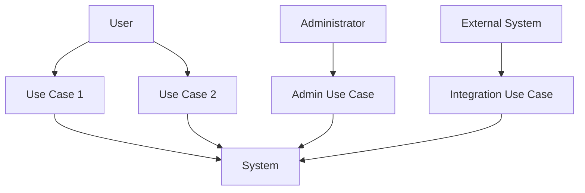
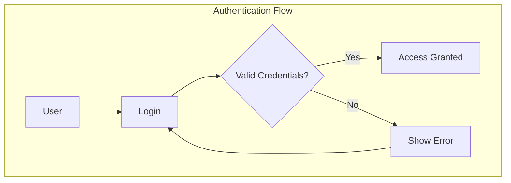
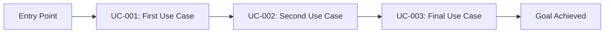

<!-- reference @.docs/design.md -->

[<< Back](./../design.md)

# Use Cases
Below we elaborate on the system's use cases. These document various use cases that should be met, based on the system requirements.

Ensure we follow our **design principles**.

## 📋 Template Guidance for AI Implementation

### Purpose & Scope
This document defines **what** the system needs to do and **who** will use it. Use cases bridge business requirements and functional design without diving into technical implementation details.

**🎯 Focus**: User goals, business value, and functional requirements
**🚫 Avoid**: Technical architecture, API design, detailed error handling, implementation specifics

### Completion Guidelines
- **5-15 detailed use cases** for most systems
- **3-7 actors** to avoid over-complexity  
- **Clear, user-focused language** without technical jargon
- **Traceable to business requirements** and forward to acceptance criteria

## 🎯 Business Context

### Problem Statement
**Current State**: [What problems exist today?]
**Desired State**: [How will this system improve things?]
**Success Metrics**: [How will we measure success?]

### Target Users
**Primary Users**: [Main user types and their goals]
**Secondary Users**: [Supporting user types]
**Usage Context**: [When/where/how will they use the system?]

## System Requirements

### Functional Requirements
- **FR-001**: [Requirement Description]
- **FR-002**: [Requirement Description]
- **FR-003**: [Requirement Description]

### Non-Functional Requirements
- **NFR-001**: [Performance Requirements]
- **NFR-002**: [Security Requirements]
- **NFR-003**: [Scalability Requirements]
- **NFR-004**: [Usability Requirements]

## Actors
*Define the different types of users/systems that interact with the system*

- **Primary Actors**: [Users who directly interact with the system]
- **Secondary Actors**: [External systems or services]
- **Administrative Actors**: [System administrators, support staff]

## Use Case Diagrams

### High-Level System Overview

### Actor Interaction Flows

## Detailed Use Cases

### UC-001: [Use Case Name]
- **Actor**: [Primary Actor]
- **Stakeholders**: [Other affected parties]
- **Precondition**: [What must be true before this use case can execute]
- **Trigger**: [What initiates this use case]
- **Business Value**: [Why this use case matters to the business]
- **Frequency**: [How often this occurs: Daily/Weekly/Monthly]

**Main Success Scenario**:
  1. [Step 1]
  2. [Step 2]
  3. [Step 3]
  4. [Step 4]

**Alternative Flows**:
  - **2a**: [Alternative scenario if step 2 has variations]
  - **3a**: [Alternative scenario if step 3 fails]

**Exception Flows**:
  - **E1**: [What happens if system error occurs]
  - **E2**: [What happens if validation fails]

**Data Requirements**:
  - **Input**: [What data is needed]
  - **Output**: [What data is created/modified]
  - **Validation**: [Key validation rules]

**Success Criteria**:
  - [How we know this use case succeeded]
  - [Performance expectations: response time, throughput]
  - [Quality expectations: error rate, user satisfaction]

- **Postcondition**: [What is true after successful completion]
- **Business Rules**: [Any business rules that apply]
- **Notes**: [Additional considerations, constraints, or context]

### UC-002: [Use Case Name]
- **Actor**: [Primary Actor]
- **Stakeholders**: [Other affected parties]
- **Precondition**: [Prerequisites]
- **Trigger**: [Initiating event]
- **Business Value**: [Business justification]
- **Frequency**: [Usage frequency]

**Main Success Scenario**:
  1. [Step 1]
  2. [Step 2]
  3. [Step 3]

**Alternative Flows**: [Variations]
**Exception Flows**: [Error handling]

**Data Requirements**:
  - **Input**: [Required input]
  - **Output**: [Created/modified data]
  - **Validation**: [Key validation rules]

**Success Criteria**: [Performance and quality expectations]

- **Postcondition**: [End state]
- **Business Rules**: [Applicable rules]
- **Notes**: [Additional context]

## Sub-Use Cases & Detailed Breakdowns

*When core use cases are high-level, break them into specific sub-actions for clarity*

### UC-001 Sub-Use Cases: [Parent Use Case Name]

**UC-001.1: [Specific Sub-Action]**
- **Description**: [What this specific action accomplishes]
- **Trigger**: [When this sub-action is needed]
- **Steps**: [Brief 2-3 step process]
- **Outcome**: [Specific result of this sub-action]

**UC-001.2: [Another Sub-Action]**
- **Description**: [What this specific action accomplishes]
- **Trigger**: [When this sub-action is needed]
- **Steps**: [Brief 2-3 step process]
- **Outcome**: [Specific result of this sub-action]

**UC-001.3: [Final Sub-Action]**
- **Description**: [What this specific action accomplishes]
- **Trigger**: [When this sub-action is needed]
- **Steps**: [Brief 2-3 step process]
- **Outcome**: [Specific result of this sub-action]

### Example: UC-Admin: Manage System Dashboard

**UC-Admin.1: View System Health**
- **Description**: Monitor overall system status and performance metrics
- **Trigger**: Admin opens dashboard or needs to check system status
- **Steps**: 
  1. Display real-time system metrics (CPU, memory, active users)
  2. Show service status indicators (green/yellow/red)
  3. Present recent alerts and warnings
- **Outcome**: Admin has clear view of system health

**UC-Admin.2: Manage User Accounts**
- **Description**: Create, modify, disable, or delete user accounts
- **Trigger**: New user registration, access issues, or account violations
- **Steps**:
  1. Search and select user account
  2. Modify user permissions, status, or profile data
  3. Save changes and notify user if needed
- **Outcome**: User account is updated with proper access levels

**UC-Admin.3: Configure System Settings**
- **Description**: Adjust system-wide configuration and business rules
- **Trigger**: Business requirement changes or system optimization needs
- **Steps**:
  1. Navigate to configuration section
  2. Modify settings (timeouts, limits, feature flags)
  3. Validate and apply changes
- **Outcome**: System operates with updated configuration

### Sub-Use Case Guidelines

**When to Create Sub-Use Cases**:
- Parent use case has 8+ steps in main scenario
- Use case combines multiple distinct user goals
- Different stakeholders care about different parts
- Implementation requires multiple development stories

**Sub-Use Case Naming Convention**:
- Format: `UC-[Parent].[Number]: [Specific Action]`
- Keep action verbs specific: "View", "Create", "Update", "Delete", "Configure"
- Focus on single, cohesive user goal

## 🗺️ User Journey Overview

### Primary User Journey: [Journey Name]
**Goal**: [What the user wants to accomplish overall]
**Flow**: [UC-001] → [UC-002] → [UC-003]

**Journey Success Metrics**:
- **Completion Rate**: [% who complete the entire journey]
- **Time to Value**: [How long until user gets value]
- **Drop-off Points**: [Where users typically abandon the journey]

## Use Case Prioritization

### High Priority (Must Have)
- **UC-001**: [Use Case Name] - [Business justification]
- **UC-002**: [Use Case Name] - [Business justification]

### Medium Priority (Should Have)
- **UC-003**: [Use Case Name] - [Business justification]
- **UC-004**: [Use Case Name] - [Business justification]

### Low Priority (Could Have)
- **UC-005**: [Use Case Name] - [Business justification]

## Cross-Cutting Concerns

### User Experience Considerations
**Key UX principles to consider during use case analysis**:
- **User Flow Logic**: Clear paths through the system without unnecessary complexity
- **Error Prevention**: How the system guides users away from mistakes
- **Feedback & Communication**: What users need to know at each step
- **Accessibility**: Inclusive design considerations for all users

### Security Use Cases
- **Authentication**: How users prove their identity
- **Authorization**: How permissions are enforced across use cases
- **Data Protection**: How sensitive data is handled in each use case

### System Administration Use Cases
- **User Management**: CRUD operations for user accounts
- **System Monitoring**: Health checks and performance monitoring
- **Data Management**: Backup, recovery, and maintenance procedures

## Traceability Matrix
*Link use cases back to requirements and forward to acceptance criteria*

| Use Case | Requirements | Business Value | Acceptance Criteria |
|----------|-------------|----------------|-------------------|
| UC-001   | FR-001, NFR-001 | [Business impact] | AC-001, AC-002 |
| UC-002   | FR-002, FR-003  | [Business impact] | AC-003, AC-004 |

## Acceptance Criteria

### UC-001 Acceptance Criteria
- **Given** [Initial state]
- **When** [Action performed]
- **Then** [Expected outcome]
- **And** [Additional verification]

### UC-002 Acceptance Criteria
- **Given** [Initial state]
- **When** [Action performed]
- **Then** [Expected outcome]

---

**Template Instructions**: 
1. Replace all placeholder text in brackets with actual project-specific content
2. Focus on user goals and business value, not technical implementation
3. Keep use cases at the right level of detail - not too granular, not too high-level
4. Ensure traceability from business requirements through to acceptance criteria
5. Add/remove sections based on your system complexity

[<< Back](./../design.md)
