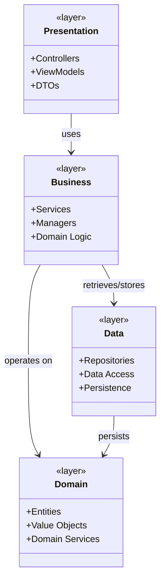
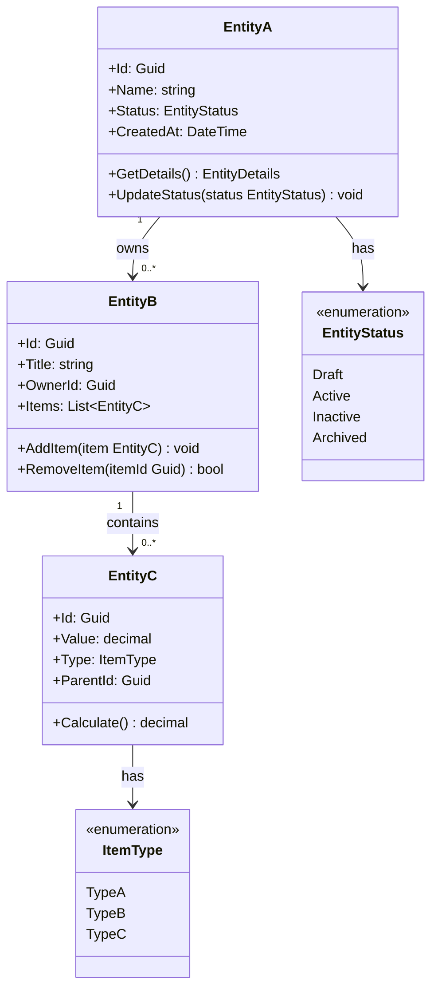
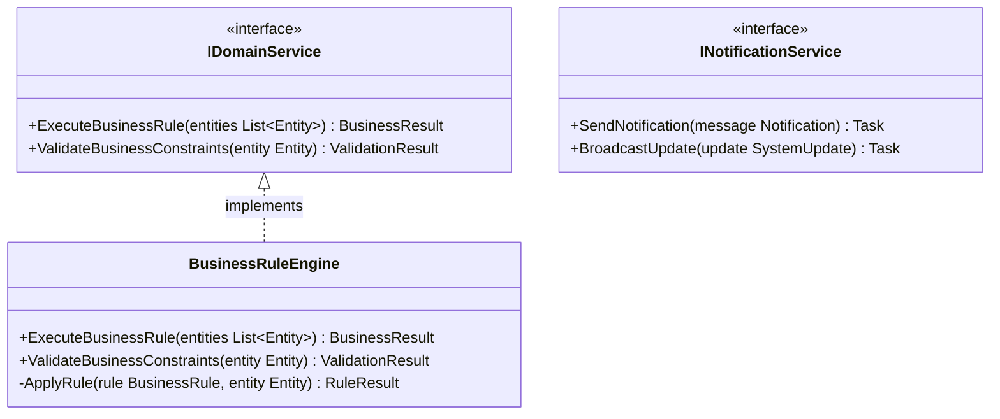
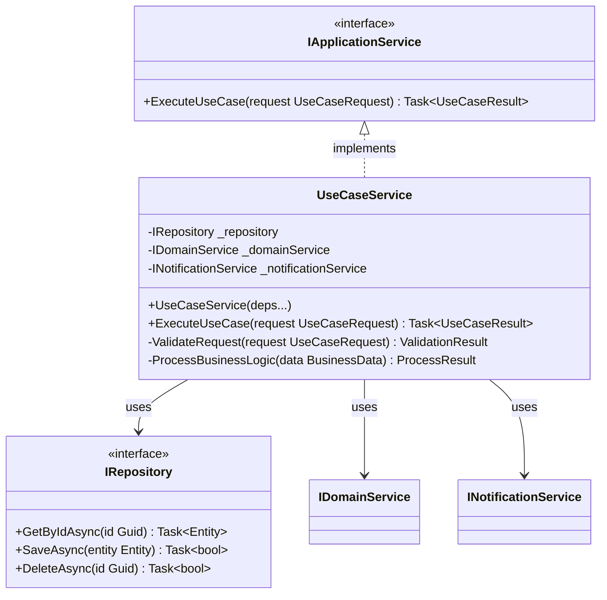
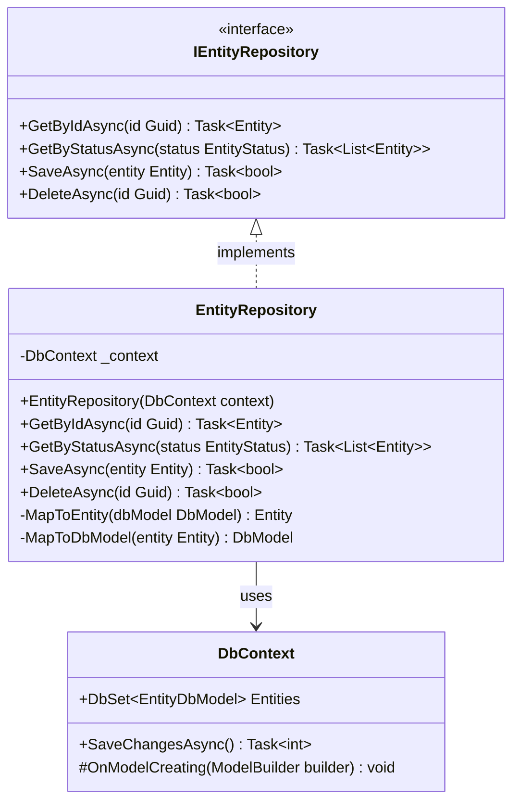
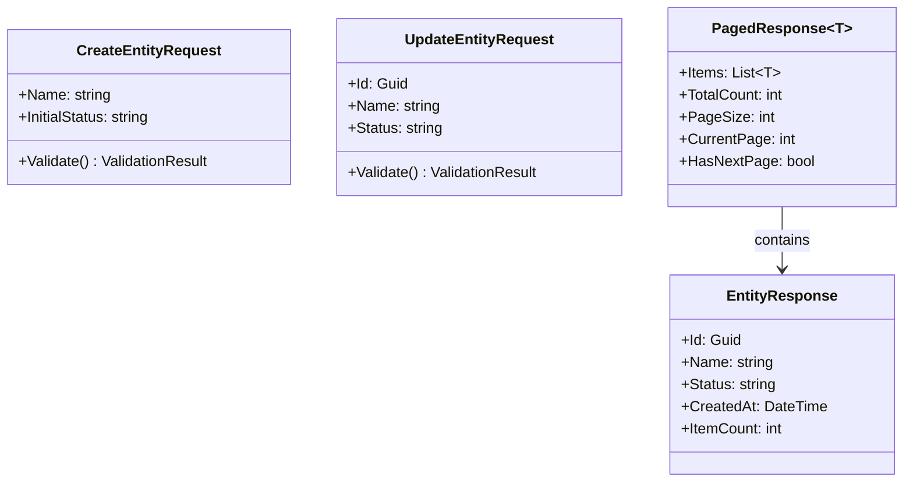
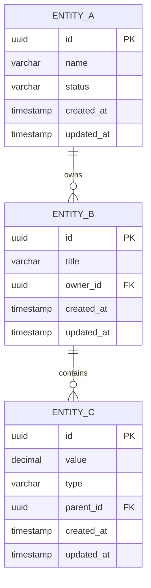
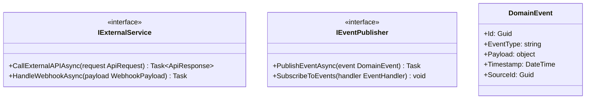

<!-- reference @.docs/design.md -->
<!-- reference @.docs/1-use-cases.md -->

[<< Back](./../design.md)

# Class Diagrams & Data Models
Below we elaborate on the system's class diagrams and data relationships. This document translates use cases into concrete class structures and data models.

Ensure we follow our **design principles** and that this document naturally extends the **use cases**.

## 📋 Template Guidance

### Purpose & Scope
This document defines the **structural design** of the system - what classes exist, how they relate, and what data they manage. It bridges **use cases** to technical implementation.

**🎯 Focus**: Domain entities, relationships, interfaces, and data flow
**🚫 Avoid**: Implementation details, database optimization, deployment specifics

### Class Diagram Guidelines
- **Domain-driven**: Start with business entities from **use cases**
- **Interface-focused**: Define contracts before implementations  
- **Relationship clarity**: Show how classes collaborate to fulfill **use cases**
- **Appropriate abstraction**: Not too detailed, not too high-level

## 🏗️ System Architecture Overview

### High-Level Class Structure

## 📊 Domain Model

### Core Business Entities
*Map directly from **use cases** and business requirements*

### Domain Services
*Services that implement business logic spanning multiple entities*

## 🔌 Service Layer

### Application Services
*Orchestrate **use cases** and coordinate between layers*

## 💾 Data Layer

### Repository Pattern
*Abstract data access based on domain needs*

## 🔄 Data Transfer Objects

### API Request/Response Models
*Define data contracts for external communication*

## 🗄️ Database Schema (ERD)

### Entity Relationships
*Database representation of domain model*

## 🔧 Integration Points

### External Service Interfaces
*Define contracts for external system integration*

## 📋 Class Design Checklist

### Domain Model Validation
- [ ] All entities map to business concepts from **use cases**
- [ ] Relationships reflect real business rules
- [ ] Entities encapsulate behavior, not just data
- [ ] Value objects are used for complex business concepts

### Service Design Validation  
- [ ] Services coordinate **use cases** without business logic
- [ ] Interfaces define clear contracts
- [ ] Dependencies flow inward (toward domain)
- [ ] Services are stateless and focused

### Data Design Validation
- [ ] Repositories abstract persistence concerns
- [ ] DTOs provide clean API contracts
- [ ] Database design supports query patterns
- [ ] Foreign keys enforce referential integrity

**Template Instructions**:
1. Replace placeholder entities with actual business concepts from **use cases**
2. Ensure all classes support the identified **use cases**
3. Keep class responsibilities focused and clear
4. Define interfaces before implementations
5. Show relationships that matter for understanding system behavior

[<< Back](./../design.md)
