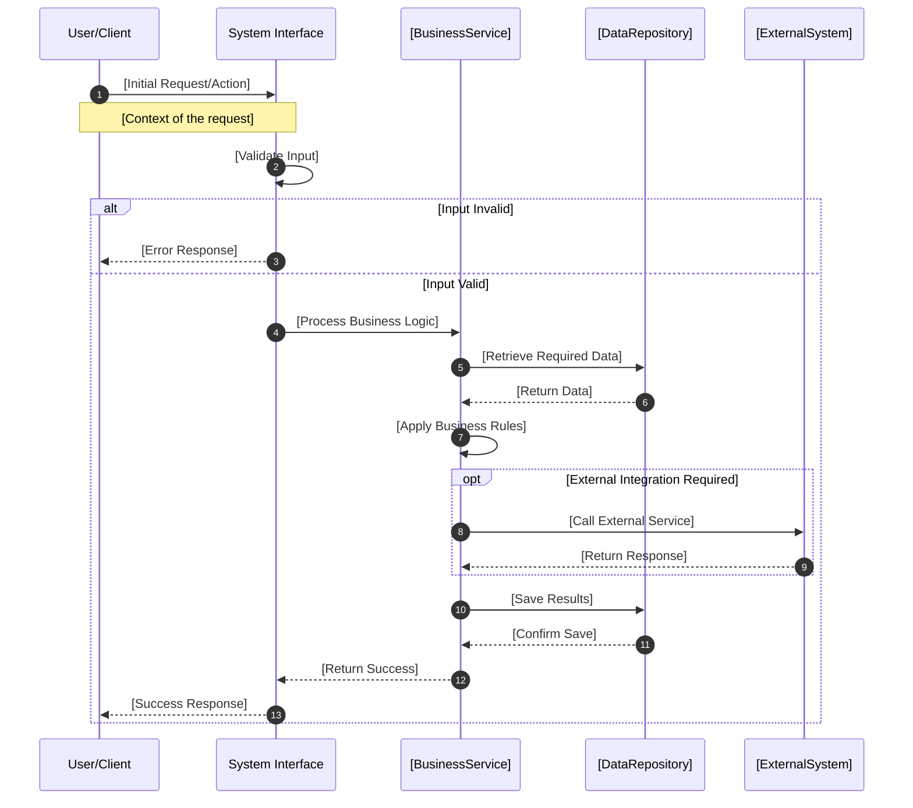
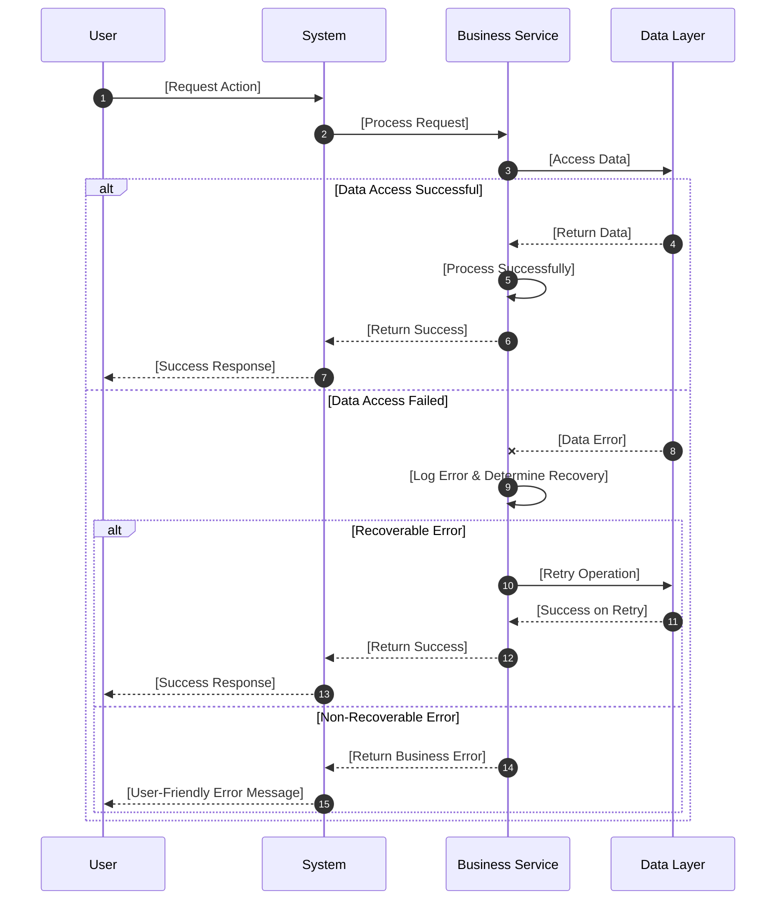
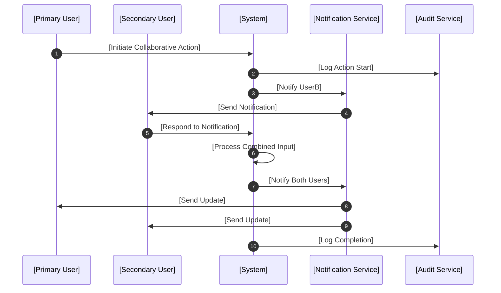
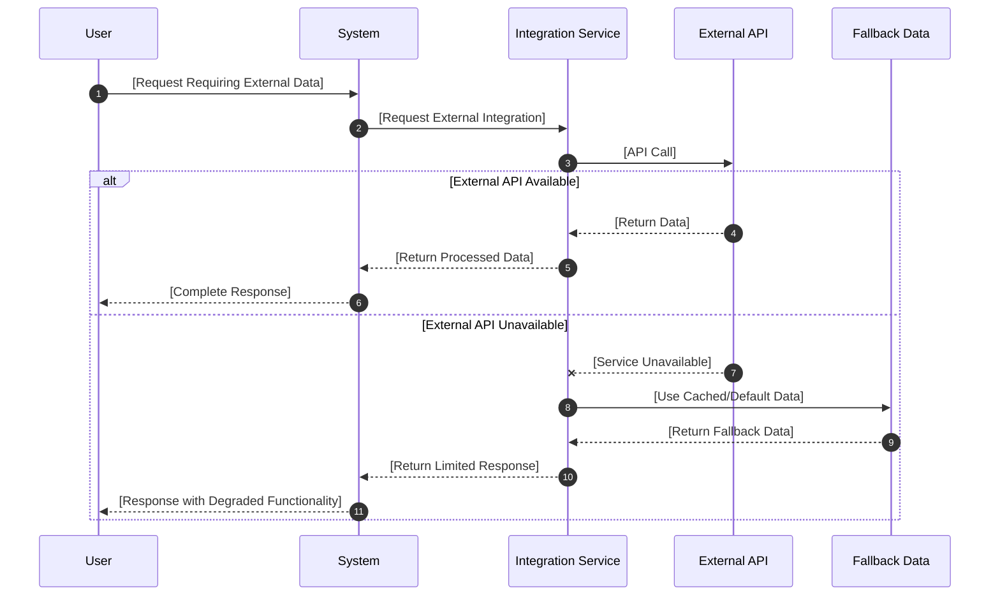
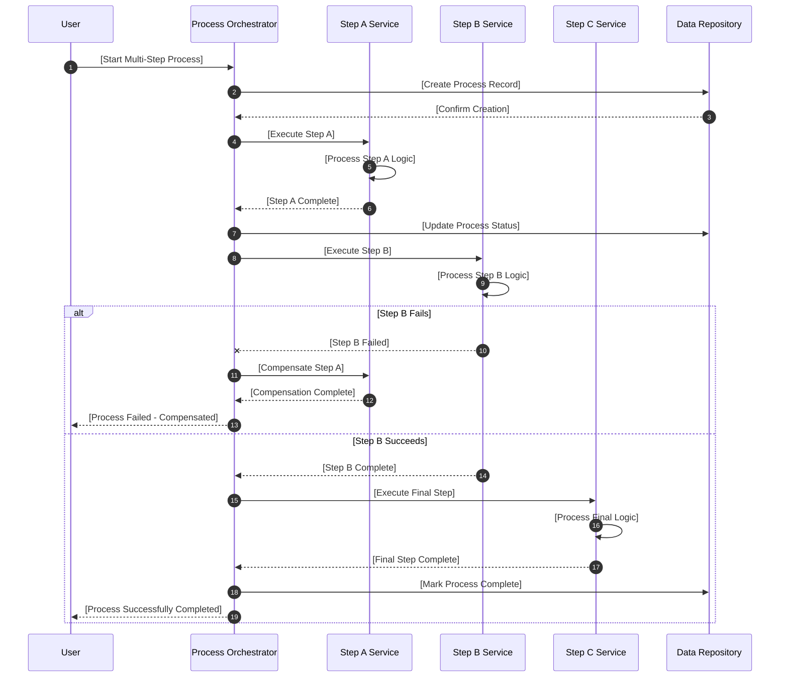

<!-- reference @.docs/design.md -->
<!-- reference @.docs/1-use-cases.md -->
<!-- reference @.docs/2-class.md -->

[<< Back](./../design.md)

# Sequence Diagrams

Below we elaborate on the system's sequence diagrams that show how classes collaborate to fulfill **use cases**.

Ensure we follow our **design principles** and that this document naturally extends the **use cases** and **class diagrams**.

## 📋 Template Guidance

### Purpose & Scope
This document shows **how** the system executes use cases by mapping the **flow of interactions** between classes over time. It bridges static class structure to dynamic behavior.

**🎯 Focus**: Use case execution flows, object collaboration, interaction patterns
**🚫 Avoid**: Implementation details, infrastructure concerns, deployment specifics

### Sequence Diagram Guidelines
- **Use case driven**: Each major diagram should map to a specific use case
- **Appropriate abstraction**: Show key interactions, hide internal details
- **Clear participants**: Use meaningful names from class diagrams
- **Error scenarios**: Include alternative flows for key failure modes

---

## 🎯 Primary Use Case Flows

### UC-001: [Use Case Name from use cases document]
*Map this directly to a use case from your use cases document*



### UC-002: [Another Use Case Name]
*Choose your most critical or complex use case*

```mermaid
sequenceDiagram
    autonumber
    participant Actor as [Primary Actor]
    participant Interface as [System Interface]
    participant ServiceA as [Service A]
    participant ServiceB as [Service B]
    participant Storage as [Data Storage]

    Actor->>Interface: [Trigger Action]
    Interface->>ServiceA: [Initial Processing]
    
    ServiceA->>Storage: [Load Context Data]
    Storage-->>ServiceA: [Return Context]
    
    ServiceA->>ServiceB: [Delegate Specialized Logic]
    ServiceB->>ServiceB: [Complex Business Processing]
    ServiceB-->>ServiceA: [Return Processed Result]
    
    ServiceA->>Storage: [Persist Changes]
    Storage-->>ServiceA: [Confirm Persistence]
    
    ServiceA-->>Interface: [Return Final Result]
    Interface-->>Actor: [Present Outcome]
```

## 🔄 Alternative and Error Flows

### Error Handling Pattern
*Standard pattern for handling errors across use cases*



### Multi-Actor Collaboration
*When use cases involve multiple actors or systems*



## 🔌 Integration Patterns

### External Service Integration
*Pattern for integrating with external systems*



## 📊 Complex Business Process Flows

### Multi-Step Business Process
*For use cases that involve multiple sequential steps*



## 📋 Use Case to Sequence Mapping

### Mapping Guidelines
**For each major use case, create a sequence diagram that shows:**

1. **Primary Actor Interaction**: How the use case is triggered
2. **System Response Flow**: How the system processes the request
3. **Key Decision Points**: Where business rules are applied
4. **Data Interactions**: When and how data is accessed/modified
5. **Success/Failure Outcomes**: How different scenarios conclude

### Sequence Complexity Guidelines

**Simple Use Cases** (3-5 steps):
- Single sequence diagram showing happy path
- Brief alternative flow for validation errors

**Complex Use Cases** (6+ steps or multiple actors):
- Primary sequence diagram for happy path
- Separate diagrams for key alternative flows
- Error handling pattern diagram

**Integration-Heavy Use Cases**:
- Focus on external system interactions
- Show fallback/retry patterns
- Include timeout and failure scenarios

---

**Template Instructions**:
1. **Replace all placeholders** with actual actors, services, and systems from your class diagrams
2. **Map to specific use cases** - each diagram should fulfill an identified use case
3. **Focus on business value** - show how user goals are achieved through system interactions
4. **Include realistic error scenarios** - show how the system handles common failure modes
5. **Keep appropriate detail level** - enough to understand the flow, not implementation specifics

**Related Documents**:
- Business flows → [1-use-cases.md](./1-use-cases.md)
- Class responsibilities → [2-class.md](./2-class.md)
- Technical architecture → [3-architecture.md](./3-architecture.md)

[<< Back](./../design.md)
