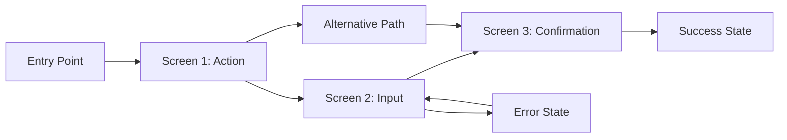

<!-- reference @.docs/design.md -->
<!-- reference @.docs/1-use-cases.md -->
<!-- reference @.docs/2-class.md -->
<!-- reference @.docs/3-sequence.md -->

[<< Back](./../design.md)

# Frontend Design Specification

This document defines the complete frontend user experience, design system, and user interface specifications. It translates **use cases** into concrete user flows and visual design.

Ensure we follow our **design principles** and that this document naturally extends the **use cases**, **class diagrams** and **sequence diagrams**.

## 📋 Template Guidance

### Purpose & Scope
This document defines **how users interact** with the system through visual interfaces. It bridges **use cases** to user experience design and provides implementation-ready specifications.

**🎯 Focus**: User flows, design language, component specifications, responsive behavior
**🚫 Avoid**: Implementation code, technical architecture, deployment details

### Frontend Design Guidelines
- **User-centered**: Every design decision serves user needs from **use cases**
- **Consistent**: Unified design language across all interfaces
- **Accessible**: WCAG AA compliant for inclusive user experience
- **Responsive**: Mobile-first design supporting all device types
- **Modern**: Contemporary design patterns that users expect

## 🗺️ User Flow Mapping

### Primary User Journeys
*Map directly from **use cases** to interface flows*

#### Flow 1: [Use Case UC-001 - User Journey Name]
**Entry Point**: [How users start this journey]
**Goal**: [What users want to accomplish]
**Success Outcome**: [How we know they succeeded]

**Detailed Flow Steps**:
1. **[Screen/Action Name]**: User arrives at [entry point] and sees [what they see]
2. **[Screen/Action Name]**: User performs [action] and gets [feedback]
3. **[Screen/Action Name]**: System shows [response] and user [next action]
4. **[Success State]**: User reaches [goal] with [confirmation/next steps]

**Key UI Requirements**:
- **Navigation**: [How users move between steps]
- **Feedback**: [How system communicates status/progress]
- **Error Handling**: [How errors are presented and resolved]
- **Accessibility**: [Keyboard navigation, screen reader support]

#### Flow 2: [Use Case UC-002 - Another Journey Name]
**Entry Point**: [Starting point]
**Goal**: [User objective]
**Complexity**: [Simple/Medium/Complex]

[Follow same pattern as Flow 1]

### Cross-Flow Interactions
*How different user journeys connect and overlap*

- **Journey Intersections**: [Where flows merge or branch]
- **Shared Components**: [UI elements used across multiple flows]
- **State Management**: [How user context is maintained across flows]

## 🎨 Visual Design Language

### Brand & Aesthetic Direction
**Design Philosophy**: [Modern/Minimal/Bold/Professional/Playful - based on target audience]
**Target Audience**: [Primary users and their preferences]
**Visual Inspiration**: [Reference apps/sites that inspire the aesthetic]

### Color System

**Primary Palette**:
- **Primary**: `#[HEX]` - Main brand color for CTAs and navigation
- **Secondary**: `#[HEX]` - Accent color for highlights and emphasis  
- **Tertiary**: `#[HEX]` - Supporting color for variety

**Neutral Palette**:
- **Background**: `#[HEX]` - Main background color
- **Surface**: `#[HEX]` - Card and component backgrounds
- **Border**: `#[HEX]` - Subtle borders and dividers
- **Text Primary**: `#[HEX]` - Main text color
- **Text Secondary**: `#[HEX]` - Secondary text and labels

**Semantic Colors**:
- **Success**: `#10B981` - Success states and positive actions
- **Warning**: `#F59E0B` - Warnings and caution states
- **Error**: `#EF4444` - Errors and destructive actions
- **Info**: `#3B82F6` - Information and neutral states

### Typography System

**Font Family**: [Primary font choice based on brand personality]
**Hierarchy**:
- **Display**: 2.5rem (40px) - Hero headlines
- **H1**: 2rem (32px) - Page titles  
- **H2**: 1.5rem (24px) - Section headers
- **H3**: 1.25rem (20px) - Subsection headers
- **Body**: 1rem (16px) - Standard content
- **Small**: 0.875rem (14px) - Captions and metadata

**Text Styles**:
- **Emphasis**: Bold weight for important content
- **Subtle**: Reduced opacity for secondary information
- **Links**: Underlined with primary color
- **Code**: Monospace font for technical content

### Spacing & Layout

**Spacing Scale** (8px base unit):
- **XS**: 4px - Tight element spacing
- **SM**: 8px - Small component padding
- **MD**: 16px - Standard element spacing
- **LG**: 24px - Section spacing
- **XL**: 32px - Large layout divisions
- **2XL**: 48px - Major page sections

**Layout Grid**:
- **Container**: Max-width with centered content
- **Columns**: Responsive grid system (1→2→3 columns)
- **Gutters**: Consistent spacing between grid items

## 📱 Responsive Design Strategy

### Device Breakpoints
- **Mobile**: 375px - 767px (Primary mobile experience)
- **Tablet**: 768px - 1023px (Intermediate layouts)
- **Desktop**: 1024px+ (Full desktop experience)

### Mobile-First Approach
**Mobile Layout Patterns**:
- Single-column content flow
- Bottom navigation for primary actions
- Collapsible menus and accordions
- Swipe gestures for galleries/carousels
- 44px minimum touch targets

**Progressive Enhancement**:
- **Tablet**: Two-column layouts, expanded navigation
- **Desktop**: Multi-column layouts, hover states, larger imagery

### Touch & Interaction
- **Touch Targets**: Minimum 44px for accessibility
- **Gesture Support**: Swipe, pinch, scroll where appropriate
- **Visual Feedback**: Clear pressed/active states

## 🧩 Component Specifications

### Core Components
*Essential UI building blocks referenced in user flows*

#### Navigation Components
- **Primary Navigation**: Main site navigation with active states
- **Breadcrumbs**: User location indicators for deep navigation
- **Pagination**: Content navigation for lists and search results

#### Data Display Components  
- **Cards**: Content containers with consistent styling
- **Tables**: Structured data display with sorting/filtering
- **Lists**: Simple and complex list layouts

#### Input Components
- **Forms**: Text inputs, dropdowns, checkboxes with validation
- **Buttons**: Primary, secondary, and destructive action buttons
- **Search**: Search inputs with autocomplete and filtering

#### Feedback Components
- **Notifications**: Success, error, warning, and info messages
- **Loading States**: Spinners, skeleton screens, progress indicators
- **Empty States**: Helpful content when no data is available

#### Modal & Overlay Components
- **Modals**: Dialog boxes for focused tasks
- **Tooltips**: Contextual help and information
- **Dropdowns**: Menu overlays and selection interfaces

### Component States
**Interactive States**:
- **Default**: Normal appearance
- **Hover**: Mouse-over feedback
- **Focus**: Keyboard navigation indicator
- **Active/Pressed**: Touch/click feedback
- **Disabled**: Non-interactive appearance

**Content States**:
- **Loading**: Data fetching indicators
- **Empty**: No content available
- **Error**: Error condition display

## 🎯 Information Architecture

### Page Structure
**Global Elements**:
- **Header**: Logo, navigation, user account access
- **Main Content**: Primary page content area
- **Footer**: Secondary links, legal information

**Page Templates**:
- **Landing/Home**: Introduction and primary CTAs
- **Dashboard**: Overview of user data and quick actions
- **Detail Pages**: In-depth information and actions
- **Form Pages**: Data input and submission
- **List/Browse**: Content discovery and filtering

### Navigation Patterns
- **Primary Navigation**: Main site sections
- **Secondary Navigation**: Sub-sections and related content
- **Contextual Navigation**: Page-specific actions and tools
- **User Navigation**: Account, settings, logout

### Content Hierarchy
- **Information Priority**: Most important content prominently placed
- **Visual Weight**: Size, color, and spacing to guide attention
- **Scanning Patterns**: F-pattern and Z-pattern layout considerations

## ♿ Accessibility Standards

### WCAG AA Compliance
- **Color Contrast**: 4.5:1 minimum for text, 3:1 for UI elements
- **Keyboard Navigation**: All functionality accessible via keyboard
- **Screen Reader Support**: Proper ARIA labels and semantic HTML
- **Focus Management**: Clear focus indicators and logical tab order

### Inclusive Design Practices
- **Alternative Text**: Descriptive alt text for all images
- **Form Labels**: Clear, descriptive labels for all inputs
- **Error Messages**: Specific, actionable error descriptions
- **Content Structure**: Proper heading hierarchy and landmarks

## 🔄 User Feedback & States

### Notification System
**Toast Notifications**:
- **Success**: Confirm successful actions (green)
- **Error**: Alert users to problems (red) 
- **Warning**: Caution about potential issues (amber)
- **Info**: Provide helpful information (blue)

**Inline Feedback**:
- **Form Validation**: Real-time field validation
- **Loading Indicators**: Progress feedback for actions
- **Status Updates**: System state communications

### Animation & Micro-interactions
**Purposeful Animations**:
- **Transitions**: Smooth page and state changes (250ms)
- **Hover Effects**: Subtle interactive feedback
- **Loading States**: Engaging wait experiences
- **Success Confirmation**: Delightful action completion

**Performance Guidelines**:
- **60fps Target**: Smooth animation performance
- **Reduced Motion**: Respect user accessibility preferences

## 📊 Performance & Quality Standards

### Performance Targets
- **First Contentful Paint**: < 1.5s
- **Largest Contentful Paint**: < 2.5s
- **Lighthouse Score**: 90+ across all categories

### Quality Assurance
**Visual Testing Requirements**:
- **Screenshot Tests**: All major pages at mobile/tablet/desktop
- **Component Testing**: All states and variations
- **Accessibility Testing**: Keyboard navigation and screen reader testing
- **Cross-browser Testing**: Chrome, Firefox, Safari, Edge

**Testing Strategy**:
- **Responsive Testing**: All breakpoints function correctly
- **Interactive Testing**: All user flows work as designed
- **Error Testing**: Error states display appropriately
- **Performance Testing**: Page load times meet targets

**Template Instructions**:
1. **Map all use cases** to user flows with specific interface requirements
2. **Define consistent design language** that serves your target audience
3. **Specify component requirements** for all UI elements mentioned in flows
4. **Include responsive behavior** for mobile, tablet, and desktop experiences
5. **Plan accessibility** from the design stage, not as an afterthought

[<< Back](./../design.md)
